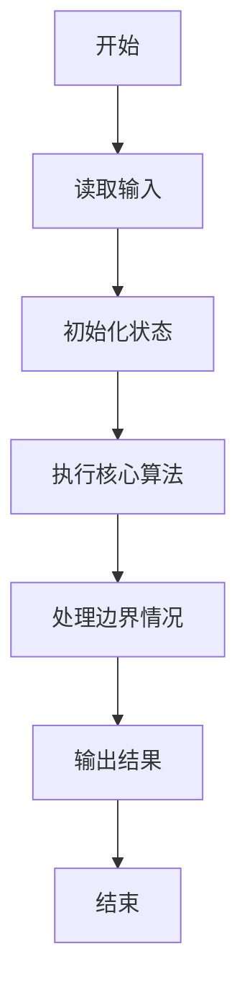
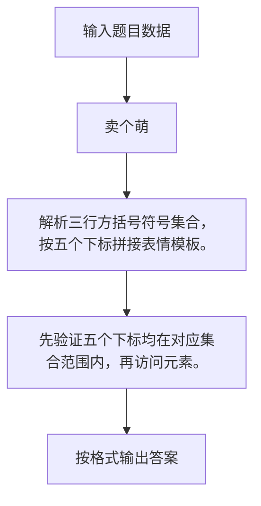

# 1052 卖个萌

- **分值：** 20分

### 题目描述

萌萌哒表情符号通常由“手”、“眼”、“口”三个主要部分组成。简单起见，我们假设一个表情符号是按下列格式输出的：
```
[左手]([左眼][口][右眼])[右手]
```
现给出可选用的符号集合，请你按用户的要求输出表情。

### 输入格式：

输入首先在前三行顺序对应给出手、眼、口的可选符号集。每个符号括在一对方括号 `[]`内。题目保证每个集合都至少有一个符号，并不超过 10 个符号；每个符号包含 1 到 4 个非空字符。

之后一行给出一个正整数 K，为用户请求的个数。随后 K 行，每行给出一个用户的符号选择，顺序为左手、左眼、口、右眼、右手——这里只给出符号在相应集合中的序号（从 1 开始），数字间以空格分隔。

### 输出格式：

对每个用户请求，在一行中输出生成的表情。若用户选择的序号不存在，则输出 `Are you kidding me? @\/@`。

### 输入样例：
```
[╮][╭][o][~\][/~]  [<][>]
 [╯][╰][^][-][=][>][<][@][⊙]
[Д][▽][_][ε][^]  ...
4
1 1 2 2 2
6 8 1 5 5
3 3 4 3 3
2 10 3 9 3

```

### 输出样例：
```
╮(╯▽╰)╭
<(@Д=)/~
o(^ε^)o
Are you kidding me? @\/@
```


### 解题思路

解析三行方括号符号集合，按五个下标拼接表情模板。 先验证五个下标均在对应集合范围内，再访问元素。

实现时按照题目的输入顺序读取数据，使用与数据规模匹配的数据结构保存必要状态，在遍历或模拟过程中完成核心计算，最后严格按照输出格式生成答案。

### 代码流程说明

1. 读取题目输入，初始化计数器、数组、集合或其他辅助状态。
2. 解析三行方括号符号集合，按五个下标拼接表情模板。
3. 先验证五个下标均在对应集合范围内，再访问元素。
4. 根据题目要求处理边界情况，并输出最终结果。

时间复杂度为 O(S+Q)，空间复杂度主要取决于输入数据和辅助状态，通常为 O(1) 到 O(n)。

### 代码实现

以下是本题对应的完整 C++17 实现：

```cpp
#include <bits/stdc++.h>
using namespace std;
// 算法原理：解析三行方括号符号集合，按五个下标拼接表情模板。
// 关键步骤：先验证五个下标均在对应集合范围内，再访问元素。
vector<string> get() {
    string s;
    getline(cin, s);
    vector<string> v;
    for (int i = 0; i < (int)s.size(); ++i)
        if (s[i] == '[') {
            int j = s.find(']', i);
            if (j != string::npos)
                v.push_back(s.substr(i + 1, j - i - 1)), i = j;
        }
    return v;
}
int main() {
    vector<string> h = get(), e = get(), m = get();
    int k;
    cin >> k;
    while (k--) {
        int a, b, c, d, f;
        cin >> a >> b >> c >> d >> f;
        if (a > h.size() || b > e.size() || c > m.size() || d > e.size() || f > h.size())
            cout << "Are you kidding me? @\\/@";
        else
            cout << h[a - 1] << '(' << e[b - 1] << m[c - 1] << e[d - 1] << ')' << h[f - 1];
        if (k)
            cout << '\n';
    }
}
```

### 代码流程图



### 解题流程图



### 常见易错点

- 注意输入规模，超大整数、长字符串或链表地址不能简单依赖普通整数和下标。
- 严格区分题目中的边界条件，例如是否包含等号、是否需要保留前导零以及是否只处理完整区块。
- 输出时按照题目规定的空格、换行、大小写和小数位数格式，避免计算正确但格式错误。
