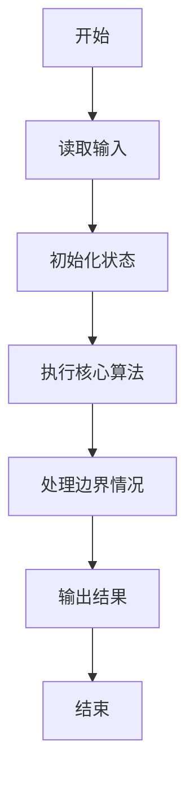
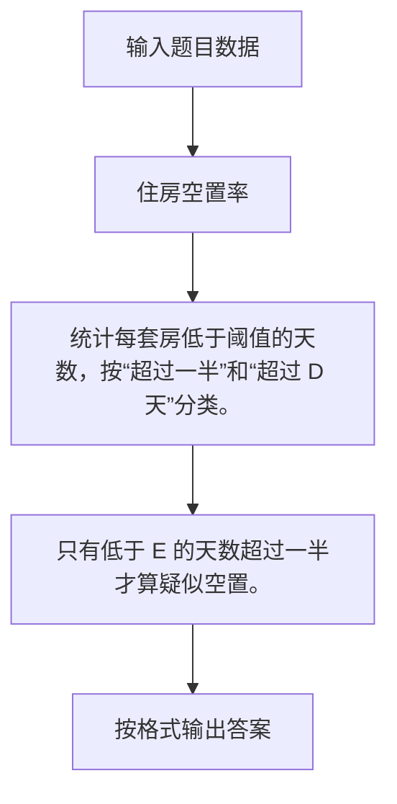

# 1053 住房空置率

- **分值：** 20分

### 题目描述

在不打扰居民的前提下，统计住房空置率的一种方法是根据每户用电量的连续变化规律进行判断。判断方法如下：

- 在观察期内，若存在超过一半的日子用电量低于某给定的阈值 $e$，则该住房为“可能空置”；

- 若观察期超过某给定阈值 $D$ 天，且满足上一个条件，则该住房为“空置”。

现给定某居民区的住户用电量数据，请你统计“可能空置”的比率和“空置”比率，即以上两种状态的住房占居民区住房总套数的百分比。

### 输入格式：

输入第一行给出正整数 $N$（$\le 1000$），为居民区住房总套数；正实数 $e$，即低电量阈值；正整数 $D$，即观察期阈值。随后 $N$ 行，每行按以下格式给出一套住房的用电量数据：

$K$ $E_1$ $E_2$ ... $E_K$

其中 $K$ 为观察的天数，$E_i$ 为第 $i$ 天的用电量。

### 输出格式：

在一行中输出“可能空置”的比率和“空置”比率的百分比值，其间以一个空格分隔，保留小数点后 1 位。

### 输入样例：
```
5 0.5 10
6 0.3 0.4 0.5 0.2 0.8 0.6
10 0.0 0.1 0.2 0.3 0.0 0.8 0.6 0.7 0.0 0.5
5 0.4 0.3 0.5 0.1 0.7
11 0.1 0.1 0.1 0.1 0.1 0.1 0.1 0.1 0.1 0.1 0.1
11 2 2 2 1 1 0.1 1 0.1 0.1 0.1 0.1
```

### 输出样例：
```
40.0% 20.0%
```

（样例解释：第2、3户为“可能空置”，第4户为“空置”，其他户不是空置。）


### 解题思路

统计每套房低于阈值的天数，按“超过一半”和“超过 D 天”分类。 只有低于 E 的天数超过一半才算疑似空置。

实现时按照题目的输入顺序读取数据，使用与数据规模匹配的数据结构保存必要状态，在遍历或模拟过程中完成核心计算，最后严格按照输出格式生成答案。

### 代码流程说明

1. 读取题目输入，初始化计数器、数组、集合或其他辅助状态。
2. 统计每套房低于阈值的天数，按“超过一半”和“超过 D 天”分类。
3. 只有低于 E 的天数超过一半才算疑似空置。
4. 根据题目要求处理边界情况，并输出最终结果。

时间复杂度为 O(总观测数)，空间复杂度主要取决于输入数据和辅助状态，通常为 O(1) 到 O(n)。

### 代码实现

以下是本题对应的完整 C++17 实现：

```cpp
#include <bits/stdc++.h>
using namespace std;
// 算法原理：统计每套房低于阈值的天数，按“超过一半”和“超过 D 天”分类。
// 关键步骤：只有低于 E 的天数超过一半才算疑似空置。
int main() {
    int n, d;
    double e;
    cin >> n >> e >> d;
    int a = 0, b = 0;
    for (int i = 0; i < n; ++i) {
        int k, total, c = 0;
        cin >> k;
        total = k;
        for (int j = 0; j < k; ++j) {
            double x;
            cin >> x, c += x < e;
        }
        if (c > total / 2.0)
            ++(total > d ? b : a);
    }
    cout << fixed << setprecision(1) << 100.0 * a / n << "% " << 100.0 * b / n << '%';
}
```

### 代码流程图



### 解题流程图



### 常见易错点

- 注意输入规模，超大整数、长字符串或链表地址不能简单依赖普通整数和下标。
- 严格区分题目中的边界条件，例如是否包含等号、是否需要保留前导零以及是否只处理完整区块。
- 输出时按照题目规定的空格、换行、大小写和小数位数格式，避免计算正确但格式错误。
