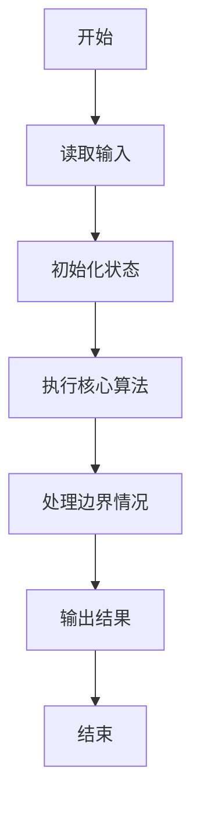
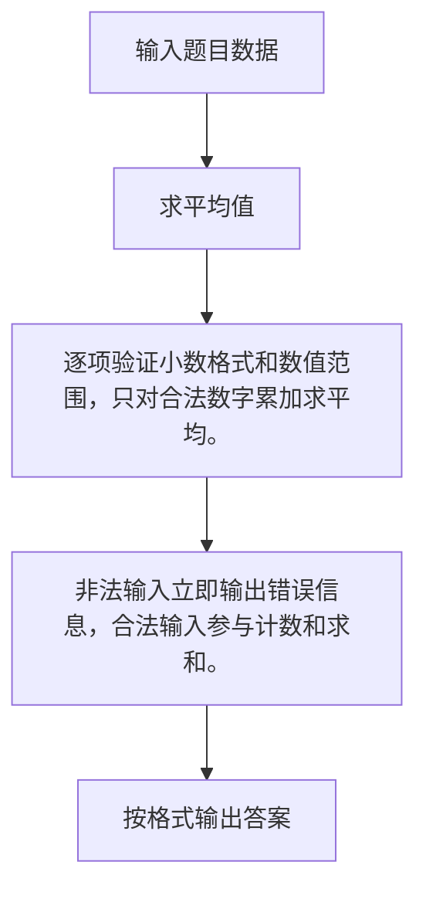

# 1054 求平均值

- **分值：** 20分

### 题目描述

本题的基本要求非常简单：给定 $N$ 个实数，计算它们的平均值。但复杂的是有些输入数据可能是非法的。一个“合法”的输入是 [$-1000, 1000$] 区间内的实数，并且最多精确到小数点后 2 位。当你计算平均值的时候，不能把那些非法的数据算在内。

### 输入格式：

输入第一行给出正整数 $N$（$\le 100$）。随后一行给出 $N$ 个实数，数字间以一个空格分隔。

### 输出格式：

对每个非法输入，在一行中输出 `ERROR: X is not a legal number`，其中 `X` 是输入。最后在一行中输出结果：`The average of K numbers is Y`，其中 `K` 是合法输入的个数，`Y` 是它们的平均值，精确到小数点后 2 位。如果平均值无法计算，则用 `Undefined` 替换 `Y`。如果 `K` 为 1，则输出 `The average of 1 number is Y`。

### 输入样例：1
```
7
5 -3.2 aaa 9999 2.3.4 7.123 2.35
```

### 输出样例：1
```
ERROR: aaa is not a legal number
ERROR: 9999 is not a legal number
ERROR: 2.3.4 is not a legal number
ERROR: 7.123 is not a legal number
The average of 3 numbers is 1.38
```

### 输入样例：2
```
2
aaa -9999
```

### 输出样例：2
```
ERROR: aaa is not a legal number
ERROR: -9999 is not a legal number
The average of 0 numbers is Undefined
```


### 解题思路

逐项验证小数格式和数值范围，只对合法数字累加求平均。 非法输入立即输出错误信息，合法输入参与计数和求和。

实现时按照题目的输入顺序读取数据，使用与数据规模匹配的数据结构保存必要状态，在遍历或模拟过程中完成核心计算，最后严格按照输出格式生成答案。

### 代码流程说明

1. 读取题目输入，初始化计数器、数组、集合或其他辅助状态。
2. 逐项验证小数格式和数值范围，只对合法数字累加求平均。
3. 非法输入立即输出错误信息，合法输入参与计数和求和。
4. 根据题目要求处理边界情况，并输出最终结果。

时间复杂度为 O(总字符数)，空间复杂度主要取决于输入数据和辅助状态，通常为 O(1) 到 O(n)。

### 代码实现

以下是本题对应的完整 C++17 实现：

```cpp
#include <bits/stdc++.h>
using namespace std;
// 算法原理：逐项验证小数格式和数值范围，只对合法数字累加求平均。
// 关键步骤：非法输入立即输出错误信息，合法输入参与计数和求和。
bool valid(string s) {
    int dots = 0, digits = 0, fractionDigits = 0;
    for (int i = 0; i < (int)s.size(); ++i) {
        if (s[i] == '.') {
            if (++dots > 1)
                return false;
        } else if (isdigit((unsigned char)s[i]))
            ++digits, fractionDigits += dots > 0;
        else if ((s[i] == '+' || s[i] == '-') && i == 0) {
        } else
            return false;
    }
    if (!digits || fractionDigits > 2)
        return false;
    try {
        double x = stod(s);
        return x >= -1000 && x <= 1000;
    } catch (...) {
        return false;
    }
}
int main() {
    int n;
    cin >> n;
    double sum = 0;
    int c = 0;
    while (n--) {
        string s;
        cin >> s;
        if (valid(s)) {
            sum += stod(s);
            ++c;
        } else
            cout << "ERROR: " << s << " is not a legal number\n";
    }
    if (c == 0)
        cout << "The average of 0 numbers is Undefined";
    else if (c == 1)
        cout << "The average of 1 number is " << fixed << setprecision(2) << sum;
    else
        cout << "The average of " << c << " numbers is " << fixed << setprecision(2) << sum / c;
}
```

### 代码流程图



### 解题流程图



### 常见易错点

- 注意输入规模，超大整数、长字符串或链表地址不能简单依赖普通整数和下标。
- 严格区分题目中的边界条件，例如是否包含等号、是否需要保留前导零以及是否只处理完整区块。
- 输出时按照题目规定的空格、换行、大小写和小数位数格式，避免计算正确但格式错误。
