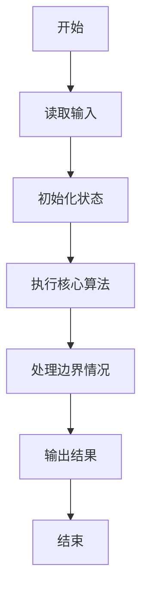
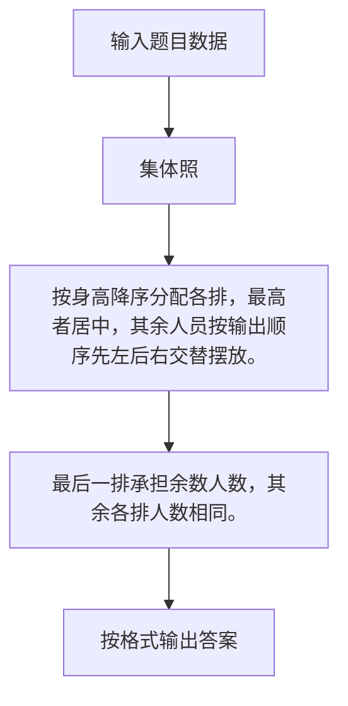

# 1055 集体照

- **分值：** 25分

### 题目描述

拍集体照时队形很重要，这里对给定的 $N$ 个人 $K$ 排的队形设计排队规则如下：

- 每排人数为 $N/K$（向下取整），多出来的人全部站在最后一排；

- 后排所有人的个子都不比前排任何人矮；

- 每排中最高者站中间（中间位置为 $m/2+1$，其中 $m$ 为该排人数，除法向下取整）；

- 每排其他人以中间人为轴，按身高非增序，先右后左交替入队站在中间人的两侧（例如5人身高为190、188、186、175、170，则队形为175、188、190、186、170。这里假设你面对拍照者，所以你的左边是中间人的右边）；

- 若多人身高相同，则按名字的字典序升序排列。这里保证无重名。

现给定一组拍照人，请编写程序输出他们的队形。

### 输入格式：

每个输入包含 1 个测试用例。每个测试用例第 1 行给出两个正整数 $N$（$\le 10^4$，总人数）和 $K$（$\le 10$，总排数）。随后 $N$ 行，每行给出一个人的名字（不包含空格、长度不超过 8 个英文字母）和身高（[30, 300] 区间内的整数）。

### 输出格式：

输出拍照的队形。即K排人名，其间以空格分隔，行末不得有多余空格。注意：假设你面对拍照者，后排的人输出在上方，前排输出在下方。

### 输入样例：
```
10 3
Tom 188
Mike 170
Eva 168
Tim 160
Joe 190
Ann 168
Bob 175
Nick 186
Amy 160
John 159
```

### 输出样例：
```
Bob Tom Joe Nick
Ann Mike Eva
Tim Amy John
```


### 解题思路

按身高降序分配各排，最高者居中，其余人员按输出顺序先左后右交替摆放。最后一排承担余数人数，其余各排人数相同。

实现时按照题目的输入顺序读取数据，使用与数据规模匹配的数据结构保存必要状态，在遍历或模拟过程中完成核心计算，最后严格按照输出格式生成答案。

### 代码流程说明

1. 读取题目输入，初始化计数器、数组、集合或其他辅助状态。
2. 按身高降序分配各排，最高者居中，其余人员按输出顺序先左后右交替摆放。
3. 最后一排承担余数人数，其余各排人数相同。
4. 根据题目要求处理边界情况，并输出最终结果。

时间复杂度为 O(N log N)，空间复杂度主要取决于输入数据和辅助状态，通常为 O(1) 到 O(n)。

### 代码实现

以下是本题对应的完整 C++17 实现：

```cpp
#include <bits/stdc++.h>
using namespace std;
// 算法原理：按身高降序分配各排，最高者居中，其余人员按先左后右交替摆放。
// 关键步骤：最后一排承担余数人数，其余各排人数相同。
struct P {
    string n;
    int h;
};
int main() {
    int n, k;
    cin >> n >> k;
    vector<P> a(n);
    for (auto &x : a)
        cin >> x.n >> x.h;
    sort(a.begin(), a.end(),
         [](const P &x, const P &y) { return x.h != y.h ? x.h > y.h : x.n < y.n; });
    int base = n / k, extra = n % k, pos = 0;
    for (int row = k; row >= 1; --row) {
        int len = base + (row == k ? extra : 0);
        vector<string> out(len);
        int middle = len / 2;
        out[middle] = a[pos].n;
        for (int i = 1; i < len; ++i) {
            int index = i % 2 ? middle - (i + 1) / 2 : middle + i / 2;
            out[index] = a[pos + i].n;
        }
        for (int i = 0; i < len; ++i)
            cout << (i ? " " : "") << out[i];
        cout << '\n';
        pos += len;
    }
}
```

### 代码流程图



### 解题流程图



### 常见易错点

- 注意输入规模，超大整数、长字符串或链表地址不能简单依赖普通整数和下标。
- 严格区分题目中的边界条件，例如是否包含等号、是否需要保留前导零以及是否只处理完整区块。
- 输出时按照题目规定的空格、换行、大小写和小数位数格式，避免计算正确但格式错误。
