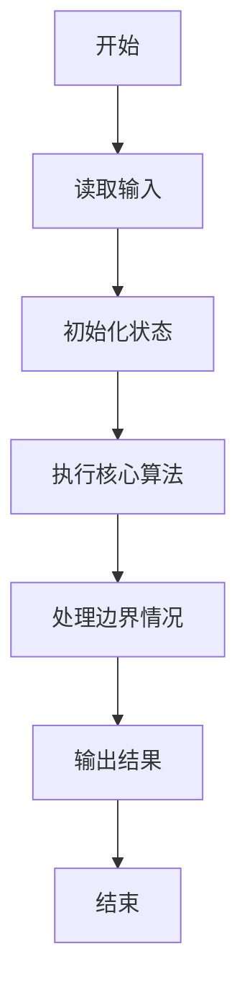
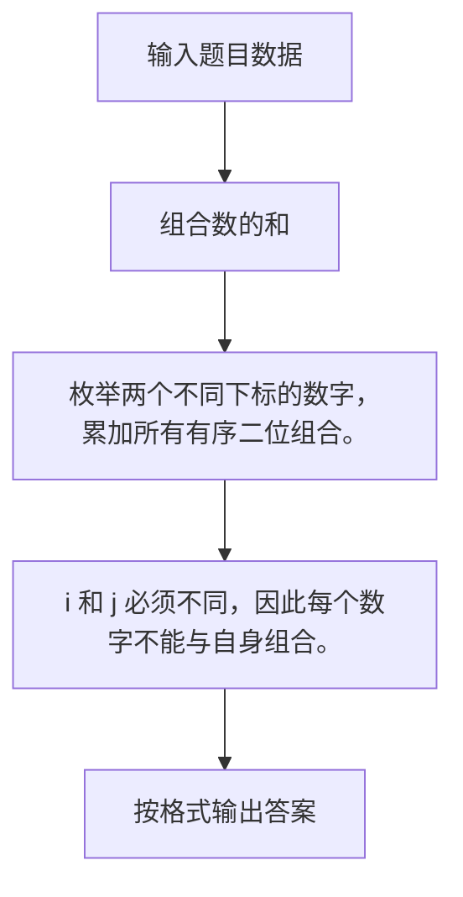

# 1056 组合数的和

- **分值：** 15分

### 题目描述

给定 N 个非 0 的个位数字，用其中任意 2 个数字都可以组合成 1 个 2 位的数字。要求所有可能组合出来的 2 位数字的和。例如给定 2、5、8，则可以组合出：25、28、52、58、82、85，它们的和为330。

### 输入格式：

输入在一行中先给出 N（1 $<$ N $<$ 10），随后给出 N 个不同的非 0 个位数字。数字间以空格分隔。

### 输出格式：

输出所有可能组合出来的2位数字的和。

### 输入样例：
```
3 2 8 5
```

### 输出样例：
```
330
```


### 解题思路

枚举两个不同下标的数字，累加所有有序二位组合。 i 和 j 必须不同，因此每个数字不能与自身组合。

实现时按照题目的输入顺序读取数据，使用与数据规模匹配的数据结构保存必要状态，在遍历或模拟过程中完成核心计算，最后严格按照输出格式生成答案。

### 代码流程说明

1. 读取题目输入，初始化计数器、数组、集合或其他辅助状态。
2. 枚举两个不同下标的数字，累加所有有序二位组合。
3. i 和 j 必须不同，因此每个数字不能与自身组合。
4. 根据题目要求处理边界情况，并输出最终结果。

时间复杂度为 O(N²)，空间复杂度主要取决于输入数据和辅助状态，通常为 O(1) 到 O(n)。

### 代码实现

以下是本题对应的完整 C++17 实现：

```cpp
#include <bits/stdc++.h>
using namespace std;
// 算法原理：枚举两个不同下标的数字，累加所有有序二位组合。
// 关键步骤：i 和 j 必须不同，因此每个数字不能与自身组合。
int main() {
    int n;
    cin >> n;
    vector<int> a(n);
    for (int &x : a)
        cin >> x;
    long long s = 0;
    for (int i = 0; i < n; ++i)
        for (int j = 0; j < n; ++j)
            if (i != j)
                s += 10 * a[i] + a[j];
    cout << s;
}
```

### 代码流程图



### 解题流程图



### 常见易错点

- 注意输入规模，超大整数、长字符串或链表地址不能简单依赖普通整数和下标。
- 严格区分题目中的边界条件，例如是否包含等号、是否需要保留前导零以及是否只处理完整区块。
- 输出时按照题目规定的空格、换行、大小写和小数位数格式，避免计算正确但格式错误。
