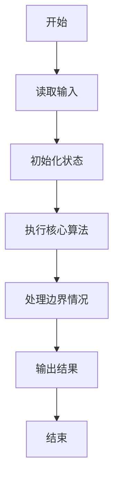
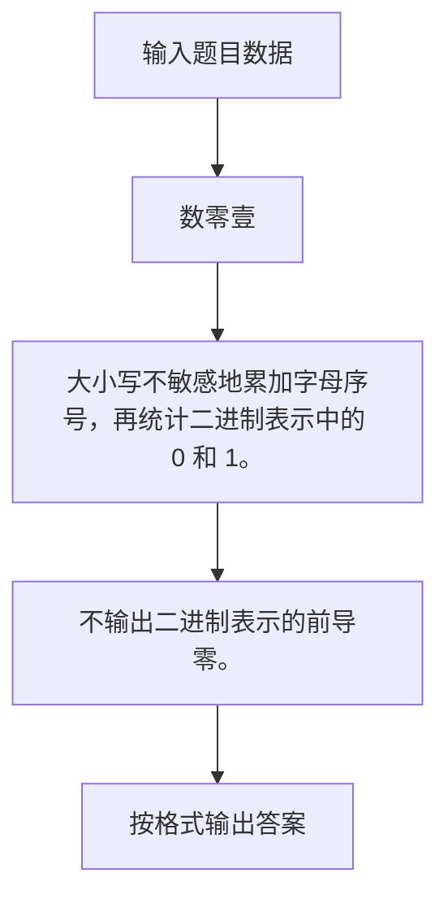

# 1057 数零壹

- **分值：** 20分

### 题目描述

给定一串长度不超过 $10^5$ 的字符串，本题要求你将其中所有英文字母的序号（字母 a-z 对应序号 1-26，不分大小写）相加，得到整数 N，然后再分析一下 N 的二进制表示中有多少 0、多少 1。例如给定字符串 `PAT (Basic)`，其字母序号之和为：16+1+20+2+1+19+9+3=71，而 71 的二进制是 1000111，即有 3 个 0、4 个 1。

### 输入格式：

输入在一行中给出长度不超过 $10^5$、以回车结束的字符串。

### 输出格式：

在一行中先后输出 0 的个数和 1 的个数，其间以空格分隔。注意：若字符串中不存在字母，则视为 N 不存在，也就没有 0 和 1。

### 输入样例：
```
PAT (Basic)
```

### 输出样例：
```
3 4
```

**鸣谢浙江工业大学之江学院石洗凡老师补充题面说明。**


### 解题思路

大小写不敏感地累加字母序号，再统计二进制表示中的 0 和 1。 不输出二进制表示的前导零。

实现时按照题目的输入顺序读取数据，使用与数据规模匹配的数据结构保存必要状态，在遍历或模拟过程中完成核心计算，最后严格按照输出格式生成答案。

### 代码流程说明

1. 读取题目输入，初始化计数器、数组、集合或其他辅助状态。
2. 大小写不敏感地累加字母序号，再统计二进制表示中的 0 和 1。
3. 不输出二进制表示的前导零。
4. 根据题目要求处理边界情况，并输出最终结果。

时间复杂度为 O(L)，空间复杂度主要取决于输入数据和辅助状态，通常为 O(1) 到 O(n)。

### 代码实现

以下是本题对应的完整 C++17 实现：

```cpp
#include <bits/stdc++.h>
using namespace std;
// 算法原理：大小写不敏感地累加字母序号，再统计二进制表示中的 0 和 1。
// 关键步骤：不输出二进制表示的前导零。
int main() {
    string s;
    getline(cin, s);
    int sum = 0;
    for (char c : s)
        if (isalpha((unsigned char)c))
            sum += tolower((unsigned char)c) - 'a' + 1;
    int one = __builtin_popcount((unsigned)sum),
        zero = sum ? 32 - __builtin_clz((unsigned)sum) - one : 0;
    cout << zero << ' ' << one;
}
```

### 代码流程图



### 解题流程图



### 常见易错点

- 注意输入规模，超大整数、长字符串或链表地址不能简单依赖普通整数和下标。
- 严格区分题目中的边界条件，例如是否包含等号、是否需要保留前导零以及是否只处理完整区块。
- 输出时按照题目规定的空格、换行、大小写和小数位数格式，避免计算正确但格式错误。
