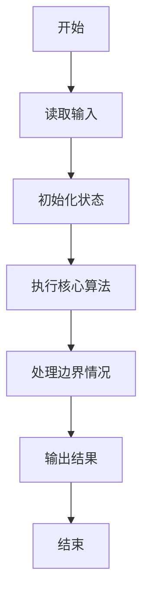
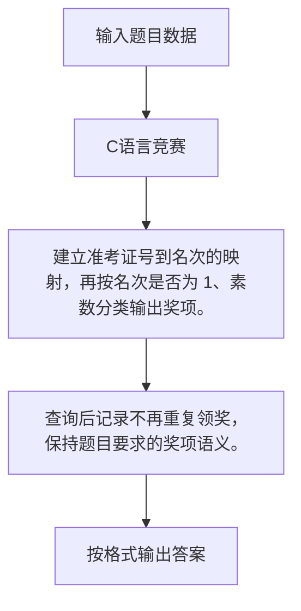

# 1059 C语言竞赛

- **分值：** 20分

### 题目描述

C 语言竞赛是浙江大学计算机学院主持的一个欢乐的竞赛。既然竞赛主旨是为了好玩，颁奖规则也就制定得很滑稽：

- 0、冠军将赢得一份“神秘大奖”（比如很巨大的一本学生研究论文集……）。
- 1、排名为素数的学生将赢得最好的奖品 —— 小黄人玩偶！
- 2、其他人将得到巧克力。

给定比赛的最终排名以及一系列参赛者的 ID，你要给出这些参赛者应该获得的奖品。

### 输入格式：

输入第一行给出一个正整数 $N$（$\le 10^4$），是参赛者人数。随后 $N$ 行给出最终排名，每行按排名顺序给出一位参赛者的 ID（4 位数字组成）。接下来给出一个正整数 $K$ 以及 $K$ 个需要查询的 ID。

### 输出格式：

对每个要查询的 ID，在一行中输出 `ID: 奖品`，其中奖品或者是 `Mystery Award`（神秘大奖）、或者是 `Minion`（小黄人）、或者是 `Chocolate`（巧克力）。如果所查 ID 根本不在排名里，打印 `Are you kidding?`（耍我呢？）。如果该 ID 已经查过了（即奖品已经领过了），打印 `ID: Checked`（不能多吃多占）。

### 输入样例：
```
6
1111
6666
8888
1234
5555
0001
6
8888
0001
1111
2222
8888
2222
```

### 输出样例：
```
8888: Minion
0001: Chocolate
1111: Mystery Award
2222: Are you kidding?
8888: Checked
2222: Are you kidding?
```


### 解题思路

建立准考证号到名次的映射，再按名次是否为 1、素数分类输出奖项。 查询后记录不再重复领奖，保持题目要求的奖项语义。

实现时按照题目的输入顺序读取数据，使用与数据规模匹配的数据结构保存必要状态，在遍历或模拟过程中完成核心计算，最后严格按照输出格式生成答案。

### 代码流程说明

1. 读取题目输入，初始化计数器、数组、集合或其他辅助状态。
2. 建立准考证号到名次的映射，再按名次是否为 1、素数分类输出奖项。
3. 查询后记录不再重复领奖，保持题目要求的奖项语义。
4. 根据题目要求处理边界情况，并输出最终结果。

时间复杂度为 O(N+Q)，空间复杂度主要取决于输入数据和辅助状态，通常为 O(1) 到 O(n)。

### 代码实现

以下是本题对应的完整 C++17 实现：

```cpp
#include <bits/stdc++.h>
using namespace std;
// 算法原理：建立准考证号到名次的映射，再按名次是否为 1、素数分类输出奖项。
// 关键步骤：查询后记录不再重复领奖，保持题目要求的奖项语义。
bool prime(int x) {
    if (x < 2)
        return false;
    for (int i = 2; i * i <= x; ++i)
        if (x % i == 0)
            return false;
    return true;
}
int main() {
    int n;
    cin >> n;
    map<string, int> rank;
    for (int i = 1; i <= n; ++i) {
        string x;
        cin >> x;
        rank[x] = i;
    }
    int k;
    cin >> k;
    set<string> checked;
    while (k--) {
        string x;
        cin >> x;
        if (!rank.count(x))
            cout << x << ": Are you kidding?";
        else if (checked.count(x))
            cout << x << ": Checked";
        else if (rank[x] == 1)
            cout << x << ": Mystery Award";
        else if (prime(rank[x]))
            cout << x << ": Minion";
        else
            cout << x << ": Chocolate";
        checked.insert(x);
        if (k)
            cout << '\n';
    }
}
```

### 代码流程图



### 解题流程图



### 常见易错点

- 注意输入规模，超大整数、长字符串或链表地址不能简单依赖普通整数和下标。
- 严格区分题目中的边界条件，例如是否包含等号、是否需要保留前导零以及是否只处理完整区块。
- 输出时按照题目规定的空格、换行、大小写和小数位数格式，避免计算正确但格式错误。
