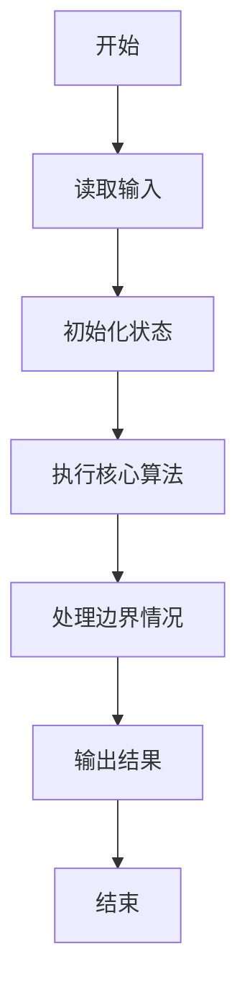
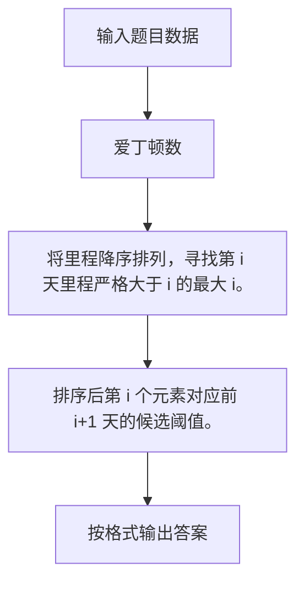

# 1060 爱丁顿数

- **分值：** 25分

### 题目描述

英国天文学家爱丁顿很喜欢骑车。据说他为了炫耀自己的骑车功力，还定义了一个“爱丁顿数” $E$ ，即满足有 $E$ 天骑车超过 $E$ 英里的最大整数 $E$。据说爱丁顿自己的 $E$ 等于87。

现给定某人 $N$ 天的骑车距离，请你算出对应的爱丁顿数 $E$（$\le N$）。

### 输入格式：

输入第一行给出一个正整数 $N$ ($\le 10^5$)，即连续骑车的天数；第二行给出 $N$ 个非负整数，代表每天的骑车距离。

### 输出格式：

在一行中给出 $N$ 天的爱丁顿数。

### 输入样例：
```
10
6 7 6 9 3 10 8 2 7 8
```

### 输出样例：
```
6
```


### 解题思路

将里程降序排列，寻找第 i 天里程严格大于 i 的最大 i。 排序后第 i 个元素对应前 i+1 天的候选阈值。

实现时按照题目的输入顺序读取数据，使用与数据规模匹配的数据结构保存必要状态，在遍历或模拟过程中完成核心计算，最后严格按照输出格式生成答案。

### 代码流程说明

1. 读取题目输入，初始化计数器、数组、集合或其他辅助状态。
2. 将里程降序排列，寻找第 i 天里程严格大于 i 的最大 i。
3. 排序后第 i 个元素对应前 i+1 天的候选阈值。
4. 根据题目要求处理边界情况，并输出最终结果。

时间复杂度为 O(N log N)，空间复杂度主要取决于输入数据和辅助状态，通常为 O(1) 到 O(n)。

### 代码实现

以下是本题对应的完整 C++17 实现：

```cpp
#include <bits/stdc++.h>
using namespace std;
// 算法原理：将里程降序排列，寻找第 i 天里程严格大于 i 的最大 i。
// 关键步骤：排序后第 i 个元素对应前 i+1 天的候选阈值。
int main() {
    int n;
    cin >> n;
    vector<int> a(n);
    for (int &x : a)
        cin >> x;
    sort(a.rbegin(), a.rend());
    int ans = 0;
    for (int i = 0; i < n && a[i] > i + 1; ++i)
        ans = i + 1;
    cout << ans;
}
```

### 代码流程图



### 解题流程图



### 常见易错点

- 注意输入规模，超大整数、长字符串或链表地址不能简单依赖普通整数和下标。
- 严格区分题目中的边界条件，例如是否包含等号、是否需要保留前导零以及是否只处理完整区块。
- 输出时按照题目规定的空格、换行、大小写和小数位数格式，避免计算正确但格式错误。
