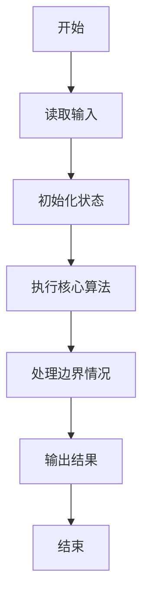
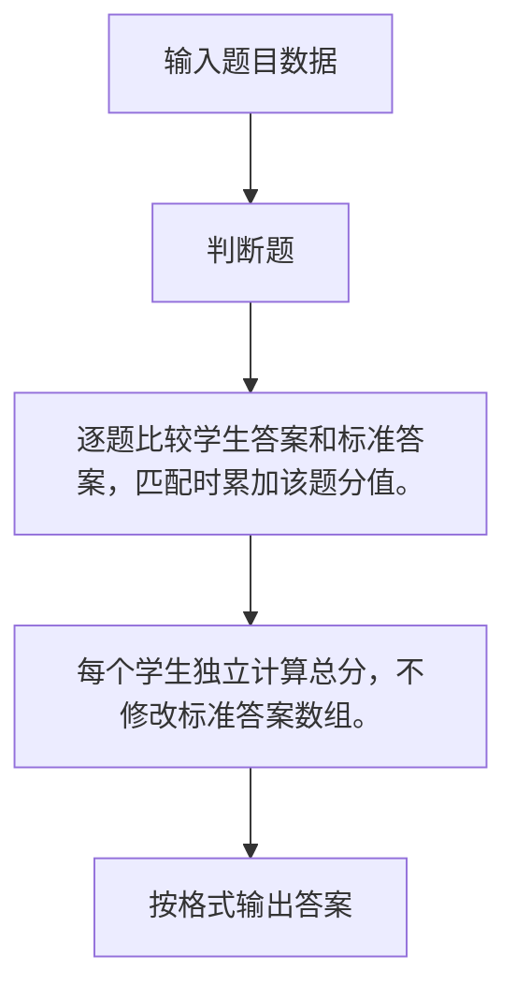

# 1061 判断题

- **分值：** 15分

### 题目描述

判断题的评判很简单，本题就要求你写个简单的程序帮助老师判题并统计学生们判断题的得分。

### 输入格式：

输入在第一行给出两个不超过 100 的正整数 N 和 M，分别是学生人数和判断题数量。第二行给出 M 个不超过 5 的正整数，是每道题的满分值。第三行给出每道题对应的正确答案，0 代表“非”，1 代表“是”。随后 N 行，每行给出一个学生的解答。数字间均以空格分隔。

### 输出格式：

按照输入的顺序输出每个学生的得分，每个分数占一行。

### 输入样例：
```
3 6
2 1 3 3 4 5
0 0 1 0 1 1
0 1 1 0 0 1
1 0 1 0 1 0
1 1 0 0 1 1
```

### 输出样例：
```
13
11
12
```


### 解题思路

逐题比较学生答案和标准答案，匹配时累加该题分值。 每个学生独立计算总分，不修改标准答案数组。

实现时按照题目的输入顺序读取数据，使用与数据规模匹配的数据结构保存必要状态，在遍历或模拟过程中完成核心计算，最后严格按照输出格式生成答案。

### 代码流程说明

1. 读取题目输入，初始化计数器、数组、集合或其他辅助状态。
2. 逐题比较学生答案和标准答案，匹配时累加该题分值。
3. 每个学生独立计算总分，不修改标准答案数组。
4. 根据题目要求处理边界情况，并输出最终结果。

时间复杂度为 O(NM)，空间复杂度主要取决于输入数据和辅助状态，通常为 O(1) 到 O(n)。

### 代码实现

以下是本题对应的完整 C++17 实现：

```cpp
#include <bits/stdc++.h>
using namespace std;
// 算法原理：逐题比较学生答案和标准答案，匹配时累加该题分值。
// 关键步骤：每个学生独立计算总分，不修改标准答案数组。
int main() {
    int n, m;
    cin >> n >> m;
    vector<int> a(m), b(m);
    for (int &x : a)
        cin >> x;
    for (int &x : b)
        cin >> x;
    for (int q = 0; q < n; ++q) {
        int ans = 0;
        for (int i = 0, x; i < m; ++i)
            cin >> x, ans += x == b[i] ? a[i] : 0;
        cout << ans << '\n';
    }
}
```

### 代码流程图



### 解题流程图



### 常见易错点

- 注意输入规模，超大整数、长字符串或链表地址不能简单依赖普通整数和下标。
- 严格区分题目中的边界条件，例如是否包含等号、是否需要保留前导零以及是否只处理完整区块。
- 输出时按照题目规定的空格、换行、大小写和小数位数格式，避免计算正确但格式错误。
