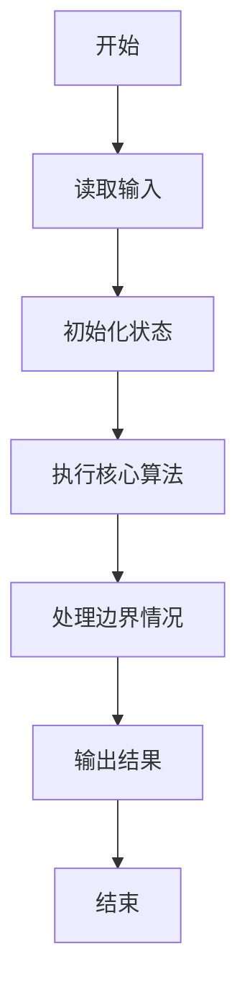
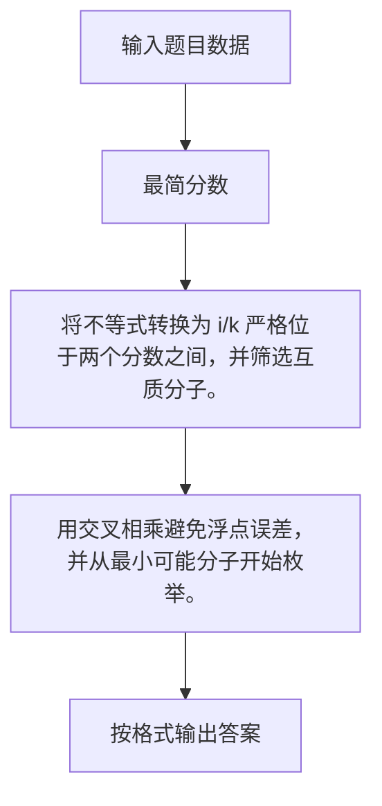

# 1062 最简分数

- **分值：** 20分

### 题目描述

一个分数一般写成两个整数相除的形式：$N/M$，其中 $M$ 不为0。最简分数是指分子和分母没有公约数的分数表示形式。

现给定两个不相等的正分数 $N_1/M_1$ 和 $N_2/M_2$，要求你按从小到大的顺序列出它们之间分母为 $K$ 的最简分数。

### 输入格式：

输入在一行中按 $N/M$ 的格式给出两个正分数，随后是一个正整数分母 $K$，其间以空格分隔。题目保证给出的所有整数都不超过 10000。

### 输出格式：

在一行中按 $N/M$ 的格式列出两个给定分数之间分母为 $K$ 的所有最简分数，按从小到大的顺序，其间以 1 个空格分隔。行首尾不得有多余空格。题目保证至少有 1 个输出。

### 输入样例：
```
7/18 13/20 12
```

### 输出样例：
```
5/12 7/12
```
**鸣谢海南师范大学王心诗慧同学修正题面！**


### 解题思路

将不等式转换为 i/k 严格位于两个分数之间，并筛选互质分子。 用交叉相乘避免浮点误差，并从最小可能分子开始枚举。

实现时按照题目的输入顺序读取数据，使用与数据规模匹配的数据结构保存必要状态，在遍历或模拟过程中完成核心计算，最后严格按照输出格式生成答案。

### 代码流程说明

1. 读取题目输入，初始化计数器、数组、集合或其他辅助状态。
2. 将不等式转换为 i/k 严格位于两个分数之间，并筛选互质分子。
3. 用交叉相乘避免浮点误差，并从最小可能分子开始枚举。
4. 根据题目要求处理边界情况，并输出最终结果。

时间复杂度为 O(候选分子数)，空间复杂度主要取决于输入数据和辅助状态，通常为 O(1) 到 O(n)。

### 代码实现

以下是本题对应的完整 C++17 实现：

```cpp
#include <bits/stdc++.h>
using namespace std;
// 算法原理：将不等式转换为 i/k 严格位于两个分数之间，并筛选互质分子。
// 关键步骤：用交叉相乘避免浮点误差，并从最小可能分子开始枚举。
using ll = long long;
int main() {
    ll a, b, c, d, k;
    scanf("%lld/%lld %lld/%lld %lld", &a, &b, &c, &d, &k);
    if (a * d > c * b)
        swap(a, c), swap(b, d);
    ll lo = a * k / b + 1;
    bool first = true;
    for (ll i = lo; i * d < c * k; ++i)
        if (gcd(i, k) == 1) {
            if (!first)
                cout << ' ';
            cout << i << '/' << k;
            first = false;
        }
}
```

### 代码流程图



### 解题流程图



### 常见易错点

- 注意输入规模，超大整数、长字符串或链表地址不能简单依赖普通整数和下标。
- 严格区分题目中的边界条件，例如是否包含等号、是否需要保留前导零以及是否只处理完整区块。
- 输出时按照题目规定的空格、换行、大小写和小数位数格式，避免计算正确但格式错误。
