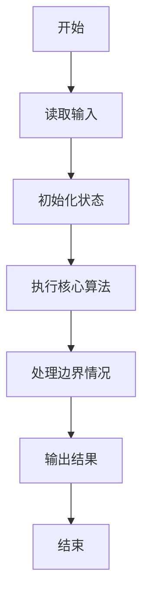
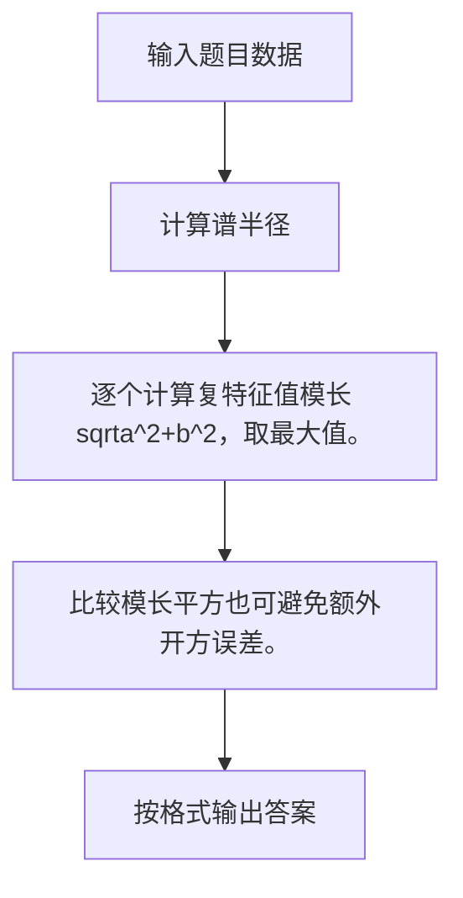

# 1063 计算谱半径

- **分值：** 20分

### 题目描述

在数学中，矩阵的“谱半径”是指其特征值的模集合的上确界。换言之，对于给定的 $n$ 个复数空间的特征值 { $a_1+b_1i, \cdots , a_n+b_ni$ }，它们的模为实部与虚部的平方和的开方，而“谱半径”就是最大模。

现在给定一些复数空间的特征值，请你计算并输出这些特征值的谱半径。

### 输入格式：

输入第一行给出正整数 N（$\le$ 10 000）是输入的特征值的个数。随后 N 行，每行给出 1 个特征值的实部和虚部，其间以空格分隔。注意：题目保证实部和虚部均为绝对值不超过 1000 的整数。

### 输出格式：

在一行中输出谱半径，四舍五入保留小数点后 2 位。

### 输入样例：
```
5
0 1
2 0
-1 0
3 3
0 -3
```

### 输出样例：
```
4.24
```


### 解题思路

逐个计算复特征值模长 sqrta^2+b^2，取最大值。 比较模长平方也可避免额外开方误差。

实现时按照题目的输入顺序读取数据，使用与数据规模匹配的数据结构保存必要状态，在遍历或模拟过程中完成核心计算，最后严格按照输出格式生成答案。

### 代码流程说明

1. 读取题目输入，初始化计数器、数组、集合或其他辅助状态。
2. 逐个计算复特征值模长 sqrta^2+b^2，取最大值。
3. 比较模长平方也可避免额外开方误差。
4. 根据题目要求处理边界情况，并输出最终结果。

时间复杂度为 O(N)，空间复杂度主要取决于输入数据和辅助状态，通常为 O(1) 到 O(n)。

### 代码实现

以下是本题对应的完整 C++17 实现：

```cpp
#include <bits/stdc++.h>
using namespace std;
// 算法原理：逐个计算复特征值模长 sqrt(a^2+b^2)，取最大值。
// 关键步骤：比较模长平方也可避免额外开方误差。
int main() {
    int n;
    cin >> n;
    double ans = 0;
    while (n--) {
        double a, b;
        cin >> a >> b;
        ans = max(ans, sqrt(a * a + b * b));
    }
    cout << fixed << setprecision(2) << ans;
}
```

### 代码流程图



### 解题流程图



### 常见易错点

- 注意输入规模，超大整数、长字符串或链表地址不能简单依赖普通整数和下标。
- 严格区分题目中的边界条件，例如是否包含等号、是否需要保留前导零以及是否只处理完整区块。
- 输出时按照题目规定的空格、换行、大小写和小数位数格式，避免计算正确但格式错误。
