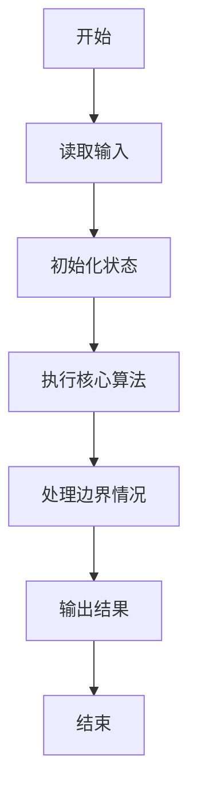
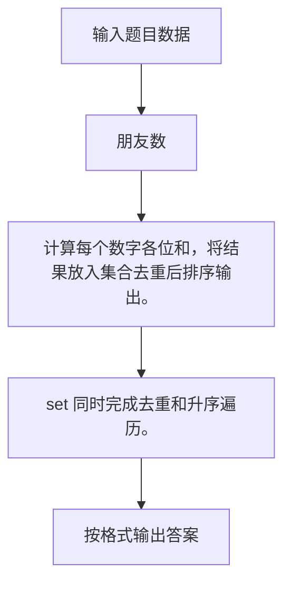

# 1064 朋友数

- **分值：** 20分

### 题目描述

如果两个整数各位数字的和是一样的，则被称为是“朋友数”，而那个公共的和就是它们的“朋友证号”。例如 123 和 51 就是朋友数，因为 1+2+3 = 5+1 = 6，而 6 就是它们的朋友证号。给定一些整数，要求你统计一下它们中有多少个不同的朋友证号。

### 输入格式：

输入第一行给出正整数 N。随后一行给出 N 个正整数，数字间以空格分隔。题目保证所有数字小于 $10^4$。

### 输出格式：

首先第一行输出给定数字中不同的朋友证号的个数；随后一行按递增顺序输出这些朋友证号，数字间隔一个空格，且行末不得有多余空格。

### 输入样例：
```
8
123 899 51 998 27 33 36 12
```

### 输出样例：
```
4
3 6 9 26
```


### 解题思路

计算每个数字各位和，将结果放入集合去重后排序输出。 set 同时完成去重和升序遍历。

实现时按照题目的输入顺序读取数据，使用与数据规模匹配的数据结构保存必要状态，在遍历或模拟过程中完成核心计算，最后严格按照输出格式生成答案。

### 代码流程说明

1. 读取题目输入，初始化计数器、数组、集合或其他辅助状态。
2. 计算每个数字各位和，将结果放入集合去重后排序输出。
3. set 同时完成去重和升序遍历。
4. 根据题目要求处理边界情况，并输出最终结果。

时间复杂度为 O(总数字位数)，空间复杂度主要取决于输入数据和辅助状态，通常为 O(1) 到 O(n)。

### 代码实现

以下是本题对应的完整 C++17 实现：

```cpp
#include <bits/stdc++.h>
using namespace std;
// 算法原理：计算每个数字各位和，将结果放入集合去重后排序输出。
// 关键步骤：set 同时完成去重和升序遍历。
int main() {
    int n;
    cin >> n;
    set<int> s;
    while (n--) {
        string x;
        cin >> x;
        int z = 0;
        for (char c : x)
            z += c - '0';
        s.insert(z);
    }
    cout << s.size() << '\n';
    int i = 0;
    for (int x : s)
        cout << (i++ ? " " : "") << x;
}
```

### 代码流程图



### 解题流程图



### 常见易错点

- 注意输入规模，超大整数、长字符串或链表地址不能简单依赖普通整数和下标。
- 严格区分题目中的边界条件，例如是否包含等号、是否需要保留前导零以及是否只处理完整区块。
- 输出时按照题目规定的空格、换行、大小写和小数位数格式，避免计算正确但格式错误。
