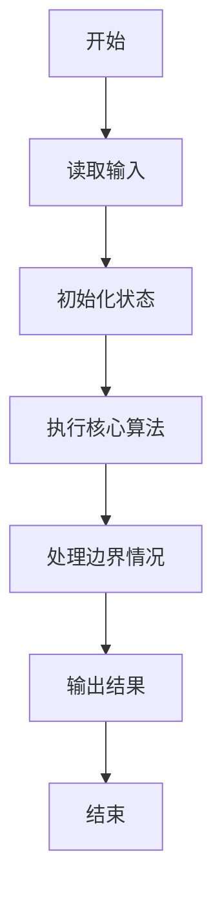
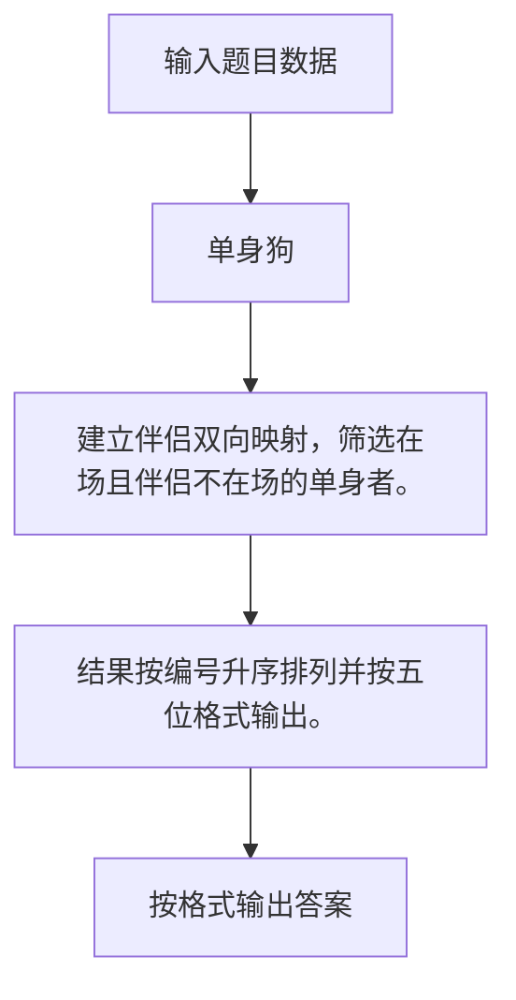

# 1065 单身狗

- **分值：** 25分

### 题目描述

“单身狗”是中文对于单身人士的一种爱称。本题请你从上万人的大型派对中找出落单的客人，以便给予特殊关爱。

### 输入格式：

输入第一行给出一个正整数 N（$\le$ 50 000），是已知夫妻/伴侣的对数；随后 N 行，每行给出一对夫妻/伴侣——为方便起见，每人对应一个 ID 号，为 5 位数字（从 00000 到 99999），ID 间以空格分隔；之后给出一个正整数 M（$\le$ 10 000），为参加派对的总人数；随后一行给出这 M 位客人的 ID，以空格分隔。题目保证无人重婚或脚踩两条船。

### 输出格式：

首先第一行输出落单客人的总人数；随后第二行按 ID 递增顺序列出落单的客人。ID 间用 1 个空格分隔，行的首尾不得有多余空格。

### 输入样例：
```
3
11111 22222
33333 44444
55555 66666
7
55555 44444 10000 88888 22222 11111 23333
```

### 输出样例：
```
5
10000 23333 44444 55555 88888
```


### 解题思路

建立伴侣双向映射，筛选在场且伴侣不在场的单身者。 结果按编号升序排列并按五位格式输出。

实现时按照题目的输入顺序读取数据，使用与数据规模匹配的数据结构保存必要状态，在遍历或模拟过程中完成核心计算，最后严格按照输出格式生成答案。

### 代码流程说明

1. 读取题目输入，初始化计数器、数组、集合或其他辅助状态。
2. 建立伴侣双向映射，筛选在场且伴侣不在场的单身者。
3. 结果按编号升序排列并按五位格式输出。
4. 根据题目要求处理边界情况，并输出最终结果。

时间复杂度为 O((N+M) log M)，空间复杂度主要取决于输入数据和辅助状态，通常为 O(1) 到 O(n)。

### 代码实现

以下是本题对应的完整 C++17 实现：

```cpp
#include <bits/stdc++.h>
using namespace std;
// 算法原理：建立伴侣双向映射，筛选在场且伴侣不在场的单身者。
// 关键步骤：结果按编号升序排列并按五位格式输出。
int main() {
    int n;
    cin >> n;
    map<int, int> p;
    for (int i = 0, a, b; i < n; ++i)
        cin >> a >> b, p[a] = b, p[b] = a;
    int m;
    cin >> m;
    vector<int> a(m);
    set<int> s;
    for (int &x : a)
        cin >> x, s.insert(x);
    vector<int> v;
    for (int x : a)
        if (!p.count(x) || !s.count(p[x]))
            v.push_back(x);
    sort(v.begin(), v.end());
    cout << v.size() << '\n';
    for (int i = 0; i < (int)v.size(); ++i)
        cout << (i ? " " : "") << setw(5) << setfill('0') << v[i];
}
```

### 代码流程图



### 解题流程图



### 常见易错点

- 注意输入规模，超大整数、长字符串或链表地址不能简单依赖普通整数和下标。
- 严格区分题目中的边界条件，例如是否包含等号、是否需要保留前导零以及是否只处理完整区块。
- 输出时按照题目规定的空格、换行、大小写和小数位数格式，避免计算正确但格式错误。
