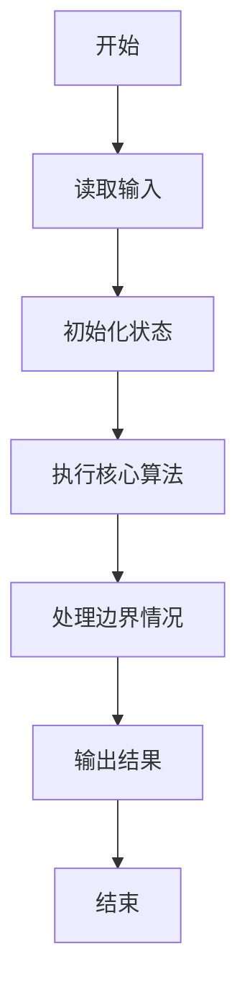
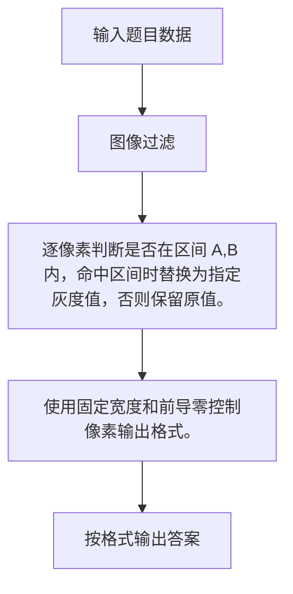

# 1066 图像过滤

- **分值：** 15分

### 题目描述

图像过滤是把图像中不重要的像素都染成背景色，使得重要部分被凸显出来。现给定一幅黑白图像，要求你将灰度值位于某指定区间内的所有像素颜色都用一种指定的颜色替换。

### 输入格式：

输入在第一行给出一幅图像的分辨率，即两个正整数 $M$ 和 $N$（$0 < M, N \le 500$），另外是待过滤的灰度值区间端点 $A$ 和 $B$（$0 \le A < B \le 255$）、以及指定的替换灰度值。随后 $M$ 行，每行给出 $N$ 个像素点的灰度值，其间以空格分隔。所有灰度值都在 [0, 255] 区间内。

### 输出格式：

输出按要求过滤后的图像。即输出 $M$ 行，每行 $N$ 个像素灰度值，每个灰度值占 3 位（例如黑色要显示为 `000`），其间以一个空格分隔。行首尾不得有多余空格。

### 输入样例：
```
3 5 100 150 0
3 189 254 101 119
150 233 151 99 100
88 123 149 0 255
```

### 输出样例：
```
003 189 254 000 000
000 233 151 099 000
088 000 000 000 255
```


### 解题思路

逐像素判断是否在区间 A,B 内，命中区间时替换为指定灰度值，否则保留原值。使用固定宽度和前导零控制像素输出格式。

实现时按照题目的输入顺序读取数据，使用与数据规模匹配的数据结构保存必要状态，在遍历或模拟过程中完成核心计算，最后严格按照输出格式生成答案。

### 代码流程说明

1. 读取题目输入，初始化计数器、数组、集合或其他辅助状态。
2. 逐像素判断是否在区间 A,B 内，命中区间时替换为指定灰度值，否则保留原值。
3. 使用固定宽度和前导零控制像素输出格式。
4. 根据题目要求处理边界情况，并输出最终结果。

时间复杂度为 O(MN)，空间复杂度主要取决于输入数据和辅助状态，通常为 O(1) 到 O(n)。

### 代码实现

以下是本题对应的完整 C++17 实现：

```cpp
#include <bits/stdc++.h>
using namespace std;
// 算法原理：逐像素判断是否在区间 [A,B] 内，命中区间时替换为指定灰度值。
// 关键步骤：使用固定宽度和前导零控制像素输出格式。
int main() {
    int m, n, a, b, replacement;
    cin >> m >> n >> a >> b >> replacement;
    for (int i = 0; i < m * n; ++i) {
        int x;
        cin >> x;
        if (i)
            cout << (i % n ? ' ' : '\n');
        cout << setw(3) << setfill('0') << (x >= a && x <= b ? replacement : x);
    }
}
```

### 代码流程图



### 解题流程图



### 常见易错点

- 注意输入规模，超大整数、长字符串或链表地址不能简单依赖普通整数和下标。
- 严格区分题目中的边界条件，例如是否包含等号、是否需要保留前导零以及是否只处理完整区块。
- 输出时按照题目规定的空格、换行、大小写和小数位数格式，避免计算正确但格式错误。
