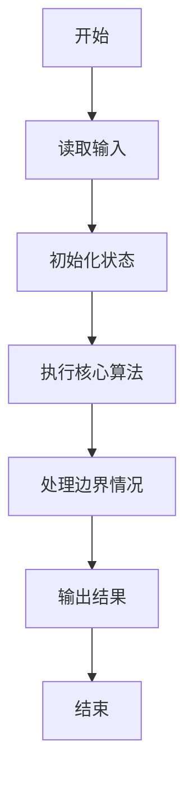
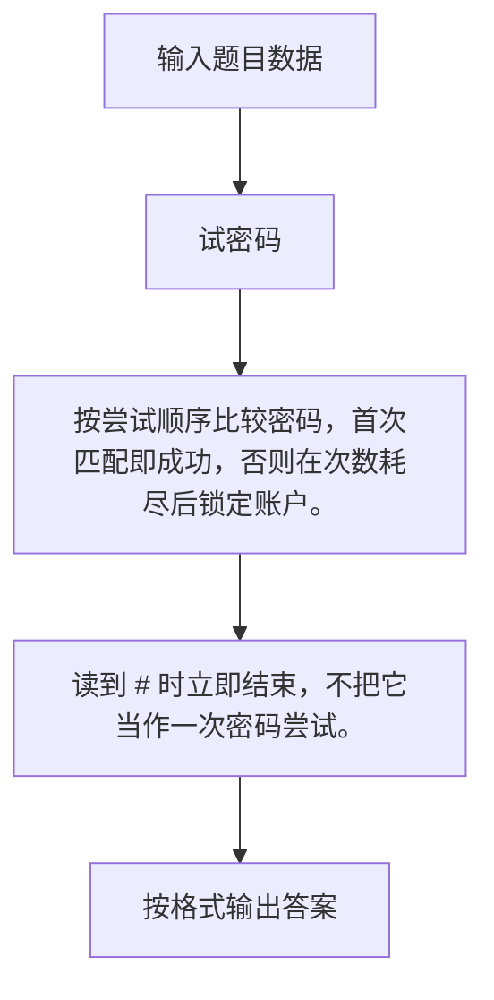

# 1067 试密码

- **分值：** 20分

### 题目描述

当你试图登录某个系统却忘了密码时，系统一般只会允许你尝试有限多次，当超出允许次数时，账号就会被锁死。本题就请你实现这个小功能。

### 输入格式：

输入在第一行给出一个密码（长度不超过 20 的、不包含空格、Tab、回车的非空字符串）和一个正整数 N（$\le$ 10），分别是正确的密码和系统允许尝试的次数。随后每行给出一个以回车结束的非空字符串，是用户尝试输入的密码。输入保证至少有一次尝试。当读到一行只有单个 # 字符时，输入结束，并且这一行不是用户的输入。

### 输出格式：

对用户的每个输入，如果是正确的密码且尝试次数不超过 N，则在一行中输出 `Welcome in`，并结束程序；如果是错误的，则在一行中按格式输出 `Wrong password: 用户输入的错误密码`；当错误尝试达到 N 次时，再输出一行 `Account locked`，并结束程序。

### 输入样例：1
```
Correct%pw 3
correct%pw
Correct@PW
whatisthepassword!
Correct%pw
#
```

### 输出样例：1
```
Wrong password: correct%pw
Wrong password: Correct@PW
Wrong password: whatisthepassword!
Account locked
```

### 输入样例：2
```
cool@gplt 3
coolman@gplt
coollady@gplt
cool@gplt
try again
#
```

### 输出样例：2
```
Wrong password: coolman@gplt
Wrong password: coollady@gplt
Welcome in
```


### 解题思路

按尝试顺序比较密码，首次匹配即成功，否则在次数耗尽后锁定账户。 读到 # 时立即结束，不把它当作一次密码尝试。

实现时按照题目的输入顺序读取数据，使用与数据规模匹配的数据结构保存必要状态，在遍历或模拟过程中完成核心计算，最后严格按照输出格式生成答案。

### 代码流程说明

1. 读取题目输入，初始化计数器、数组、集合或其他辅助状态。
2. 按尝试顺序比较密码，首次匹配即成功，否则在次数耗尽后锁定账户。
3. 读到 # 时立即结束，不把它当作一次密码尝试。
4. 根据题目要求处理边界情况，并输出最终结果。

时间复杂度为 O(尝试次数×密码长度)，空间复杂度主要取决于输入数据和辅助状态，通常为 O(1) 到 O(n)。

### 代码实现

以下是本题对应的完整 C++17 实现：

```cpp
#include <bits/stdc++.h>
using namespace std;
// 算法原理：按尝试顺序比较密码，首次匹配即成功，否则在次数耗尽后锁定账户。
// 关键步骤：读到 # 时立即结束，不把它当作一次密码尝试。
int main() {
    string pass, s;
    int n;
    cin >> pass >> n;
    while (n--) {
        cin >> s;
        if (s == "#")
            return 0;
        if (s == pass) {
            cout << "Welcome in";
            return 0;
        }
        cout << "Wrong password: " << s << '\n';
    }
    cout << "Account locked";
}
```

### 代码流程图



### 解题流程图



### 常见易错点

- 注意输入规模，超大整数、长字符串或链表地址不能简单依赖普通整数和下标。
- 严格区分题目中的边界条件，例如是否包含等号、是否需要保留前导零以及是否只处理完整区块。
- 输出时按照题目规定的空格、换行、大小写和小数位数格式，避免计算正确但格式错误。
