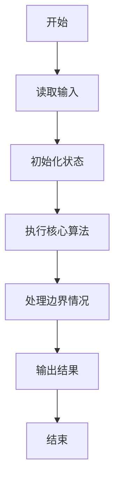
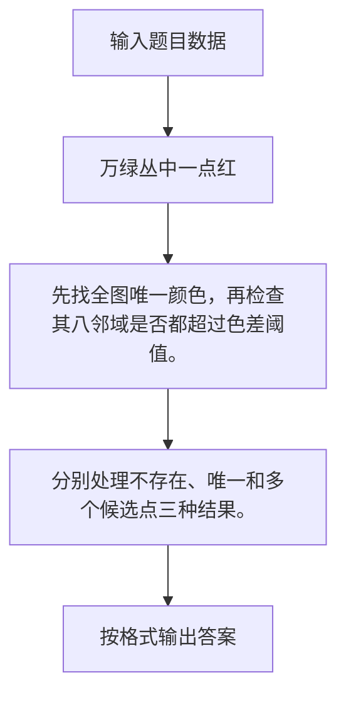

# 1068 万绿丛中一点红

- **分值：** 20分

### 题目描述

对于计算机而言，颜色不过是像素点对应的一个 24 位的数值。现给定一幅分辨率为 $M\times N$ 的画，要求你找出万绿丛中的一点红，即有独一无二颜色的那个像素点，并且该点的颜色与其周围 8 个相邻像素的颜色差充分大。

### 输入格式：

输入第一行给出三个正整数，分别是 $M$ 和 $N$（$\le$ 1000），即图像的分辨率；以及 TOL，是所求像素点与相邻点的颜色差阈值，色差超过 TOL 的点才被考虑。随后 $N$ 行，每行给出 $M$ 个像素的颜色值，范围在 $[0, 2^{24})$ 内。所有同行数字间用空格或 TAB 分开。

### 输出格式：

在一行中按照 `(x, y): color` 的格式输出所求像素点的位置以及颜色值，其中位置 `x` 和 `y` 分别是该像素在图像矩阵中的列、行编号（从 1 开始编号）。如果这样的点不唯一，则输出 `Not Unique`；如果这样的点不存在，则输出 `Not Exist`。

### 输入样例：1
```
8 6 200
0 	 0 	  0 	   0	    0 	     0 	      0        0
65280 	 65280    65280    16711479 65280    65280    65280    65280
16711479 65280    65280    65280    16711680 65280    65280    65280
65280 	 65280    65280    65280    65280    65280    165280   165280
65280 	 65280 	  16777015 65280    65280    165280   65480    165280
16777215 16777215 16777215 16777215 16777215 16777215 16777215 16777215
```

### 输出样例：1
```
(5, 3): 16711680
```

### 输入样例：2
```
4 5 2
0 0 0 0
0 0 3 0
0 0 0 0
0 5 0 0
0 0 0 0
```

### 输出样例：2
```
Not Unique
```

### 输入样例：3
```
3 3 5
1 2 3
3 4 5
5 6 7
```

### 输出样例：3
```
Not Exist
```


### 解题思路

先找全图唯一颜色，再检查其八邻域是否都超过色差阈值。 分别处理不存在、唯一和多个候选点三种结果。

实现时按照题目的输入顺序读取数据，使用与数据规模匹配的数据结构保存必要状态，在遍历或模拟过程中完成核心计算，最后严格按照输出格式生成答案。

### 代码流程说明

1. 读取题目输入，初始化计数器、数组、集合或其他辅助状态。
2. 先找全图唯一颜色，再检查其八邻域是否都超过色差阈值。
3. 分别处理不存在、唯一和多个候选点三种结果。
4. 根据题目要求处理边界情况，并输出最终结果。

时间复杂度为 O(MN)，空间复杂度主要取决于输入数据和辅助状态，通常为 O(1) 到 O(n)。

### 代码实现

以下是本题对应的完整 C++17 实现：

```cpp
#include <bits/stdc++.h>
using namespace std;
// 算法原理：先找全图唯一颜色，再检查其八邻域是否都超过色差阈值。
// 关键步骤：分别处理不存在、唯一和多个候选点三种结果。
int main() {
    int m, n, t;
    cin >> m >> n >> t;
    vector<vector<int>> a(n, vector<int>(m));
    map<int, int> cnt;
    for (auto &r : a)
        for (int &x : r)
            cin >> x, ++cnt[x];
    vector<tuple<int, int, int>> v;
    for (int i = 0; i < n; ++i)
        for (int j = 0; j < m; ++j)
            if (cnt[a[i][j]] == 1) {
                bool ok = true;
                for (int x = max(0, i - 1); x <= min(n - 1, i + 1); ++x)
                    for (int y = max(0, j - 1); y <= min(m - 1, j + 1); ++y)
                        if ((x != i || y != j) && abs(a[x][y] - a[i][j]) <= t)
                            ok = false;
                if (ok)
                    v.push_back({j + 1, i + 1, a[i][j]});
            }
    if (v.size() == 1) {
        auto [x, y, c] = v[0];
        cout << '(' << x << ", " << y << "): " << c;
    } else if (v.empty())
        cout << "Not Exist";
    else
        cout << "Not Unique";
}
```

### 代码流程图



### 解题流程图



### 常见易错点

- 注意输入规模，超大整数、长字符串或链表地址不能简单依赖普通整数和下标。
- 严格区分题目中的边界条件，例如是否包含等号、是否需要保留前导零以及是否只处理完整区块。
- 输出时按照题目规定的空格、换行、大小写和小数位数格式，避免计算正确但格式错误。
