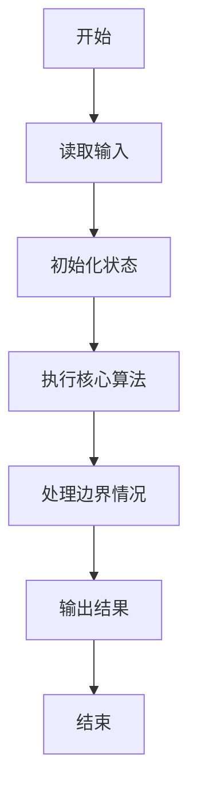
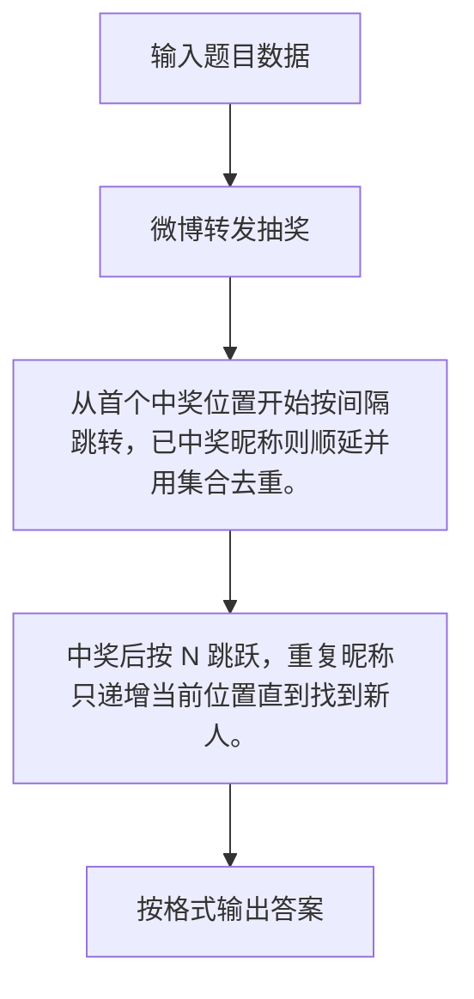

# 1069 微博转发抽奖

- **分值：** 20分

### 题目描述

小明 PAT 考了满分，高兴之余决定发起微博转发抽奖活动，从转发的网友中按顺序每隔 N 个人就发出一个红包。请你编写程序帮助他确定中奖名单。

### 输入格式：

输入第一行给出三个正整数 M（$\le$ 1000）、N 和 S，分别是转发的总量、小明决定的中奖间隔、以及第一位中奖者的序号（编号从 1 开始）。随后 M 行，顺序给出转发微博的网友的昵称（不超过 20 个字符、不包含空格回车的非空字符串）。

注意：可能有人转发多次，但不能中奖多次。所以如果处于当前中奖位置的网友已经中过奖，则跳过他顺次取下一位。

### 输出格式：

按照输入的顺序输出中奖名单，每个昵称占一行。如果没有人中奖，则输出 `Keep going...`。

### 输入样例：1
```
9 3 2
Imgonnawin!
PickMe
PickMe
LookHere
Imgonnawin!
TryAgainAgain
TryAgainAgain
Imgonnawin!
TryAgainAgain

```

### 输出样例：1
```
PickMe
Imgonnawin!
TryAgainAgain

```

### 输入样例：2
```
2 3 5
Imgonnawin!
PickMe

```

### 输出样例：2
```
Keep going...

```

**鸣谢用户 谢成星 补充数据！**


### 解题思路

从首个中奖位置开始按间隔跳转，已中奖昵称则顺延并用集合去重。 中奖后按 N 跳跃，重复昵称只递增当前位置直到找到新人。

实现时按照题目的输入顺序读取数据，使用与数据规模匹配的数据结构保存必要状态，在遍历或模拟过程中完成核心计算，最后严格按照输出格式生成答案。

### 代码流程说明

1. 读取题目输入，初始化计数器、数组、集合或其他辅助状态。
2. 从首个中奖位置开始按间隔跳转，已中奖昵称则顺延并用集合去重。
3. 中奖后按 N 跳跃，重复昵称只递增当前位置直到找到新人。
4. 根据题目要求处理边界情况，并输出最终结果。

时间复杂度为 O(M)，空间复杂度主要取决于输入数据和辅助状态，通常为 O(1) 到 O(n)。

### 代码实现

以下是本题对应的完整 C++17 实现：

```cpp
#include <bits/stdc++.h>
using namespace std;
// 算法原理：从首个中奖位置开始按间隔跳转，已中奖昵称则顺延并用集合去重。
// 关键步骤：中奖后按 N 跳跃，重复昵称只递增当前位置直到找到新人。
int main() {
    int m, n, s;
    cin >> m >> n >> s;
    vector<string> a(m);
    for (auto &x : a)
        cin >> x;
    set<string> used;
    bool any = false;
    for (int i = s - 1; i < m;) {
        if (!used.count(a[i])) {
            cout << a[i] << '\n';
            used.insert(a[i]);
            any = true;
            i += n;
        } else
            ++i;
    }
    if (!any)
        cout << "Keep going...";
}
```

### 代码流程图



### 解题流程图



### 常见易错点

- 注意输入规模，超大整数、长字符串或链表地址不能简单依赖普通整数和下标。
- 严格区分题目中的边界条件，例如是否包含等号、是否需要保留前导零以及是否只处理完整区块。
- 输出时按照题目规定的空格、换行、大小写和小数位数格式，避免计算正确但格式错误。
