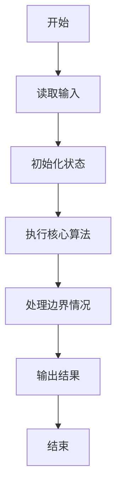
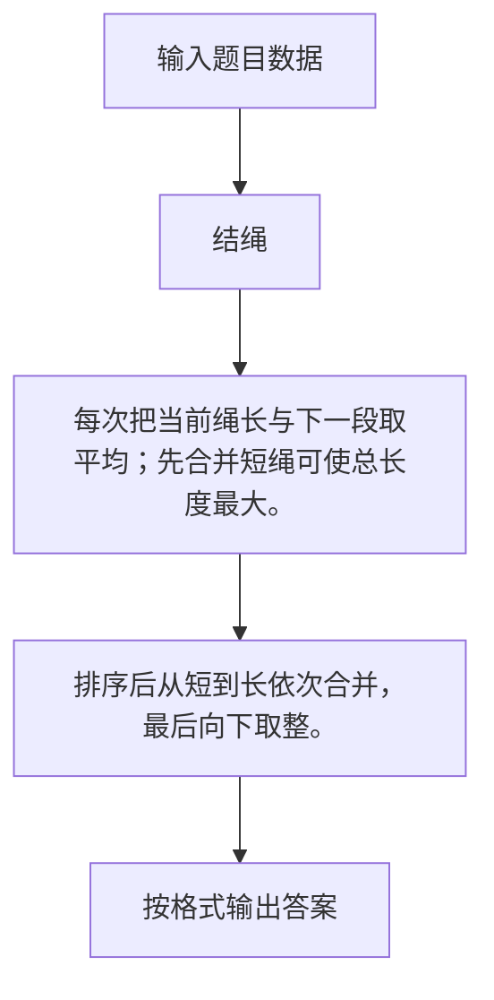

# 1070 结绳

- **分值：** 25分

### 题目描述

给定一段一段的绳子，你需要把它们串成一条绳。每次串连的时候，是把两段绳子对折，再如下图所示套接在一起。这样得到的绳子又被当成是另一段绳子，可以再次对折去跟另一段绳子串连。每次串连后，原来两段绳子的长度就会减半。


给定 $N$ 段绳子的长度，你需要找出它们能串成的绳子的最大长度。

### 输入格式：

每个输入包含 1 个测试用例。每个测试用例第 1 行给出正整数 $N$ ($2 \le N \le 10^4$)；第 2 行给出 $N$ 个正整数，即原始绳段的长度，数字间以空格分隔。所有整数都不超过$10^4$。

### 输出格式：

在一行中输出能够串成的绳子的最大长度。结果向下取整，即取为不超过最大长度的最近整数。

### 输入样例：
```
8
10 15 12 3 4 13 1 15
```

### 输出样例：
```
14
```


### 解题思路

每次把当前绳长与下一段取平均；先合并短绳可使总长度最大。 排序后从短到长依次合并，最后向下取整。

实现时按照题目的输入顺序读取数据，使用与数据规模匹配的数据结构保存必要状态，在遍历或模拟过程中完成核心计算，最后严格按照输出格式生成答案。

### 代码流程说明

1. 读取题目输入，初始化计数器、数组、集合或其他辅助状态。
2. 每次把当前绳长与下一段取平均；先合并短绳可使总长度最大。
3. 排序后从短到长依次合并，最后向下取整。
4. 根据题目要求处理边界情况，并输出最终结果。

时间复杂度为 O(N log N)，空间复杂度主要取决于输入数据和辅助状态，通常为 O(1) 到 O(n)。

### 代码实现

以下是本题对应的完整 C++17 实现：

```cpp
#include <bits/stdc++.h>
using namespace std;
// 算法原理：每次把当前绳长与下一段取平均；先合并短绳可使总长度最大。
// 关键步骤：排序后从短到长依次合并，最后向下取整。
int main() {
    int n;
    cin >> n;
    vector<double> a(n);
    for (auto &x : a)
        cin >> x;
    sort(a.begin(), a.end());
    double x = a[0];
    for (int i = 1; i < n; ++i)
        x = (x + a[i]) / 2;
    cout << (int)x;
}
```

### 代码流程图



### 解题流程图



### 常见易错点

- 注意输入规模，超大整数、长字符串或链表地址不能简单依赖普通整数和下标。
- 严格区分题目中的边界条件，例如是否包含等号、是否需要保留前导零以及是否只处理完整区块。
- 输出时按照题目规定的空格、换行、大小写和小数位数格式，避免计算正确但格式错误。
