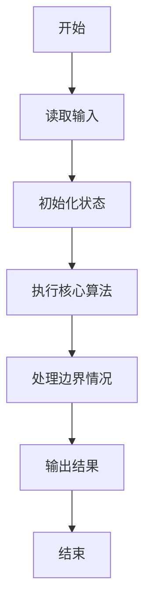
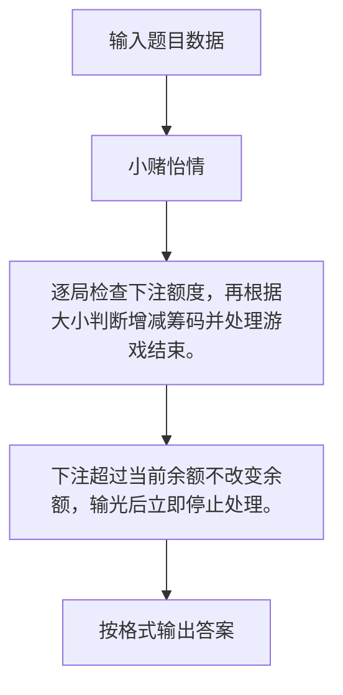

# 1071 小赌怡情

- **分值：** 15分

### 题目描述

常言道“小赌怡情”。这是一个很简单的小游戏：首先由计算机给出第一个整数；然后玩家下注赌第二个整数将会比第一个数大还是小；玩家下注 t 个筹码后，计算机给出第二个数。若玩家猜对了，则系统奖励玩家 t 个筹码；否则扣除玩家 t 个筹码。

注意：玩家下注的筹码数不能超过自己帐户上拥有的筹码数。当玩家输光了全部筹码后，游戏就结束。

### 输入格式：

输入在第一行给出 2 个正整数 T 和 K（$\le$ 100），分别是系统在初始状态下赠送给玩家的筹码数、以及需要处理的游戏次数。随后 K 行，每行对应一次游戏，顺序给出 4 个数字：
```
n1 b t n2
```
其中 `n1` 和 `n2` 是计算机先后给出的两个[0, 9]内的整数，保证两个数字不相等。`b` 为 0 表示玩家赌`小`，为 1 表示玩家赌`大`。`t` 表示玩家下注的筹码数，保证在整型范围内。

### 输出格式：

对每一次游戏，根据下列情况对应输出（其中 `t` 是玩家下注量，`x` 是玩家当前持有的筹码量）：

- 玩家赢，输出 `Win t!  Total = x.`；
- 玩家输，输出 `Lose t.  Total = x.`；
- 玩家下注超过持有的筹码量，输出 `Not enough tokens.  Total = x.`；
- 玩家输光后，输出 `Game Over.` 并结束程序。

### 输入样例：1
```
100 4
8 0 100 2
3 1 50 1
5 1 200 6
7 0 200 8
```

### 输出样例：1
```
Win 100!  Total = 200.
Lose 50.  Total = 150.
Not enough tokens.  Total = 150.
Not enough tokens.  Total = 150.
```

### 输入样例：2
```
100 4
8 0 100 2
3 1 200 1
5 1 200 6
7 0 200 8
```

### 输出样例：2
```
Win 100!  Total = 200.
Lose 200.  Total = 0.
Game Over.
```


### 解题思路

逐局检查下注额度，再根据大小判断增减筹码并处理游戏结束。 下注超过当前余额不改变余额，输光后立即停止处理。

实现时按照题目的输入顺序读取数据，使用与数据规模匹配的数据结构保存必要状态，在遍历或模拟过程中完成核心计算，最后严格按照输出格式生成答案。

### 代码流程说明

1. 读取题目输入，初始化计数器、数组、集合或其他辅助状态。
2. 逐局检查下注额度，再根据大小判断增减筹码并处理游戏结束。
3. 下注超过当前余额不改变余额，输光后立即停止处理。
4. 根据题目要求处理边界情况，并输出最终结果。

时间复杂度为 O(K)，空间复杂度主要取决于输入数据和辅助状态，通常为 O(1) 到 O(n)。

### 代码实现

以下是本题对应的完整 C++17 实现：

```cpp
#include <bits/stdc++.h>
using namespace std;
// 算法原理：逐局检查下注额度，再根据大小判断增减筹码并处理游戏结束。
// 关键步骤：下注超过当前余额不改变余额，输光后立即停止处理。
int main() {
    int total, k;
    cin >> total >> k;
    while (k--) {
        int n1, b, t, n2;
        cin >> n1 >> b >> t >> n2;
        if (!total) {
            cout << "Game Over.";
            break;
        }
        if (t > total) {
            cout << "Not enough tokens.  Total = " << total << '.';
        } else if ((n2 > n1) == b) {
            total += t;
            cout << "Win " << t << "!  Total = " << total << '.';
        } else {
            total -= t;
            cout << "Lose " << t << ".  Total = " << total << '.';
        }
        if (k)
            cout << '\n';
    }
}
```

### 代码流程图



### 解题流程图



### 常见易错点

- 注意输入规模，超大整数、长字符串或链表地址不能简单依赖普通整数和下标。
- 严格区分题目中的边界条件，例如是否包含等号、是否需要保留前导零以及是否只处理完整区块。
- 输出时按照题目规定的空格、换行、大小写和小数位数格式，避免计算正确但格式错误。
