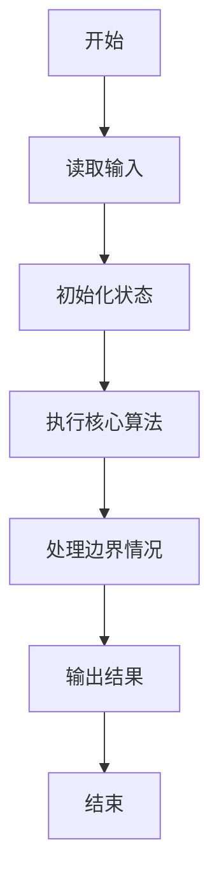
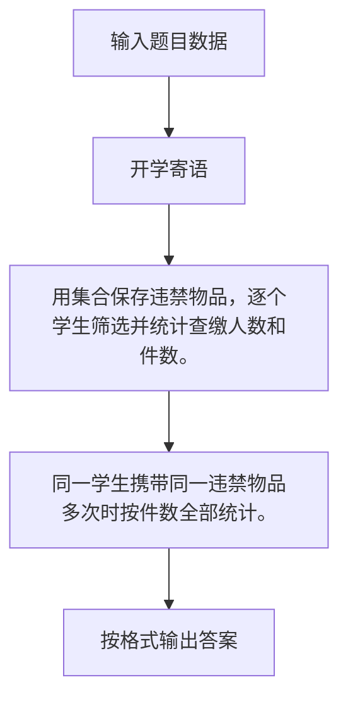

# 1072 开学寄语

- **分值：** 20分

### 题目描述

下图是上海某校的新学期开学寄语：天将降大任于斯人也，必先删其微博，卸其 QQ，封其电脑，夺其手机，收其 ipad，断其 wifi，使其百无聊赖，然后，净面、理发、整衣，然后思过、读书、锻炼、明智、开悟、精进。而后必成大器也！


本题要求你写个程序帮助这所学校的老师检查所有学生的物品，以助其成大器。

### 输入格式：

输入第一行给出两个正整数 N（$\le$ 1000）和 M（$\le$ 6），分别是学生人数和需要被查缴的物品种类数。第二行给出 M 个需要被查缴的物品编号，其中编号为 4 位数字。随后 N 行，每行给出一位学生的姓名缩写（由 1-4 个大写英文字母组成）、个人物品数量 K（0 $\le$ K $\le$ 10）、以及 K 个物品的编号。

### 输出格式：

顺次检查每个学生携带的物品，如果有需要被查缴的物品存在，则按以下格式输出该生的信息和其需要被查缴的物品的信息（注意行末不得有多余空格）：
```
姓名缩写: 物品编号1 物品编号2 ……
```
最后一行输出存在问题的学生的总人数和被查缴物品的总数。

### 输入样例：
```
4 2
2333 6666
CYLL 3 1234 2345 3456
U 4 9966 6666 8888 6666
GG 2 2333 7777
JJ 3 0012 6666 2333
```

### 输出样例：
```
U: 6666 6666
GG: 2333
JJ: 6666 2333
3 5
```


### 解题思路

用集合保存违禁物品，逐个学生筛选并统计查缴人数和件数。 同一学生携带同一违禁物品多次时按件数全部统计。

实现时按照题目的输入顺序读取数据，使用与数据规模匹配的数据结构保存必要状态，在遍历或模拟过程中完成核心计算，最后严格按照输出格式生成答案。

### 代码流程说明

1. 读取题目输入，初始化计数器、数组、集合或其他辅助状态。
2. 用集合保存违禁物品，逐个学生筛选并统计查缴人数和件数。
3. 同一学生携带同一违禁物品多次时按件数全部统计。
4. 根据题目要求处理边界情况，并输出最终结果。

时间复杂度为 O(物品总数)，空间复杂度主要取决于输入数据和辅助状态，通常为 O(1) 到 O(n)。

### 代码实现

以下是本题对应的完整 C++17 实现：

```cpp
#include <bits/stdc++.h>
using namespace std;
// 算法原理：用集合保存违禁物品，逐个学生筛选并统计查缴人数和件数。
// 关键步骤：同一学生携带同一违禁物品多次时按件数全部统计。
int main() {
    int n, m;
    cin >> n >> m;
    set<string> x;
    for (int i = 0; i < m; ++i) {
        string s;
        cin >> s;
        x.insert(s);
    }
    int stu = 0, item = 0;
    for (int i = 0; i < n; ++i) {
        string name;
        int k;
        cin >> name >> k;
        vector<string> bad;
        while (k--) {
            string s;
            cin >> s;
            if (x.count(s))
                bad.push_back(s);
        }
        if (!bad.empty()) {
            ++stu;
            item += bad.size();
            cout << name << ":";
            for (auto &s : bad)
                cout << ' ' << s;
            cout << '\n';
        }
    }
    cout << stu << ' ' << item;
}
```

### 代码流程图



### 解题流程图



### 常见易错点

- 注意输入规模，超大整数、长字符串或链表地址不能简单依赖普通整数和下标。
- 严格区分题目中的边界条件，例如是否包含等号、是否需要保留前导零以及是否只处理完整区块。
- 输出时按照题目规定的空格、换行、大小写和小数位数格式，避免计算正确但格式错误。
