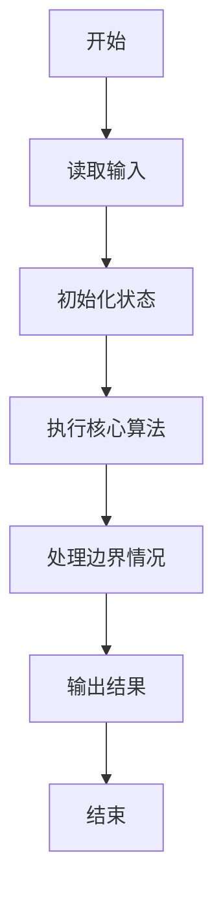
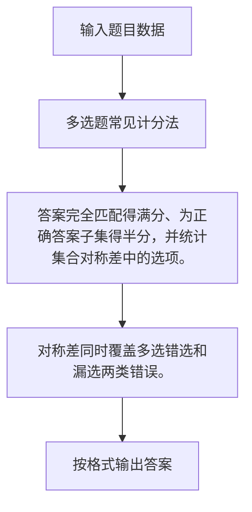

# 1073 多选题常见计分法

- **分值：** 20分

### 题目描述

批改多选题是比较麻烦的事情，有很多不同的计分方法。有一种最常见的计分方法是：如果考生选择了部分正确选项，并且没有选择任何错误选项，则得到 50% 分数；如果考生选择了任何一个错误的选项，则不能得分。本题就请你写个程序帮助老师批改多选题，并且指出哪道题的哪个选项错的人最多。

### 输入格式：

输入在第一行给出两个正整数 N（$\le$1000）和 M（$\le$100），分别是学生人数和多选题的个数。随后 M 行，每行顺次给出一道题的满分值（不超过 5 的正整数）、选项个数（不少于 2 且不超过 5 的正整数）、正确选项个数（不超过选项个数的正整数）、所有正确选项。注意每题的选项从小写英文字母 a 开始顺次排列。各项间以 1 个空格分隔。最后 N 行，每行给出一个学生的答题情况，其每题答案格式为 `(选中的选项个数 选项1 ……)`，按题目顺序给出。注意：题目保证学生的答题情况是合法的，即不存在选中的选项数超过实际选项数的情况。另一方面，题目也保证`选中的选项个数`是正整数。

### 输出格式：

按照输入的顺序给出每个学生的得分，每个分数占一行，输出小数点后 1 位。最后输出错得最多的题目选项的信息，格式为：`错误次数 题目编号（题目按照输入的顺序从1开始编号）-选项号`。如果有并列，则每行一个选项，按题目编号递增顺序输出；再并列则按选项号递增顺序输出。行首尾不得有多余空格。如果所有题目都没有人错，则在最后一行输出 `Too simple`。

### 输入样例：1
```
3 4
3 4 2 a c
2 5 1 b
5 3 2 b c
1 5 4 a b d e
(2 a c) (3 b d e) (2 a c) (3 a b e)
(2 a c) (1 b) (2 a b) (4 a b d e)
(2 b d) (1 e) (1 c) (4 a b c d)
```

### 输出样例：1
```
3.5
6.0
2.5
2 2-e
2 3-a
2 3-b
```

### 输入样例：2
```
2 2
3 4 2 a c
2 5 1 b
(2 a c) (1 b)
(2 a c) (1 b)
```

### 输出样例：2
```
5.0
5.0
Too simple
```

**感谢温州大学虞铭财老师补充题面说明！**


### 解题思路

答案完全匹配得满分、为正确答案子集得半分，并统计集合对称差中的选项。 对称差同时覆盖多选错选和漏选两类错误。

实现时按照题目的输入顺序读取数据，使用与数据规模匹配的数据结构保存必要状态，在遍历或模拟过程中完成核心计算，最后严格按照输出格式生成答案。

### 代码流程说明

1. 读取题目输入，初始化计数器、数组、集合或其他辅助状态。
2. 答案完全匹配得满分、为正确答案子集得半分，并统计集合对称差中的选项。
3. 对称差同时覆盖多选错选和漏选两类错误。
4. 根据题目要求处理边界情况，并输出最终结果。

时间复杂度为 O(NM)，空间复杂度主要取决于输入数据和辅助状态，通常为 O(1) 到 O(n)。

### 代码实现

以下是本题对应的完整 C++17 实现：

```cpp
#include <bits/stdc++.h>
using namespace std;
// 算法原理：答案完全匹配得满分、为正确答案子集得半分，并统计集合对称差中的选项。
// 关键步骤：对称差同时覆盖多选错选和漏选两类错误。
int main() {
    int n, m;
    cin >> n >> m;
    vector<int> score(m);
    vector<set<char>> key(m);
    vector<vector<int>> bad(m, vector<int>(5));
    for (int i = 0; i < m; ++i) {
        int full, num, k;
        cin >> full >> num >> k;
        score[i] = full;
        while (k--) {
            char c;
            cin >> c;
            key[i].insert(c);
        }
    }
    for (int i = 0; i < n; ++i) {
        double total = 0;
        for (int j = 0; j < m; ++j) {
            char ch;
            int k;
            cin >> ch >> k;
            set<char> x;
            while (k--) {
                cin >> ch;
                x.insert(ch);
            }
            cin >> ch;
            for (char c : x)
                if (!key[j].count(c))
                    ++bad[j][c - 'a'];
            for (char c : key[j])
                if (!x.count(c))
                    ++bad[j][c - 'a'];
            if (x == key[j])
                total += score[j];
            else if (includes(key[j].begin(), key[j].end(), x.begin(), x.end()))
                total += score[j] / 2.0;
        }
        cout << fixed << setprecision(1) << total << '\n';
    }
    int mx = 0;
    for (auto &v : bad)
        for (int x : v)
            mx = max(mx, x);
    if (!mx)
        cout << "Too simple";
    else {
        bool first = true;
        for (int i = 0; i < m; ++i)
            for (int j = 0; j < 5; ++j)
                if (bad[i][j] == mx) {
                    if (!first)
                        cout << '\n';
                    cout << mx << ' ' << i + 1 << '-' << char('a' + j);
                    first = false;
                }
    }
}
```

### 代码流程图



### 解题流程图



### 常见易错点

- 注意输入规模，超大整数、长字符串或链表地址不能简单依赖普通整数和下标。
- 严格区分题目中的边界条件，例如是否包含等号、是否需要保留前导零以及是否只处理完整区块。
- 输出时按照题目规定的空格、换行、大小写和小数位数格式，避免计算正确但格式错误。
