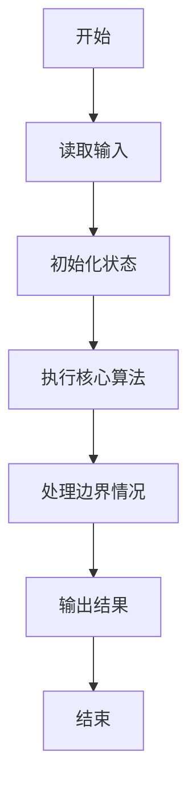
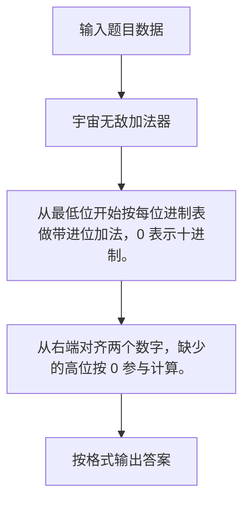

# 1074 宇宙无敌加法器

- **分值：** 20分

### 题目描述

地球人习惯使用十进制数，并且默认一个数字的每一位都是十进制的。而在 PAT 星人开挂的世界里，每个数字的每一位都是不同进制的，这种神奇的数字称为“PAT数”。每个 PAT 星人都必须熟记各位数字的进制表，例如“……0527”就表示最低位是 7 进制数、第 2 位是 2 进制数、第 3 位是 5 进制数、第 4 位是 10 进制数，等等。每一位的进制 d 或者是 0（表示十进制）、或者是 [2，9] 区间内的整数。理论上这个进制表应该包含无穷多位数字，但从实际应用出发，PAT 星人通常只需要记住前 20 位就够用了，以后各位默认为 10 进制。

在这样的数字系统中，即使是简单的加法运算也变得不简单。例如对应进制表“0527”，该如何计算“6203 + 415”呢？我们得首先计算最低位：3 + 5 = 8；因为最低位是 7 进制的，所以我们得到 1 和 1 个进位。第 2 位是：0 + 1 + 1（进位）= 2；因为此位是 2 进制的，所以我们得到 0 和 1 个进位。第 3 位是：2 + 4 + 1（进位）= 7；因为此位是 5 进制的，所以我们得到 2 和 1 个进位。第 4 位是：6 + 1（进位）= 7；因为此位是 10 进制的，所以我们就得到 7。最后我们得到：6203 + 415 = 7201。

### 输入格式：

输入首先在第一行给出一个 N 位的进制表（0 $<$ N $\le$ 20），以回车结束。 随后两行，每行给出一个不超过 N 位的非负的 PAT 数。

### 输出格式：

在一行中输出两个 PAT 数之和。

### 输入样例：
```
30527
06203
415
```

### 输出样例：
```
7201
```


### 解题思路

从最低位开始按每位进制表做带进位加法，0 表示十进制。 从右端对齐两个数字，缺少的高位按 0 参与计算。

实现时按照题目的输入顺序读取数据，使用与数据规模匹配的数据结构保存必要状态，在遍历或模拟过程中完成核心计算，最后严格按照输出格式生成答案。

### 代码流程说明

1. 读取题目输入，初始化计数器、数组、集合或其他辅助状态。
2. 从最低位开始按每位进制表做带进位加法，0 表示十进制。
3. 从右端对齐两个数字，缺少的高位按 0 参与计算。
4. 根据题目要求处理边界情况，并输出最终结果。

时间复杂度为 O(L)，空间复杂度主要取决于输入数据和辅助状态，通常为 O(1) 到 O(n)。

### 代码实现

以下是本题对应的完整 C++17 实现：

```cpp
#include <bits/stdc++.h>
using namespace std;
// 算法原理：从最低位开始按每位进制表做带进位加法，0 表示十进制。
// 关键步骤：从右端对齐两个数字，缺少的高位按 0 参与计算。
int val(char c) { return isdigit((unsigned char)c) ? c - '0' : c - 'a' + 10; }
char enc(int x) { return x < 10 ? '0' + x : 'a' + x - 10; }
int main() {
    string base, a, b;
    cin >> base >> a >> b;
    int n = base.size(), L = max(a.size(), b.size());
    a = string(L - a.size(), '0') + a;
    b = string(L - b.size(), '0') + b;
    string r;
    int carry = 0;
    for (int i = 0; i < L; ++i) {
        int p = L - 1 - i, z = val(a[p]) + val(b[p]) + carry,
            rad = i < n ? base[n - 1 - i] - '0' : 10;
        if (rad == 0)
            rad = 10;
        r += enc(z % rad);
        carry = z / rad;
    }
    if (carry)
        r += enc(carry);
    reverse(r.begin(), r.end());
    auto p = r.find_first_not_of('0');
    cout << (p == string::npos ? "0" : r.substr(p));
}
```

### 代码流程图



### 解题流程图



### 常见易错点

- 注意输入规模，超大整数、长字符串或链表地址不能简单依赖普通整数和下标。
- 严格区分题目中的边界条件，例如是否包含等号、是否需要保留前导零以及是否只处理完整区块。
- 输出时按照题目规定的空格、换行、大小写和小数位数格式，避免计算正确但格式错误。
