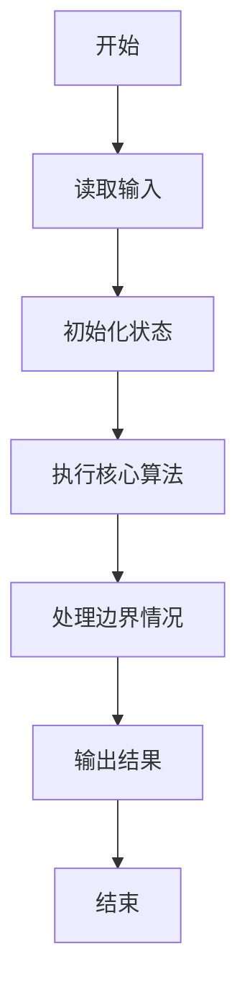
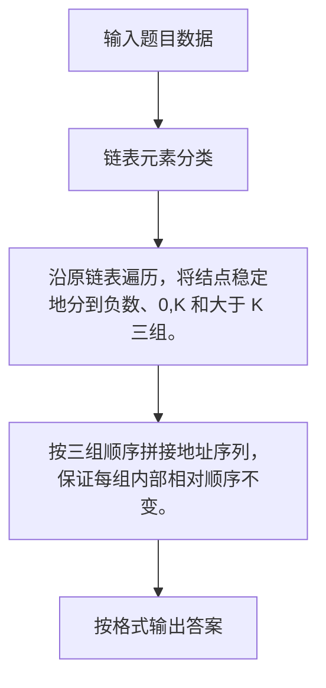

# 1075 链表元素分类

- **分值：** 25分

### 题目描述

给定一个单链表，请编写程序将链表元素进行分类排列，使得所有负值元素都排在非负值元素的前面，而 [0, K] 区间内的元素都排在大于 K 的元素前面。但每一类内部元素的顺序是不能改变的。例如：给定链表为 18→7→-4→0→5→-6→10→11→-2，K 为 10，则输出应该为 -4→-6→-2→7→0→5→10→18→11。

### 输入格式：

每个输入包含一个测试用例。每个测试用例第 1 行给出：第 1 个结点的地址；结点总个数，即正整数N ($\le 10^5$)；以及正整数K ($\le 10^3$)。结点的地址是 5 位非负整数，NULL 地址用 $-1$ 表示。

接下来有 N 行，每行格式为：
```
Address Data Next
```
其中 `Address` 是结点地址；`Data` 是该结点保存的数据，为 $[-10^5, 10^5]$ 区间内的整数；`Next` 是下一结点的地址。题目保证给出的链表不为空。

### 输出格式：

对每个测试用例，按链表从头到尾的顺序输出重排后的结果链表，其上每个结点占一行，格式与输入相同。

### 输入样例：
```
00100 9 10
23333 10 27777
00000 0 99999
00100 18 12309
68237 -6 23333
33218 -4 00000
48652 -2 -1
99999 5 68237
27777 11 48652
12309 7 33218
```

### 输出样例：
```
33218 -4 68237
68237 -6 48652
48652 -2 12309
12309 7 00000
00000 0 99999
99999 5 23333
23333 10 00100
00100 18 27777
27777 11 -1
```


### 解题思路

沿原链表遍历，将结点稳定地分到负数、0,K 和大于 K 三组。 按三组顺序拼接地址序列，保证每组内部相对顺序不变。

实现时按照题目的输入顺序读取数据，使用与数据规模匹配的数据结构保存必要状态，在遍历或模拟过程中完成核心计算，最后严格按照输出格式生成答案。

### 代码流程说明

1. 读取题目输入，初始化计数器、数组、集合或其他辅助状态。
2. 沿原链表遍历，将结点稳定地分到负数、0,K 和大于 K 三组。
3. 按三组顺序拼接地址序列，保证每组内部相对顺序不变。
4. 根据题目要求处理边界情况，并输出最终结果。

时间复杂度为 O(N)，空间复杂度主要取决于输入数据和辅助状态，通常为 O(1) 到 O(n)。

### 代码实现

以下是本题对应的完整 C++17 实现：

```cpp
#include <bits/stdc++.h>
using namespace std;
// 算法原理：沿原链表遍历，将结点稳定地分到负数、[0,K] 和大于 K 三组。
// 关键步骤：按三组顺序拼接地址序列，保证每组内部相对顺序不变。
struct N {
    int d, n;
};
string adr(int x) {
    if (x < 0)
        return "-1";
    ostringstream o;
    o << setw(5) << setfill('0') << x;
    return o.str();
}
int main() {
    int h, n, k;
    cin >> h >> n >> k;
    vector<N> a(100000);
    for (int i = 0, x; i < n; ++i) {
        cin >> x >> a[x].d >> a[x].n;
    }
    vector<int> v[3];
    for (int x = h; x != -1; x = a[x].n)
        v[a[x].d < 0 ? 0 : a[x].d <= k ? 1 : 2].push_back(x);
    vector<int> o;
    for (auto &z : v)
        o.insert(o.end(), z.begin(), z.end());
    for (int i = 0; i < (int)o.size(); ++i)
        cout << adr(o[i]) << ' ' << a[o[i]].d << ' ' << adr(i + 1 < (int)o.size() ? o[i + 1] : -1)
             << '\n';
}
```

### 代码流程图



### 解题流程图



### 常见易错点

- 注意输入规模，超大整数、长字符串或链表地址不能简单依赖普通整数和下标。
- 严格区分题目中的边界条件，例如是否包含等号、是否需要保留前导零以及是否只处理完整区块。
- 输出时按照题目规定的空格、换行、大小写和小数位数格式，避免计算正确但格式错误。
