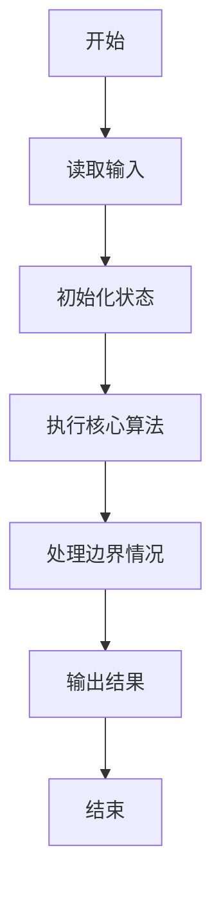
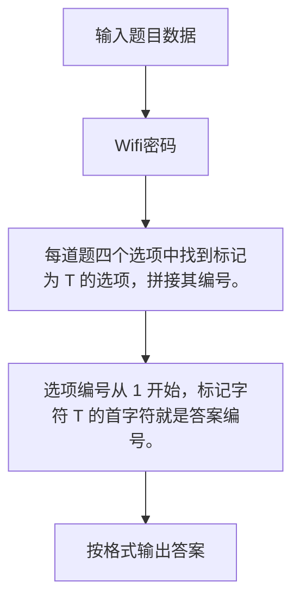

# 1076 Wifi密码

- **分值：** 15分

### 题目描述

下面是微博上流传的一张照片：“各位亲爱的同学们，鉴于大家有时需要使用 wifi，又怕耽误亲们的学习，现将 wifi 密码设置为下列数学题答案：A-1；B-2；C-3；D-4；请同学们自己作答，每两日一换。谢谢合作！！~”—— 老师们为了促进学生学习也是拼了…… 本题就要求你写程序把一系列题目的答案按照卷子上给出的对应关系翻译成 wifi 的密码。这里简单假设每道选择题都有 4 个选项，有且只有 1 个正确答案。


### 输入格式：

输入第一行给出一个正整数 N（$\le$ 100），随后 N 行，每行按照 `编号-答案` 的格式给出一道题的 4 个选项，`T` 表示正确选项，`F` 表示错误选项。选项间用空格分隔。

### 输出格式：

在一行中输出 wifi 密码。

### 输入样例：
```
8
A-T B-F C-F D-F
C-T B-F A-F D-F
A-F D-F C-F B-T
B-T A-F C-F D-F
B-F D-T A-F C-F
A-T C-F B-F D-F
D-T B-F C-F A-F
C-T A-F B-F D-F
```

### 输出样例：
```
13224143
```


### 解题思路

每道题四个选项中找到标记为 T 的选项，拼接其编号。 选项编号从 1 开始，标记字符 T 的首字符就是答案编号。

实现时按照题目的输入顺序读取数据，使用与数据规模匹配的数据结构保存必要状态，在遍历或模拟过程中完成核心计算，最后严格按照输出格式生成答案。

### 代码流程说明

1. 读取题目输入，初始化计数器、数组、集合或其他辅助状态。
2. 每道题四个选项中找到标记为 T 的选项，拼接其编号。
3. 选项编号从 1 开始，标记字符 T 的首字符就是答案编号。
4. 根据题目要求处理边界情况，并输出最终结果。

时间复杂度为 O(N)，空间复杂度主要取决于输入数据和辅助状态，通常为 O(1) 到 O(n)。

### 代码实现

以下是本题对应的完整 C++17 实现：

```cpp
#include <bits/stdc++.h>
using namespace std;
// 算法原理：每道题四个选项中找到标记为 T 的选项，拼接其编号。
// 关键步骤：选项编号从 1 开始，标记字符 T 的首字符就是答案编号。
int main() {
    int n;
    cin >> n;
    for (int i = 0; i < n; ++i) {
        for (int j = 0; j < 4; ++j) {
            string s;
            cin >> s;
            if (s.back() == 'T')
                cout << s[0] - 'A' + 1;
        }
    }
}
```

### 代码流程图



### 解题流程图



### 常见易错点

- 注意输入规模，超大整数、长字符串或链表地址不能简单依赖普通整数和下标。
- 严格区分题目中的边界条件，例如是否包含等号、是否需要保留前导零以及是否只处理完整区块。
- 输出时按照题目规定的空格、换行、大小写和小数位数格式，避免计算正确但格式错误。
