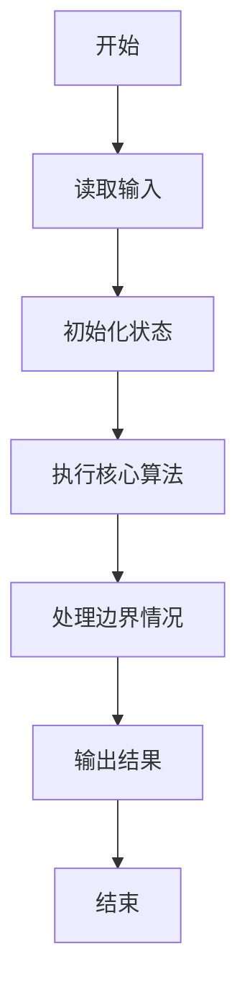
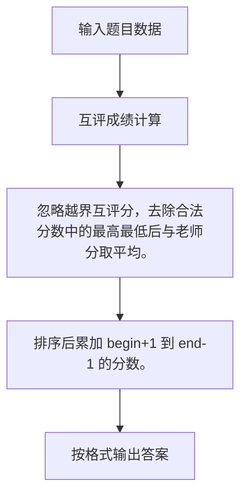

# 1077 互评成绩计算

- **分值：** 20分

### 题目描述

在浙大的计算机专业课中，经常有互评分组报告这个环节。一个组上台介绍自己的工作，其他组在台下为其表现评分。最后这个组的互评成绩是这样计算的：所有其他组的评分中，去掉一个最高分和一个最低分，剩下的分数取平均分记为 $G_1$；老师给这个组的评分记为 $G_2$。该组得分为 $(G_1+G_2)/2$，最后结果四舍五入后保留整数分。本题就要求你写个程序帮助老师计算每个组的互评成绩。

### 输入格式：

输入第一行给出两个正整数 $N$（$>$ 3）和 $M$，分别是分组数和满分，均不超过 100。随后 $N$ 行，每行给出该组得到的 $N$ 个分数（均保证为整型范围内的整数），其中第 1 个是老师给出的评分，后面 $N-1$ 个是其他组给的评分。合法的输入应该是 $[0, M]$ 区间内的整数，若不在合法区间内，则该分数须被忽略。题目保证老师的评分都是合法的，并且每个组至少会有 3 个来自同学的合法评分。

### 输出格式：

为每个组输出其最终得分。每个得分占一行。

### 输入样例：
```
6 50
42 49 49 35 38 41
36 51 50 28 -1 30
40 36 41 33 47 49
30 250 -25 27 45 31
48 0 0 50 50 1234
43 41 36 29 42 29
```

### 输出样例：
```
42
33
41
31
37
39
```


### 解题思路

忽略越界互评分，去除合法分数中的最高最低后与老师分取平均。 排序后累加 begin+1 到 end-1 的分数。

实现时按照题目的输入顺序读取数据，使用与数据规模匹配的数据结构保存必要状态，在遍历或模拟过程中完成核心计算，最后严格按照输出格式生成答案。

### 代码流程说明

1. 读取题目输入，初始化计数器、数组、集合或其他辅助状态。
2. 忽略越界互评分，去除合法分数中的最高最低后与老师分取平均。
3. 排序后累加 begin+1 到 end-1 的分数。
4. 根据题目要求处理边界情况，并输出最终结果。

时间复杂度为 O(N²)，空间复杂度主要取决于输入数据和辅助状态，通常为 O(1) 到 O(n)。

### 代码实现

以下是本题对应的完整 C++17 实现：

```cpp
#include <bits/stdc++.h>
using namespace std;
// 算法原理：忽略越界互评分，去除合法分数中的最高最低后与老师分取平均。
// 关键步骤：排序后累加 begin+1 到 end-1 的分数。
int main() {
    int n, m;
    cin >> n >> m;
    for (int i = 0; i < n; ++i) {
        int teacher;
        cin >> teacher;
        vector<int> a;
        for (int j = 1; j < n; ++j) {
            int x;
            cin >> x;
            if (x >= 0 && x <= m)
                a.push_back(x);
        }
        sort(a.begin(), a.end());
        double sum = accumulate(a.begin() + 1, a.end() - 1, 0.0);
        cout << lround((sum / (a.size() - 2) + teacher) / 2) << '\n';
    }
}
```

### 代码流程图



### 解题流程图



### 常见易错点

- 注意输入规模，超大整数、长字符串或链表地址不能简单依赖普通整数和下标。
- 严格区分题目中的边界条件，例如是否包含等号、是否需要保留前导零以及是否只处理完整区块。
- 输出时按照题目规定的空格、换行、大小写和小数位数格式，避免计算正确但格式错误。
