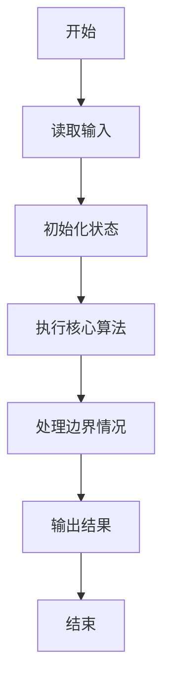
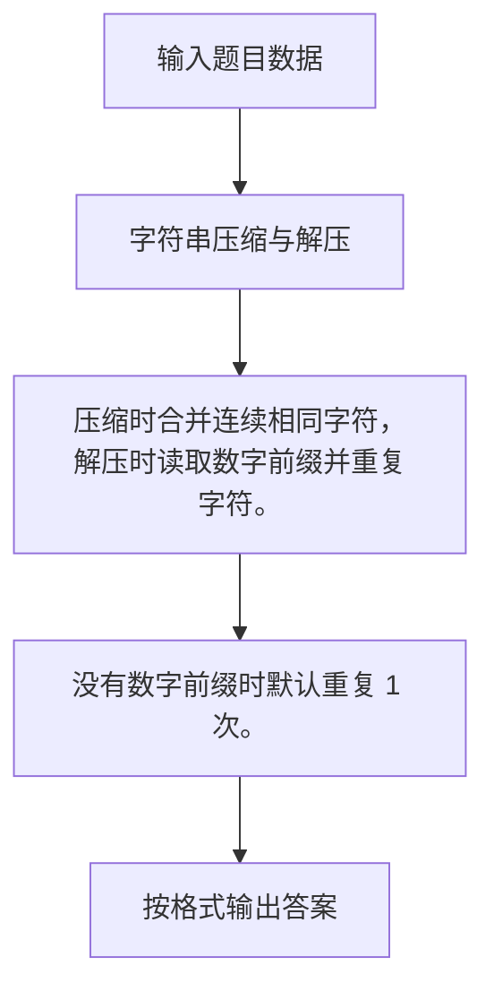

# 1078 字符串压缩与解压

- **分值：** 20分

### 题目描述

文本压缩有很多种方法，这里我们只考虑最简单的一种：把由相同字符组成的一个连续的片段用这个字符和片段中含有这个字符的个数来表示。例如 `ccccc` 就用 `5c` 来表示。如果字符没有重复，就原样输出。例如 `aba` 压缩后仍然是 `aba`。

解压方法就是反过来，把形如 `5c` 这样的表示恢复为 `ccccc`。

本题需要你根据压缩或解压的要求，对给定字符串进行处理。这里我们简单地假设原始字符串是完全由英文字母和空格组成的非空字符串。

### 输入格式：

输入第一行给出一个字符，如果是 `C` 就表示下面的字符串需要被压缩；如果是 `D` 就表示下面的字符串需要被解压。第二行给出需要被压缩或解压的不超过 1000 个字符的字符串，以回车结尾。题目保证字符重复个数在整型范围内，且输出文件不超过 1MB。

### 输出格式：

根据要求压缩或解压字符串，并在一行中输出结果。

### 输入样例：1
```
C
TTTTThhiiiis isssss a   tesssst CAaaa as
```

### 输出样例：1
```
5T2h4is i5s a3 te4st CA3a as
```

### 输入样例：2
```
D
5T2h4is i5s a3 te4st CA3a as10Z
```

### 输出样例：2
```
TTTTThhiiiis isssss a   tesssst CAaaa asZZZZZZZZZZ
```


### 解题思路

压缩时合并连续相同字符，解压时读取数字前缀并重复字符。 没有数字前缀时默认重复 1 次。

实现时按照题目的输入顺序读取数据，使用与数据规模匹配的数据结构保存必要状态，在遍历或模拟过程中完成核心计算，最后严格按照输出格式生成答案。

### 代码流程说明

1. 读取题目输入，初始化计数器、数组、集合或其他辅助状态。
2. 压缩时合并连续相同字符，解压时读取数字前缀并重复字符。
3. 没有数字前缀时默认重复 1 次。
4. 根据题目要求处理边界情况，并输出最终结果。

时间复杂度为 O(L)，空间复杂度主要取决于输入数据和辅助状态，通常为 O(1) 到 O(n)。

### 代码实现

以下是本题对应的完整 C++17 实现：

```cpp
#include <bits/stdc++.h>
using namespace std;
// 算法原理：压缩时合并连续相同字符，解压时读取数字前缀并重复字符。
// 关键步骤：没有数字前缀时默认重复 1 次。
int main() {
    char op;
    string s;
    cin >> op;
    getline(cin, s);
    getline(cin, s);
    if (op == 'C') {
        for (int i = 0; i < (int)s.size();) {
            int j = i + 1;
            while (j < (int)s.size() && s[j] == s[i])
                ++j;
            if (j - i > 1)
                cout << j - i;
            cout << s[i];
            i = j;
        }
    } else {
        for (int i = 0; i < (int)s.size();) {
            int k = 0;
            while (i < (int)s.size() && isdigit((unsigned char)s[i]))
                k = k * 10 + s[i++] - '0';
            if (i < (int)s.size()) {
                if (!k)
                    k = 1;
                cout << string(k, s[i++]);
            }
        }
    }
}
```

### 代码流程图



### 解题流程图



### 常见易错点

- 注意输入规模，超大整数、长字符串或链表地址不能简单依赖普通整数和下标。
- 严格区分题目中的边界条件，例如是否包含等号、是否需要保留前导零以及是否只处理完整区块。
- 输出时按照题目规定的空格、换行、大小写和小数位数格式，避免计算正确但格式错误。
