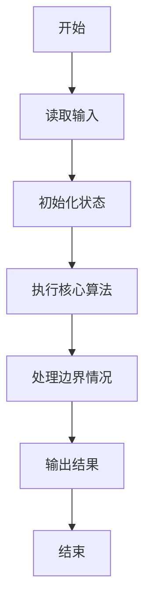
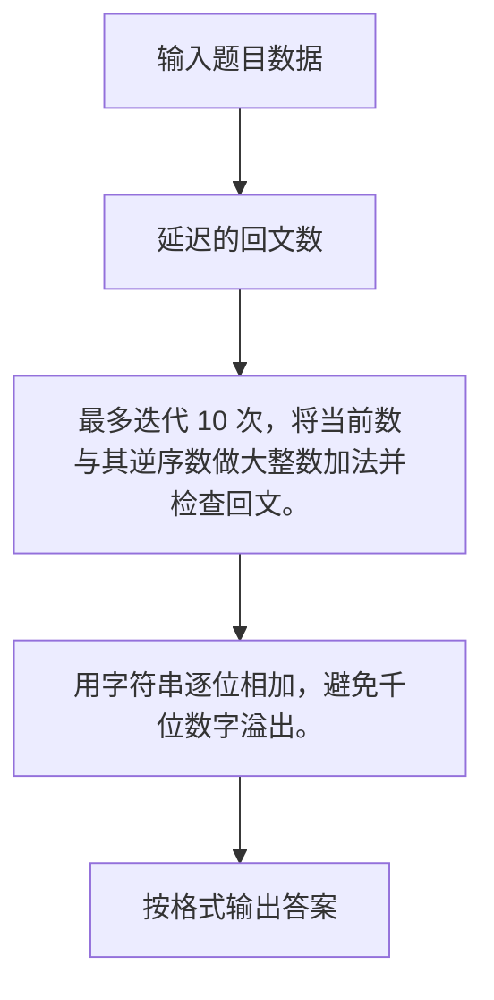

# 1079 延迟的回文数

- **分值：** 20分

### 题目描述

给定一个 $k+1$ 位的正整数 $N$，写成 $a_k \cdots a_1 a_0$ 的形式，其中对所有 $i$ 有 $0 \le a_i < 10$ 且 $a_k > 0$。$N$ 被称为一个**回文数**，当且仅当对所有 $i$ 有 $a_i = a_{k-i}$。零也被定义为一个回文数。

非回文数也可以通过一系列操作变出回文数。首先将该数字逆转，再将逆转数与该数相加，如果和还不是一个回文数，就重复这个逆转再相加的操作，直到一个回文数出现。如果一个非回文数可以变出回文数，就称这个数为**延迟的回文数**。（定义翻译自 https://en.wikipedia.org/wiki/Palindromic_number ）

给定任意一个正整数，本题要求你找到其变出的那个回文数。

### 输入格式：

输入在一行中给出一个不超过1000位的正整数。

### 输出格式：

对给定的整数，一行一行输出其变出回文数的过程。每行格式如下
```
A + B = C
```
其中 `A` 是原始的数字，`B` 是 `A` 的逆转数，`C` 是它们的和。`A` 从输入的整数开始。重复操作直到 `C` 在 10 步以内变成回文数，这时在一行中输出 `C is a palindromic number.`；或者如果 10 步都没能得到回文数，最后就在一行中输出 `Not found in 10 iterations.`。

### 输入样例：1
```
97152
```

### 输出样例：1
```
97152 + 25179 = 122331
122331 + 133221 = 255552
255552 is a palindromic number.
```

### 输入样例：2
```
196
```

### 输出样例：2
```
196 + 691 = 887
887 + 788 = 1675
1675 + 5761 = 7436
7436 + 6347 = 13783
13783 + 38731 = 52514
52514 + 41525 = 94039
94039 + 93049 = 187088
187088 + 880781 = 1067869
1067869 + 9687601 = 10755470
10755470 + 07455701 = 18211171
Not found in 10 iterations.
```


### 解题思路

最多迭代 10 次，将当前数与其逆序数做大整数加法并检查回文。 用字符串逐位相加，避免千位数字溢出。

实现时按照题目的输入顺序读取数据，使用与数据规模匹配的数据结构保存必要状态，在遍历或模拟过程中完成核心计算，最后严格按照输出格式生成答案。

### 代码流程说明

1. 读取题目输入，初始化计数器、数组、集合或其他辅助状态。
2. 最多迭代 10 次，将当前数与其逆序数做大整数加法并检查回文。
3. 用字符串逐位相加，避免千位数字溢出。
4. 根据题目要求处理边界情况，并输出最终结果。

时间复杂度为 O(10L)，空间复杂度主要取决于输入数据和辅助状态，通常为 O(1) 到 O(n)。

### 代码实现

以下是本题对应的完整 C++17 实现：

```cpp
#include <bits/stdc++.h>
using namespace std;
// 算法原理：最多迭代 10 次，将当前数与其逆序数做大整数加法并检查回文。
// 关键步骤：用字符串逐位相加，避免千位数字溢出。
string add(string a, string b) {
    int c = 0;
    string r;
    for (int i = a.size() - 1; i >= 0; --i) {
        int z = a[i] - '0' + b[i] - '0' + c;
        r += char('0' + z % 10);
        c = z / 10;
    }
    if (c)
        r += '1';
    reverse(r.begin(), r.end());
    return r;
}
bool pal(string &s) { return equal(s.begin(), s.begin() + s.size() / 2, s.rbegin()); }
int main() {
    string s;
    cin >> s;
    for (int i = 0; i <= 10; ++i) {
        if (pal(s)) {
            cout << s << " is a palindromic number.";
            return 0;
        }
        if (i == 10)
            break;
        string t = s;
        reverse(t.begin(), t.end());
        cout << s << " + " << t << " = " << (s = add(s, t)) << '\n';
    }
    cout << "Not found in 10 iterations.";
}
```

### 代码流程图



### 解题流程图



### 常见易错点

- 注意输入规模，超大整数、长字符串或链表地址不能简单依赖普通整数和下标。
- 严格区分题目中的边界条件，例如是否包含等号、是否需要保留前导零以及是否只处理完整区块。
- 输出时按照题目规定的空格、换行、大小写和小数位数格式，避免计算正确但格式错误。
