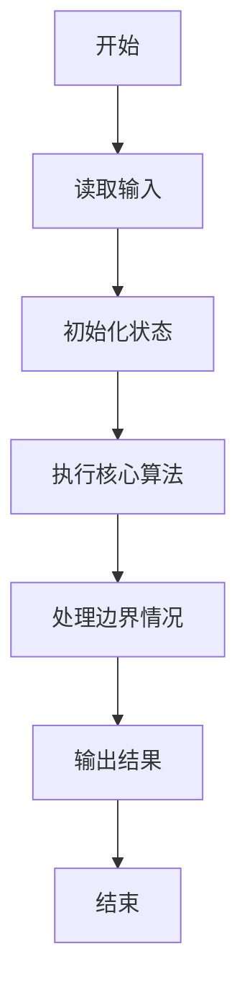
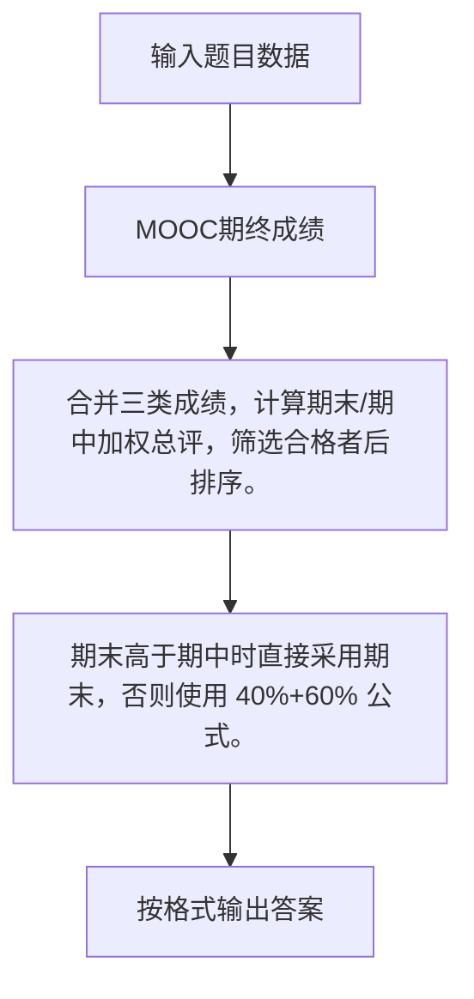

# 1080 MOOC期终成绩

- **分值：** 25分

### 题目描述

对于在中国大学MOOC（http://www.icourse163.org/ ）学习“数据结构”课程的学生，想要获得一张合格证书，必须首先获得不少于200分的在线编程作业分，然后总评获得不少于60分（满分100）。总评成绩的计算公式为 $G = (G_{mid-term}\times 40\% + G_{final}\times 60\%)$，如果 $G_{mid-term} > G_{final}$；否则总评 $G$ 就是 $G_{final}$。这里 $G_{mid-term}$ 和 $G_{final}$ 分别为学生的期中和期末成绩。

现在的问题是，每次考试都产生一张独立的成绩单。本题就请你编写程序，把不同的成绩单合为一张。

### 输入格式：

输入在第一行给出3个整数，分别是 P（做了在线编程作业的学生数）、M（参加了期中考试的学生数）、N（参加了期末考试的学生数）。每个数都不超过10000。

接下来有三块输入。第一块包含 P 个在线编程成绩 $G_p$；第二块包含 M 个期中考试成绩 $G_{mid-term}$；第三块包含 N 个期末考试成绩 $G_{final}$。每个成绩占一行，格式为：`学生学号 分数`。其中`学生学号`为不超过20个字符的英文字母和数字；`分数`是非负整数（编程总分最高为900分，期中和期末的最高分为100分）。

### 输出格式：

打印出获得合格证书的学生名单。每个学生占一行，格式为：

`学生学号` $G_p$ $G_{mid-term}$ $G_{final}$ $G$

如果有的成绩不存在（例如某人没参加期中考试），则在相应的位置输出“$-1$”。输出顺序为按照总评分数（四舍五入精确到整数）递减。若有并列，则按学号递增。题目保证学号没有重复，且至少存在1个合格的学生。

### 输入样例：
```
6 6 7
01234 880
a1903 199
ydjh2 200
wehu8 300
dx86w 220
missing 400
ydhfu77 99
wehu8 55
ydjh2 98
dx86w 88
a1903 86
01234 39
ydhfu77 88
a1903 66
01234 58
wehu8 84
ydjh2 82
missing 99
dx86w 81
```

### 输出样例：
```
missing 400 -1 99 99
ydjh2 200 98 82 88
dx86w 220 88 81 84
wehu8 300 55 84 84
```


### 解题思路

合并三类成绩，计算期末/期中加权总评，筛选合格者后排序。 期末高于期中时直接采用期末，否则使用 40%+60% 公式。

实现时按照题目的输入顺序读取数据，使用与数据规模匹配的数据结构保存必要状态，在遍历或模拟过程中完成核心计算，最后严格按照输出格式生成答案。

### 代码流程说明

1. 读取题目输入，初始化计数器、数组、集合或其他辅助状态。
2. 合并三类成绩，计算期末/期中加权总评，筛选合格者后排序。
3. 期末高于期中时直接采用期末，否则使用 40%+60% 公式。
4. 根据题目要求处理边界情况，并输出最终结果。

时间复杂度为 O((P+M+N) log(P+M+N))，空间复杂度主要取决于输入数据和辅助状态，通常为 O(1) 到 O(n)。

### 代码实现

以下是本题对应的完整 C++17 实现：

```cpp
#include <bits/stdc++.h>
using namespace std;
// 算法原理：合并三类成绩，计算期末/期中加权总评，筛选合格者后排序。
// 关键步骤：期末高于期中时直接采用期末，否则使用 40%+60% 公式。
struct S {
    string id;
    int p = -1, m = -1, f = -1, total;
};
int main() {
    int P, M, N;
    cin >> P >> M >> N;
    map<string, S> a;
    for (int i = 0; i < P; ++i) {
        string id;
        int x;
        cin >> id >> x;
        a[id].id = id;
        a[id].p = x;
    }
    for (int i = 0; i < M; ++i) {
        string id;
        int x;
        cin >> id >> x;
        a[id].id = id;
        a[id].m = x;
    }
    for (int i = 0; i < N; ++i) {
        string id;
        int x;
        cin >> id >> x;
        a[id].id = id;
        a[id].f = x;
    }
    vector<S> v;
    for (auto &[id, s] : a)
        if (s.p >= 200 && s.f >= 0) {
            s.total = round(s.m > s.f ? s.m * .4 + s.f * .6 : s.f);
            if (s.total >= 60)
                v.push_back(s);
        }
    sort(v.begin(), v.end(),
         [](S &a, S &b) { return a.total != b.total ? a.total > b.total : a.id < b.id; });
    for (auto &s : v)
        cout << s.id << ' ' << s.p << ' ' << s.m << ' ' << s.f << ' ' << s.total << '\n';
}
```

### 代码流程图



### 解题流程图



### 常见易错点

- 注意输入规模，超大整数、长字符串或链表地址不能简单依赖普通整数和下标。
- 严格区分题目中的边界条件，例如是否包含等号、是否需要保留前导零以及是否只处理完整区块。
- 输出时按照题目规定的空格、换行、大小写和小数位数格式，避免计算正确但格式错误。
