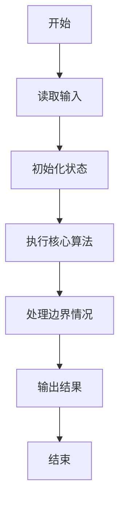
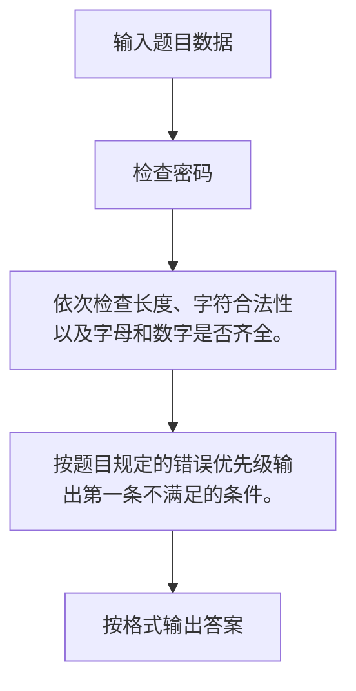

# 1081 检查密码

- **分值：** 15分

### 题目描述

本题要求你帮助某网站的用户注册模块写一个密码合法性检查的小功能。该网站要求用户设置的密码必须由不少于6个字符组成，并且只能有英文字母、数字和小数点 `.`，还必须既有字母也有数字。

### 输入格式：

输入第一行给出一个正整数 N（$\le$ 100），随后 N 行，每行给出一个用户设置的密码，为不超过 80 个字符的非空字符串，以回车结束。

**注意：** 题目保证不存在只有小数点的输入。

### 输出格式：

对每个用户的密码，在一行中输出系统反馈信息，分以下5种：

- 如果密码合法，输出`Your password is wan mei.`；
- 如果密码太短，不论合法与否，都输出`Your password is tai duan le.`；
- 如果密码长度合法，但存在不合法字符，则输出`Your password is tai luan le.`；
- 如果密码长度合法，但只有字母没有数字，则输出`Your password needs shu zi.`；
- 如果密码长度合法，但只有数字没有字母，则输出`Your password needs zi mu.`。

### 输入样例：
```
5
123s
zheshi.wodepw
1234.5678
WanMei23333
pass*word.6

```

### 输出样例：
```
Your password is tai duan le.
Your password needs shu zi.
Your password needs zi mu.
Your password is wan mei.
Your password is tai luan le.

```


### 解题思路

依次检查长度、字符合法性以及字母和数字是否齐全。按题目规定的错误优先级输出第一条不满足的条件。

实现时按照题目的输入顺序读取数据，使用与数据规模匹配的数据结构保存必要状态，在遍历或模拟过程中完成核心计算，最后严格按照输出格式生成答案。

### 代码流程说明

1. 读取题目输入，初始化计数器、数组、集合或其他辅助状态。
2. 依次检查长度、字符合法性以及字母和数字是否齐全。
3. 按题目规定的错误优先级输出第一条不满足的条件。
4. 根据题目要求处理边界情况，并输出最终结果。

时间复杂度为 O(总字符数)，空间复杂度主要取决于输入数据和辅助状态，通常为 O(1) 到 O(n)。

### 代码实现

以下是本题对应的完整 C++17 实现：

```cpp
#include <bits/stdc++.h>
using namespace std;
// 算法原理：依次检查长度、字符合法性以及字母和数字是否齐全。
// 关键步骤：按题目规定的错误优先级输出第一条不满足的条件。
int main() {
    int n;
    cin >> n;
    while (n--) {
        string s;
        cin >> s;
        bool len = s.size() >= 6 && s.size() <= 20, letter = 0, dig = 0, ok = 1;
        for (char c : s) {
            if (isalpha((unsigned char)c))
                letter = 1;
            else if (isdigit((unsigned char)c))
                dig = 1;
            else if (c == '.')
                continue;
            else
                ok = 0;
        }
        if (!len)
            cout << "Your password is tai duan le.";
        else if (!ok)
            cout << "Your password is tai luan le.";
        else if (!letter)
            cout << "Your password needs zi mu.";
        else if (!dig)
            cout << "Your password needs shu zi.";
        else
            cout << "Your password is wan mei.";
        if (n)
            cout << '\n';
    }
}
```

### 代码流程图



### 解题流程图



### 常见易错点

- 注意输入规模，超大整数、长字符串或链表地址不能简单依赖普通整数和下标。
- 严格区分题目中的边界条件，例如是否包含等号、是否需要保留前导零以及是否只处理完整区块。
- 输出时按照题目规定的空格、换行、大小写和小数位数格式，避免计算正确但格式错误。
