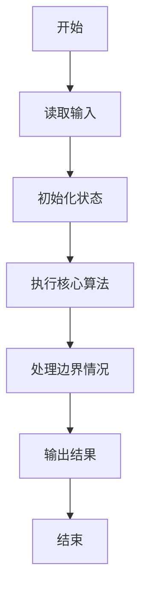
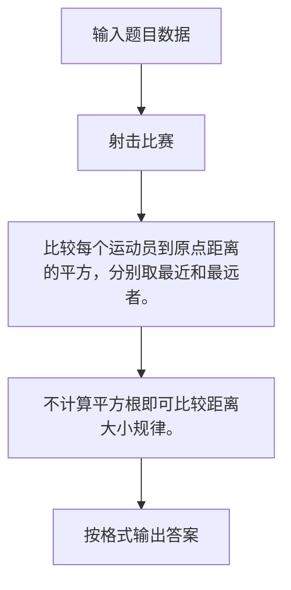

# 1082 射击比赛

- **分值：** 20分

### 题目描述

本题目给出的射击比赛的规则非常简单，谁打的弹洞距离靶心最近，谁就是冠军；谁差得最远，谁就是菜鸟。本题给出一系列弹洞的平面坐标(x,y)，请你编写程序找出冠军和菜鸟。我们假设靶心在原点(0,0)。

### 输入格式：

输入在第一行中给出一个正整数 N（$\le$ 10 000）。随后 N 行，每行按下列格式给出：

```
ID x y
```

其中 `ID` 是运动员的编号（由 4 位数字组成）；`x` 和 `y` 是其打出的弹洞的平面坐标(`x`,`y`)，均为整数，且 0 $\le$ |`x`|, |`y`| $\le$ 100。题目保证每个运动员的编号不重复，且每人只打 1 枪。

### 输出格式：

输出冠军和菜鸟的编号，中间空 1 格。题目保证他们是唯一的。

### 输入样例：
```
3
0001 5 7
1020 -1 3
0233 0 -1
```

### 输出样例：
```
0233 0001
```


### 解题思路

比较每个运动员到原点距离的平方，分别取最近和最远者。 不计算平方根即可比较距离大小规律。

实现时按照题目的输入顺序读取数据，使用与数据规模匹配的数据结构保存必要状态，在遍历或模拟过程中完成核心计算，最后严格按照输出格式生成答案。

### 代码流程说明

1. 读取题目输入，初始化计数器、数组、集合或其他辅助状态。
2. 比较每个运动员到原点距离的平方，分别取最近和最远者。
3. 不计算平方根即可比较距离大小规律。
4. 根据题目要求处理边界情况，并输出最终结果。

时间复杂度为 O(N)，空间复杂度主要取决于输入数据和辅助状态，通常为 O(1) 到 O(n)。

### 代码实现

以下是本题对应的完整 C++17 实现：

```cpp
#include <bits/stdc++.h>
using namespace std;
// 算法原理：比较每个运动员到原点距离的平方，分别取最近和最远者。
// 关键步骤：不计算平方根即可比较距离大小规律。
int main() {
    int n;
    cin >> n;
    string mn, mx;
    int lo = INT_MAX, hi = -1;
    for (int i = 0; i < n; ++i) {
        string id;
        int x, y;
        cin >> id >> x >> y;
        int z = x * x + y * y;
        if (z < lo)
            lo = z, mn = id;
        if (z > hi)
            hi = z, mx = id;
    }
    cout << mn << ' ' << mx;
}
```

### 代码流程图



### 解题流程图



### 常见易错点

- 注意输入规模，超大整数、长字符串或链表地址不能简单依赖普通整数和下标。
- 严格区分题目中的边界条件，例如是否包含等号、是否需要保留前导零以及是否只处理完整区块。
- 输出时按照题目规定的空格、换行、大小写和小数位数格式，避免计算正确但格式错误。
