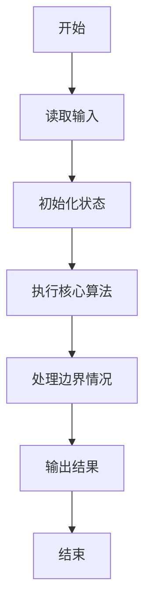
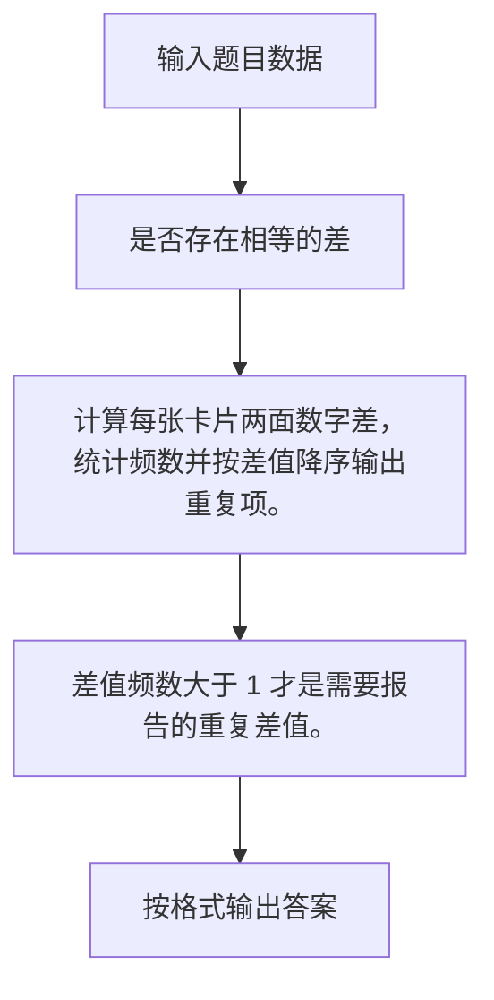

# 1083 是否存在相等的差

- **分值：** 20分

### 题目描述

给定 N 张卡片，正面分别写上 1、2、……、N，然后全部翻面，洗牌，在背面分别写上 1、2、……、N。将每张牌的正反两面数字相减（大减小），得到 N 个非负差值，其中是否存在相等的差？

### 输入格式：

输入第一行给出一个正整数 N（2 $\le$ N $\le$ 10 000），随后一行给出 1 到 N 的一个洗牌后的排列，第 i 个数表示正面写了 i 的那张卡片背面的数字。

### 输出格式：

按照“差值 重复次数”的格式从大到小输出重复的差值及其重复的次数，每行输出一个结果。

### 输入样例：
```
8
3 5 8 6 2 1 4 7
```

### 输出样例：
```
5 2
3 3
2 2
```


### 解题思路

计算每张卡片两面数字差，统计频数并按差值降序输出重复项。 差值频数大于 1 才是需要报告的重复差值。

实现时按照题目的输入顺序读取数据，使用与数据规模匹配的数据结构保存必要状态，在遍历或模拟过程中完成核心计算，最后严格按照输出格式生成答案。

### 代码流程说明

1. 读取题目输入，初始化计数器、数组、集合或其他辅助状态。
2. 计算每张卡片两面数字差，统计频数并按差值降序输出重复项。
3. 差值频数大于 1 才是需要报告的重复差值。
4. 根据题目要求处理边界情况，并输出最终结果。

时间复杂度为 O(N)，空间复杂度主要取决于输入数据和辅助状态，通常为 O(1) 到 O(n)。

### 代码实现

以下是本题对应的完整 C++17 实现：

```cpp
#include <bits/stdc++.h>
using namespace std;
// 算法原理：计算每张卡片两面数字差，统计频数并按差值降序输出重复项。
// 关键步骤：差值频数大于 1 才是需要报告的重复差值。
int main() {
    int n;
    cin >> n;
    vector<int> c(n);
    for (int i = 1, x; i <= n; ++i) {
        cin >> x;
        ++c[abs(i - x)];
    }
    bool first = true;
    for (int d = n - 1; d >= 0; --d)
        if (c[d] > 1) {
            cout << d << ' ' << c[d] << '\n';
            first = false;
        }
}
```

### 代码流程图



### 解题流程图



### 常见易错点

- 注意输入规模，超大整数、长字符串或链表地址不能简单依赖普通整数和下标。
- 严格区分题目中的边界条件，例如是否包含等号、是否需要保留前导零以及是否只处理完整区块。
- 输出时按照题目规定的空格、换行、大小写和小数位数格式，避免计算正确但格式错误。
