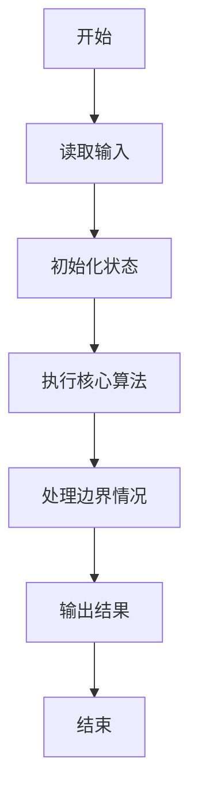
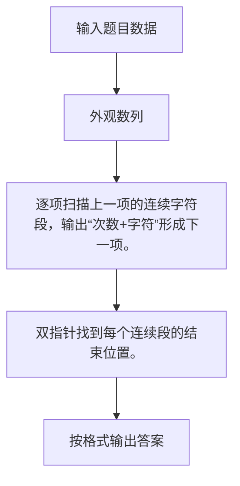

# 1084 外观数列

- **分值：** 20分

### 题目描述

外观数列是指具有以下特点的整数序列：

```
d, d1, d111, d113, d11231, d112213111, ...
```

它从不等于 1 的数字 `d` 开始，序列的第 n+1 项是对第 n 项的描述。比如第 2 项表示第 1 项有 1 个 `d`，所以就是 `d1`；第 2 项是 1 个 `d`（对应 `d1`）和 1 个 1（对应 11），所以第 3 项就是 `d111`。又比如第 4 项是 `d113`，其描述就是 1 个 `d`，2 个 1，1 个 3，所以下一项就是 `d11231`。当然这个定义对 `d` = 1 也成立。本题要求你推算任意给定数字 `d` 的外观数列的第 N 项。

### 输入格式：

输入第一行给出 [0,9] 范围内的一个整数 `d`、以及一个正整数 N（$\le$ 40），用空格分隔。

### 输出格式：

在一行中给出数字 `d` 的外观数列的第 N 项。

### 输入样例：
```
1 8
```

### 输出样例：
```
1123123111
```


### 解题思路

逐项扫描上一项的连续字符段，输出“次数+字符”形成下一项。 双指针找到每个连续段的结束位置。

实现时按照题目的输入顺序读取数据，使用与数据规模匹配的数据结构保存必要状态，在遍历或模拟过程中完成核心计算，最后严格按照输出格式生成答案。

### 代码流程说明

1. 读取题目输入，初始化计数器、数组、集合或其他辅助状态。
2. 逐项扫描上一项的连续字符段，输出“次数+字符”形成下一项。
3. 双指针找到每个连续段的结束位置。
4. 根据题目要求处理边界情况，并输出最终结果。

时间复杂度为 O(生成序列总长度)，空间复杂度主要取决于输入数据和辅助状态，通常为 O(1) 到 O(n)。

### 代码实现

以下是本题对应的完整 C++17 实现：

```cpp
#include <bits/stdc++.h>
using namespace std;
// 算法原理：逐项扫描上一项的连续字符段，输出“次数+字符”形成下一项。
// 关键步骤：双指针找到每个连续段的结束位置。
int main() {
    string s;
    int n;
    cin >> s >> n;
    while (--n) {
        string t;
        for (int i = 0; i < (int)s.size();) {
            int j = i + 1;
            while (j < (int)s.size() && s[j] == s[i])
                ++j;
            t += s[i];
            t += to_string(j - i);
            i = j;
        }
        s = t;
    }
    cout << s;
}
```

### 代码流程图



### 解题流程图



### 常见易错点

- 注意输入规模，超大整数、长字符串或链表地址不能简单依赖普通整数和下标。
- 严格区分题目中的边界条件，例如是否包含等号、是否需要保留前导零以及是否只处理完整区块。
- 输出时按照题目规定的空格、换行、大小写和小数位数格式，避免计算正确但格式错误。
