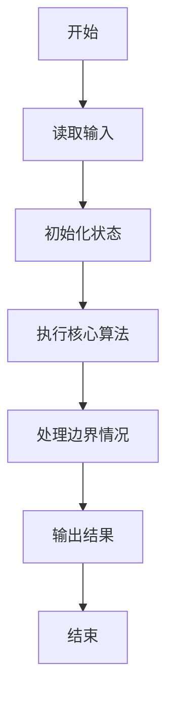
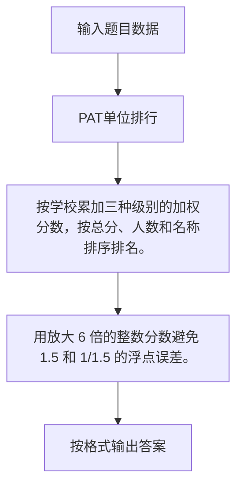

# 1085 PAT单位排行

- **分值：** 25分

### 题目描述

每次 PAT 考试结束后，考试中心都会发布一个考生单位排行榜。本题就请你实现这个功能。

### 输入格式：

输入第一行给出一个正整数 N（$\le 10^5$），即考生人数。随后 N 行，每行按下列格式给出一个考生的信息：

```
准考证号 得分 学校
```

其中`准考证号`是由 6 个字符组成的字符串，其首字母表示考试的级别：`B`代表乙级，`A`代表甲级，`T`代表顶级；`得分`是 [0, 100] 区间内的整数；`学校`是由不超过 6 个英文字母组成的单位码（大小写无关）。注意：题目保证每个考生的准考证号是不同的。

### 输出格式：

首先在一行中输出单位个数。随后按以下格式非降序输出单位的排行榜：

```
排名 学校 加权总分 考生人数
```

其中`排名`是该单位的排名（从 1 开始）；`学校`是全部按小写字母输出的单位码；`加权总分`定义为`乙级总分/1.5 + 甲级总分 + 顶级总分*1.5`的**整数部分**；`考生人数`是该属于单位的考生的总人数。

学校首先按加权总分排行。如有并列，则应对应相同的排名，并按考生人数升序输出。如果仍然并列，则按单位码的字典序输出。

### 输入样例：
```
10
A57908 85 Au
B57908 54 LanX
A37487 60 au
T28374 67 CMU
T32486 24 hypu
A66734 92 cmu
B76378 71 AU
A47780 45 lanx
A72809 100 pku
A03274 45 hypu
```

### 输出样例：
```
5
1 cmu 192 2
1 au 192 3
3 pku 100 1
4 hypu 81 2
4 lanx 81 2
```


### 解题思路

按学校累加三种级别的加权分数，按总分、人数和名称排序排名。 用放大 6 倍的整数分数避免 1.5 和 1/1.5 的浮点误差。

实现时按照题目的输入顺序读取数据，使用与数据规模匹配的数据结构保存必要状态，在遍历或模拟过程中完成核心计算，最后严格按照输出格式生成答案。

### 代码流程说明

1. 读取题目输入，初始化计数器、数组、集合或其他辅助状态。
2. 按学校累加三种级别的加权分数，按总分、人数和名称排序排名。
3. 用放大 6 倍的整数分数避免 1.5 和 1/1.5 的浮点误差。
4. 根据题目要求处理边界情况，并输出最终结果。

时间复杂度为 O(N log N)，空间复杂度主要取决于输入数据和辅助状态，通常为 O(1) 到 O(n)。

### 代码实现

以下是本题对应的完整 C++17 实现：

```cpp
#include <bits/stdc++.h>
using namespace std;
// 算法原理：按学校累加三种级别的加权分数，按总分、人数和名称排序排名。
// 关键步骤：用放大 6 倍的整数分数避免 1.5 和 1/1.5 的浮点误差。
struct S {
    string n;
    long long score;
    int cnt;
};
int main() {
    int n;
    cin >> n;
    map<string, S> a;
    for (int i = 0; i < n; ++i) {
        string id, sch;
        int x;
        cin >> id >> x >> sch;
        for (char &c : sch)
            c = tolower((unsigned char)c);
        a[sch].n = sch;
        ++a[sch].cnt;
        if (id[0] == 'B')
            a[sch].score += 4LL * x;
        else if (id[0] == 'A')
            a[sch].score += 6LL * x;
        else
            a[sch].score += 9LL * x;
    }
    vector<S> v;
    for (auto &[x, s] : a)
        v.push_back(s);
    sort(v.begin(), v.end(), [](S &a, S &b) {
        return a.score / 6 != b.score / 6 ? a.score / 6 > b.score / 6
               : a.cnt != b.cnt           ? a.cnt < b.cnt
                                          : a.n < b.n;
    });
    cout << v.size() << '\n';
    for (int i = 0, rank = 0; i < (int)v.size(); ++i) {
        if (i == 0 || v[i].score / 6 != v[i - 1].score / 6)
            rank = i + 1;
        cout << rank << ' ' << v[i].n << ' ' << v[i].score / 6 << ' ' << v[i].cnt << '\n';
    }
}
```

### 代码流程图



### 解题流程图



### 常见易错点

- 注意输入规模，超大整数、长字符串或链表地址不能简单依赖普通整数和下标。
- 严格区分题目中的边界条件，例如是否包含等号、是否需要保留前导零以及是否只处理完整区块。
- 输出时按照题目规定的空格、换行、大小写和小数位数格式，避免计算正确但格式错误。
