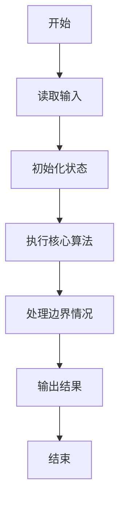
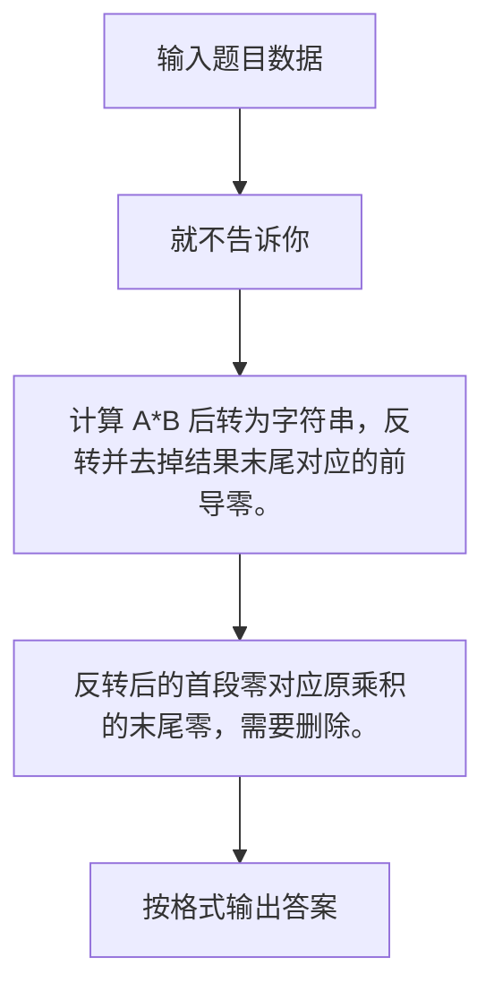

# 1086 就不告诉你

- **分值：** 15分

### 题目描述

做作业的时候，邻座的小盆友问你：“五乘以七等于多少？”你应该不失礼貌地围笑着告诉他：“五十三。”本题就要求你，对任何一对给定的正整数，倒着输出它们的乘积。


### 输入格式：

输入在第一行给出两个不超过 1000 的正整数 A 和 B，其间以空格分隔。

### 输出格式：

在一行中倒着输出 A 和 B 的乘积。

### 输入样例：
```
5 7
```

### 输出样例：
```
53
```


### 解题思路

计算 A*B 后转为字符串，反转并去掉结果末尾对应的前导零。 反转后的首段零对应原乘积的末尾零，需要删除。

实现时按照题目的输入顺序读取数据，使用与数据规模匹配的数据结构保存必要状态，在遍历或模拟过程中完成核心计算，最后严格按照输出格式生成答案。

### 代码流程说明

1. 读取题目输入，初始化计数器、数组、集合或其他辅助状态。
2. 计算 A*B 后转为字符串，反转并去掉结果末尾对应的前导零。
3. 反转后的首段零对应原乘积的末尾零，需要删除。
4. 根据题目要求处理边界情况，并输出最终结果。

时间复杂度为 O(1)，空间复杂度主要取决于输入数据和辅助状态，通常为 O(1) 到 O(n)。

### 代码实现

以下是本题对应的完整 C++17 实现：

```cpp
#include <bits/stdc++.h>
using namespace std;
// 算法原理：计算 A*B 后转为字符串，反转并去掉结果末尾对应的前导零。
// 关键步骤：反转后的首段零对应原乘积的末尾零，需要删除。
int main() {
    int a, b;
    cin >> a >> b;
    string s = to_string(a * b);
    reverse(s.begin(), s.end());
    auto p = s.find_first_not_of('0');
    cout << (p == string::npos ? "0" : s.substr(p));
}
```

### 代码流程图



### 解题流程图



### 常见易错点

- 注意输入规模，超大整数、长字符串或链表地址不能简单依赖普通整数和下标。
- 严格区分题目中的边界条件，例如是否包含等号、是否需要保留前导零以及是否只处理完整区块。
- 输出时按照题目规定的空格、换行、大小写和小数位数格式，避免计算正确但格式错误。
