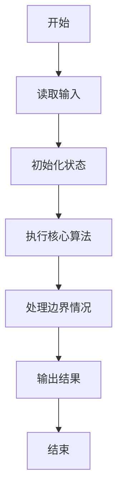
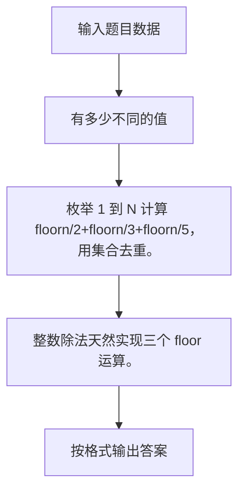

# 1087 有多少不同的值

- **分值：** 20分

### 题目描述

当自然数 $n$ 依次取 1、2、3、……、$N$ 时，算式 $\lfloor n/2\rfloor +\lfloor n/3\rfloor +\lfloor n/5\rfloor $ 有多少个不同的值？（注：$\lfloor x\rfloor$ 为取整函数，表示不超过 $x$ 的最大自然数，即 $x$ 的整数部分。）

### 输入格式：

输入给出一个正整数 $N$（$2 \le N \le 10^4$）。

### 输出格式：

在一行中输出题面中算式取到的不同值的个数。

### 输入样例：
```
2017
```

### 输出样例：
```
1480
```


### 解题思路

枚举 1 到 N 计算 floorn/2+floorn/3+floorn/5，用集合去重。 整数除法天然实现三个 floor 运算。

实现时按照题目的输入顺序读取数据，使用与数据规模匹配的数据结构保存必要状态，在遍历或模拟过程中完成核心计算，最后严格按照输出格式生成答案。

### 代码流程说明

1. 读取题目输入，初始化计数器、数组、集合或其他辅助状态。
2. 枚举 1 到 N 计算 floorn/2+floorn/3+floorn/5，用集合去重。
3. 整数除法天然实现三个 floor 运算。
4. 根据题目要求处理边界情况，并输出最终结果。

时间复杂度为 O(N)，空间复杂度主要取决于输入数据和辅助状态，通常为 O(1) 到 O(n)。

### 代码实现

以下是本题对应的完整 C++17 实现：

```cpp
#include <bits/stdc++.h>
using namespace std;
// 算法原理：枚举 1 到 N 计算 floor(n/2)+floor(n/3)+floor(n/5)，用集合去重。
// 关键步骤：整数除法天然实现三个 floor 运算。
int main() {
    int n;
    cin >> n;
    set<int> s;
    for (int i = 1; i <= n; ++i)
        s.insert(i / 2 + i / 3 + i / 5);
    cout << s.size();
}
```

### 代码流程图



### 解题流程图



### 常见易错点

- 注意输入规模，超大整数、长字符串或链表地址不能简单依赖普通整数和下标。
- 严格区分题目中的边界条件，例如是否包含等号、是否需要保留前导零以及是否只处理完整区块。
- 输出时按照题目规定的空格、换行、大小写和小数位数格式，避免计算正确但格式错误。
