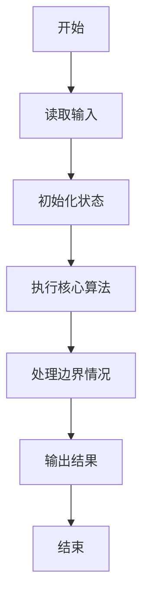
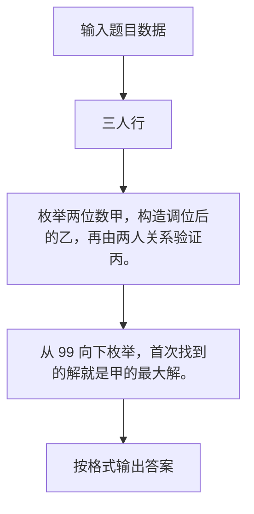

# 1088 三人行

- **分值：** 20分

### 题目描述

子曰：“三人行，必有我师焉。择其善者而从之，其不善者而改之。”

本题给定甲、乙、丙三个人的能力值关系为：甲的能力值确定是 2 位正整数；把甲的能力值的 2 个数字调换位置就是乙的能力值；甲乙两人能力差是丙的能力值的 X 倍；乙的能力值是丙的 Y 倍。请你指出谁比你强应“从之”，谁比你弱应“改之”。

### 输入格式：

输入在一行中给出三个数，依次为：M（你自己的能力值）、X 和 Y。三个数字均为不超过 1000 的正整数。

### 输出格式：

在一行中首先输出甲的能力值，随后依次输出甲、乙、丙三人与你的关系：如果其比你强，输出 `Cong`；平等则输出 `Ping`；比你弱则输出 `Gai`。其间以 1 个空格分隔，行首尾不得有多余空格。

注意：如果解不唯一，则以甲的最大解为准进行判断；如果解不存在，则输出 `No Solution`。

### 输入样例：1
```
48 3 7
```

### 输出样例：1
```
48 Ping Cong Gai
```

### 输入样例：2
```
48 11 6
```

### 输出样例：2
```
No Solution
```


### 解题思路

枚举两位数甲，构造调位后的乙，再由两人关系验证丙。 从 99 向下枚举，首次找到的解就是甲的最大解。

实现时按照题目的输入顺序读取数据，使用与数据规模匹配的数据结构保存必要状态，在遍历或模拟过程中完成核心计算，最后严格按照输出格式生成答案。

### 代码流程说明

1. 读取题目输入，初始化计数器、数组、集合或其他辅助状态。
2. 枚举两位数甲，构造调位后的乙，再由两人关系验证丙。
3. 从 99 向下枚举，首次找到的解就是甲的最大解。
4. 根据题目要求处理边界情况，并输出最终结果。

时间复杂度为 O(1000)，空间复杂度主要取决于输入数据和辅助状态，通常为 O(1) 到 O(n)。

### 代码实现

以下是本题对应的完整 C++17 实现：

```cpp
#include <bits/stdc++.h>
using namespace std;
// 算法原理：枚举两位数甲，构造调位后的乙，再由两人关系验证丙。
// 关键步骤：从 99 向下枚举，首次找到的解就是甲的最大解。
string cmp(int a, int b) { return a > b ? "Cong" : a == b ? "Ping" : "Gai"; }
int main() {
    int m, x, y;
    cin >> m >> x >> y;
    for (int a = 99; a >= 10; --a) {
        int b = a % 10 * 10 + a / 10, d = abs(a - b);
        if (d % x || b * y % x)
            continue;
        int c = d / x;
        if (b != c * y)
            continue;
        cout << a << ' ' << cmp(a, m) << ' ' << cmp(b, m) << ' ' << cmp(c, m);
        return 0;
    }
    cout << "No Solution";
}
```

### 代码流程图



### 解题流程图



### 常见易错点

- 注意输入规模，超大整数、长字符串或链表地址不能简单依赖普通整数和下标。
- 严格区分题目中的边界条件，例如是否包含等号、是否需要保留前导零以及是否只处理完整区块。
- 输出时按照题目规定的空格、换行、大小写和小数位数格式，避免计算正确但格式错误。
