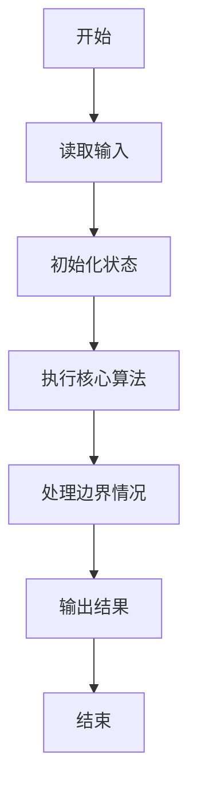
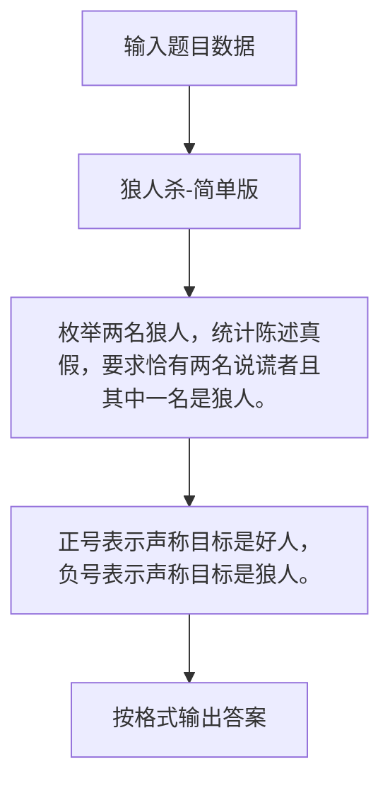

# 1089 狼人杀-简单版

- **分值：** 20分

### 题目描述

以下文字摘自《灵机一动·好玩的数学》：“狼人杀”游戏分为狼人、好人两大阵营。在一局“狼人杀”游戏中，1 号玩家说：“2 号是狼人”，2 号玩家说：“3 号是好人”，3 号玩家说：“4 号是狼人”，4 号玩家说：“5 号是好人”，5 号玩家说：“4 号是好人”。已知这 5 名玩家中有 2 人扮演狼人角色，有 2 人说的不是实话，有狼人撒谎但并不是所有狼人都在撒谎。扮演狼人角色的是哪两号玩家？

本题是这个问题的升级版：已知 $N$ 名玩家中有 2 人扮演狼人角色，有 2 人说的不是实话，有狼人撒谎但并不是所有狼人都在撒谎。要求你找出扮演狼人角色的是哪几号玩家？

### 输入格式：

输入在第一行中给出一个正整数 $N$（$5 \le N \le 100$）。随后 $N$ 行，第 $i$ 行给出第 $i$ 号玩家说的话（$1 \le i \le N$），即一个玩家编号，用正号表示好人，负号表示狼人。

### 输出格式：

如果有解，在一行中按递增顺序输出 2 个狼人的编号，其间以空格分隔，行首尾不得有多余空格。如果解不唯一，则输出最小序列解 —— 即对于两个序列 $A = { a[1], ..., a[M] }$ 和 $B = { b[1], ..., b[M] }$，若存在 $0 \le k < M$ 使得 $a[i]=b[i]$ （$i \le k$），且 $a[k+1]<b[k+1]$，则称序列 $A$ 小于序列 $B$。若无解则输出 `No Solution`。

### 输入样例：1
```
5
-2
+3
-4
+5
+4
```

### 输出样例：1
```
1 4
```

### 输入样例：2
```
6
+6
+3
+1
-5
-2
+4
```

### 输出样例：2（解不唯一）
```
1 5
```

### 输入样例：3
```
5
-2
-3
-4
-5
-1
```

### 输出样例：3
```
No Solution
```


### 解题思路

枚举两名狼人，统计陈述真假，要求恰有两名说谎者且其中一名是狼人。 正号表示声称目标是好人，负号表示声称目标是狼人。

实现时按照题目的输入顺序读取数据，使用与数据规模匹配的数据结构保存必要状态，在遍历或模拟过程中完成核心计算，最后严格按照输出格式生成答案。

### 代码流程说明

1. 读取题目输入，初始化计数器、数组、集合或其他辅助状态。
2. 枚举两名狼人，统计陈述真假，要求恰有两名说谎者且其中一名是狼人。
3. 正号表示声称目标是好人，负号表示声称目标是狼人。
4. 根据题目要求处理边界情况，并输出最终结果。

时间复杂度为 O(N³)，空间复杂度主要取决于输入数据和辅助状态，通常为 O(1) 到 O(n)。

### 代码实现

以下是本题对应的完整 C++17 实现：

```cpp
#include <bits/stdc++.h>
using namespace std;
// 算法原理：枚举两名狼人，统计陈述真假，要求恰有两名说谎者且其中一名是狼人。
// 关键步骤：正号表示声称目标是好人，负号表示声称目标是狼人。
int main() {
    int n;
    cin >> n;
    vector<int> a(n + 1);
    for (int i = 1; i <= n; ++i)
        cin >> a[i];
    for (int w1 = 1; w1 <= n; ++w1)
        for (int w2 = w1 + 1; w2 <= n; ++w2) {
            int lie = 0, inwolf = 0;
            for (int i = 1; i <= n; ++i) {
                bool wolf = i == w1 || i == w2;
                bool claimed = a[i] < 0, actual = abs(a[i]) == w1 || abs(a[i]) == w2;
                if (claimed != actual) {
                    ++lie;
                    if (wolf)
                        ++inwolf;
                }
            }
            if (lie == 2 && inwolf == 1) {
                cout << w1 << ' ' << w2;
                return 0;
            }
        }
    cout << "No Solution";
}
```

### 代码流程图



### 解题流程图



### 常见易错点

- 注意输入规模，超大整数、长字符串或链表地址不能简单依赖普通整数和下标。
- 严格区分题目中的边界条件，例如是否包含等号、是否需要保留前导零以及是否只处理完整区块。
- 输出时按照题目规定的空格、换行、大小写和小数位数格式，避免计算正确但格式错误。
