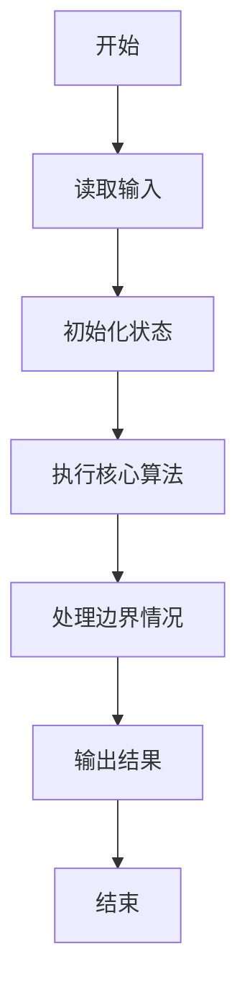
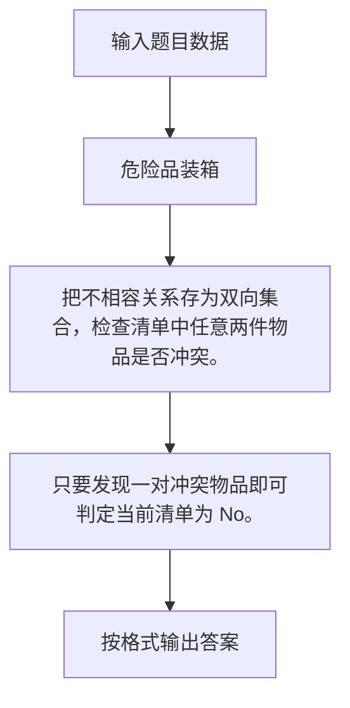

# 1090 危险品装箱

- **分值：** 25分

### 题目描述

集装箱运输货物时，我们必须特别小心，不能把不相容的货物装在一只箱子里。比如氧化剂绝对不能跟易燃液体同箱，否则很容易造成爆炸。

本题给定一张不相容物品的清单，需要你检查每一张集装箱货品清单，判断它们是否能装在同一只箱子里。

### 输入格式：

输入第一行给出两个正整数：$N$ ($\le 10^4$) 是成对的不相容物品的对数；$M$ ($\le 100$) 是集装箱货品清单的单数。

随后数据分两大块给出。第一块有 $N$ 行，每行给出一对不相容的物品。第二块有 $M$ 行，每行给出一箱货物的清单，格式如下：
```
K G[1] G[2] ... G[K]
```
其中 `K` ($\le 1000$) 是物品件数，`G[i]` 是物品的编号。简单起见，每件物品用一个 5 位数的编号代表。两个数字之间用空格分隔。

### 输出格式：

对每箱货物清单，判断是否可以安全运输。如果没有不相容物品，则在一行中输出 `Yes`，否则输出 `No`。

### 输入样例：
```
6 3
20001 20002
20003 20004
20005 20006
20003 20001
20005 20004
20004 20006
4 00001 20004 00002 20003
5 98823 20002 20003 20006 10010
3 12345 67890 23333
```

### 输出样例：
```
No
Yes
Yes
```


### 解题思路

把不相容关系存为双向集合，检查清单中任意两件物品是否冲突。 只要发现一对冲突物品即可判定当前清单为 No。

实现时按照题目的输入顺序读取数据，使用与数据规模匹配的数据结构保存必要状态，在遍历或模拟过程中完成核心计算，最后严格按照输出格式生成答案。

### 代码流程说明

1. 读取题目输入，初始化计数器、数组、集合或其他辅助状态。
2. 把不相容关系存为双向集合，检查清单中任意两件物品是否冲突。
3. 只要发现一对冲突物品即可判定当前清单为 No。
4. 根据题目要求处理边界情况，并输出最终结果。

时间复杂度为 O(MK²)，空间复杂度主要取决于输入数据和辅助状态，通常为 O(1) 到 O(n)。

### 代码实现

以下是本题对应的完整 C++17 实现：

```cpp
#include <bits/stdc++.h>
using namespace std;
// 算法原理：把不相容关系存为双向集合，检查清单中任意两件物品是否冲突。
// 关键步骤：只要发现一对冲突物品即可判定当前清单为 No。
int main() {
    int n, m;
    cin >> n >> m;
    set<pair<int, int>> bad;
    for (int i = 0, a, b; i < n; ++i)
        cin >> a >> b, bad.insert({a, b}), bad.insert({b, a});
    while (m--) {
        int k;
        cin >> k;
        vector<int> a(k);
        for (int &x : a)
            cin >> x;
        bool ok = 1;
        for (int i = 0; i < k; ++i)
            for (int j = i + 1; j < k; ++j)
                if (bad.count({a[i], a[j]}))
                    ok = 0;
        cout << (ok ? "Yes" : "No") << '\n';
    }
}
```

### 代码流程图



### 解题流程图



### 常见易错点

- 注意输入规模，超大整数、长字符串或链表地址不能简单依赖普通整数和下标。
- 严格区分题目中的边界条件，例如是否包含等号、是否需要保留前导零以及是否只处理完整区块。
- 输出时按照题目规定的空格、换行、大小写和小数位数格式，避免计算正确但格式错误。
