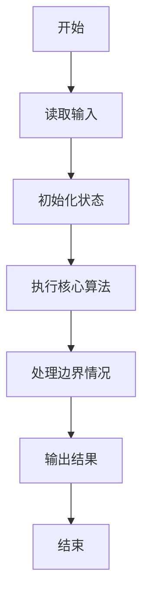
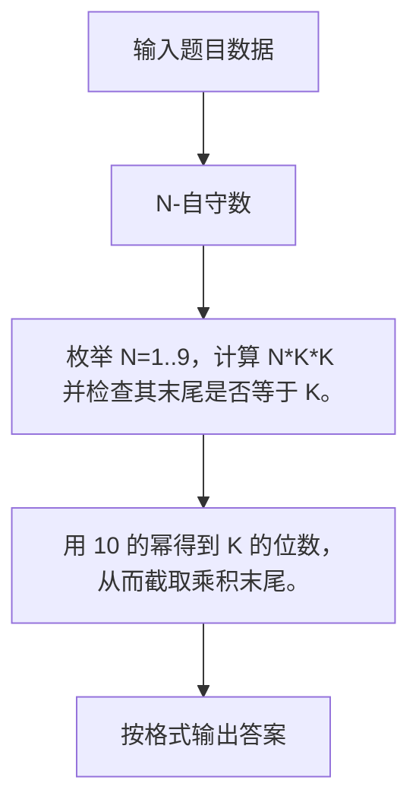

# 1091 N-自守数

- **分值：** 15分

### 题目描述

如果某个数 $K$ 的平方乘以 $N$ 以后，结果的末尾几位数等于 $K$，那么就称这个数为“$N$-自守数”。例如 $3\times 92^2 = 25 392$，而 $25 392$ 的末尾两位正好是 $92$，所以 $92$ 是一个 $3$-自守数。

本题就请你编写程序判断一个给定的数字是否关于某个 $N$ 是 $N$-自守数。

### 输入格式：

输入在第一行中给出正整数 $M$（$\le 20$），随后一行给出 $M$ 个待检测的、不超过 1000 的正整数。

### 输出格式：

对每个需要检测的数字，如果它是 $N$-自守数就在一行中输出最小的 $N$ 和 $NK^2$ 的值，以一个空格隔开；否则输出 `No`。注意题目保证 $N < 10$。

### 输入样例：
```
3
92 5 233
```

### 输出样例：
```
3 25392
1 25
No
```


### 解题思路

枚举 N=1..9，计算 N*K*K 并检查其末尾是否等于 K。 用 10 的幂得到 K 的位数，从而截取乘积末尾。

实现时按照题目的输入顺序读取数据，使用与数据规模匹配的数据结构保存必要状态，在遍历或模拟过程中完成核心计算，最后严格按照输出格式生成答案。

### 代码流程说明

1. 读取题目输入，初始化计数器、数组、集合或其他辅助状态。
2. 枚举 N=1..9，计算 N*K*K 并检查其末尾是否等于 K。
3. 用 10 的幂得到 K 的位数，从而截取乘积末尾。
4. 根据题目要求处理边界情况，并输出最终结果。

时间复杂度为 O(M)，空间复杂度主要取决于输入数据和辅助状态，通常为 O(1) 到 O(n)。

### 代码实现

以下是本题对应的完整 C++17 实现：

```cpp
#include <bits/stdc++.h>
using namespace std;
// 算法原理：枚举 N=1..9，计算 N*K*K 并检查其末尾是否等于 K。
// 关键步骤：用 10 的幂得到 K 的位数，从而截取乘积末尾。
int main() {
    int m;
    cin >> m;
    while (m--) {
        long long k;
        cin >> k;
        bool ok = 0;
        for (int n = 1; n < 10; ++n) {
            long long z = n * k * k, p = 1;
            for (long long x = k; x; x /= 10)
                p *= 10;
            if (z % p == k) {
                cout << n << ' ' << z;
                ok = 1;
                break;
            }
        }
        if (!ok)
            cout << "No";
        if (m)
            cout << '\n';
    }
}
```

### 代码流程图



### 解题流程图



### 常见易错点

- 注意输入规模，超大整数、长字符串或链表地址不能简单依赖普通整数和下标。
- 严格区分题目中的边界条件，例如是否包含等号、是否需要保留前导零以及是否只处理完整区块。
- 输出时按照题目规定的空格、换行、大小写和小数位数格式，避免计算正确但格式错误。
