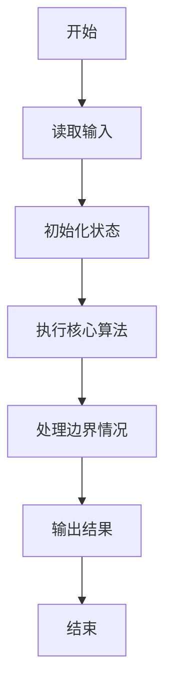
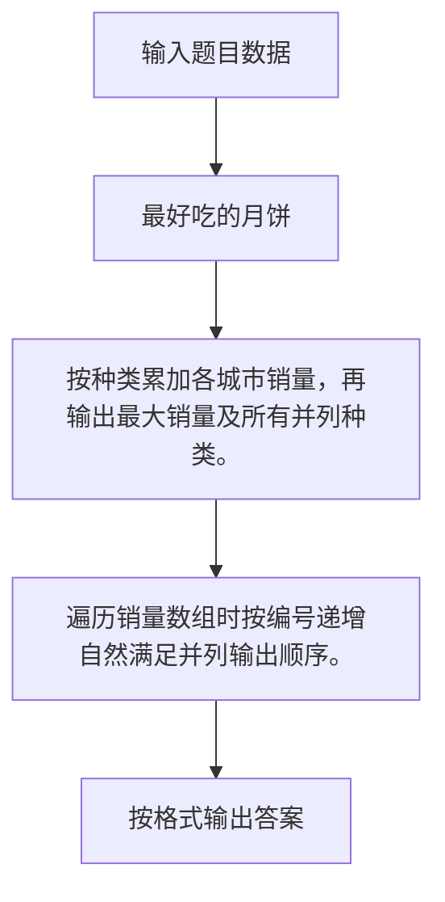

# 1092 最好吃的月饼

- **分值：** 20分

### 题目描述

月饼是久负盛名的中国传统糕点之一，自唐朝以来，已经发展出几百品种。


若想评比出一种“最好吃”的月饼，那势必在吃货界引发一场腥风血雨…… 在这里我们用数字说话，给出全国各地各种月饼的销量，要求你从中找出销量冠军，认定为最好吃的月饼。

### 输入格式：

输入首先给出两个正整数 $N$（$\le 1000$）和 $M$（$\le 100$），分别为月饼的种类数（于是默认月饼种类从 1 到 $N$ 编号）和参与统计的城市数量。

接下来 $M$ 行，每行给出 $N$ 个非负整数（均不超过 1 百万），其中第 $i$ 个整数为第 $i$ 种月饼的销量（块）。数字间以空格分隔。

### 输出格式：

在第一行中输出最大销量，第二行输出销量最大的月饼的种类编号。如果冠军不唯一，则按编号递增顺序输出并列冠军。数字间以 1 个空格分隔，行首尾不得有多余空格。

### 输入样例：
```
5 3
1001 992 0 233 6
8 0 2018 0 2008
36 18 0 1024 4
```

### 输出样例：
```
2018
3 5
```


### 解题思路

按种类累加各城市销量，再输出最大销量及所有并列种类。 遍历销量数组时按编号递增自然满足并列输出顺序。

实现时按照题目的输入顺序读取数据，使用与数据规模匹配的数据结构保存必要状态，在遍历或模拟过程中完成核心计算，最后严格按照输出格式生成答案。

### 代码流程说明

1. 读取题目输入，初始化计数器、数组、集合或其他辅助状态。
2. 按种类累加各城市销量，再输出最大销量及所有并列种类。
3. 遍历销量数组时按编号递增自然满足并列输出顺序。
4. 根据题目要求处理边界情况，并输出最终结果。

时间复杂度为 O(MN)，空间复杂度主要取决于输入数据和辅助状态，通常为 O(1) 到 O(n)。

### 代码实现

以下是本题对应的完整 C++17 实现：

```cpp
#include <bits/stdc++.h>
using namespace std;
// 算法原理：按种类累加各城市销量，再输出最大销量及所有并列种类。
// 关键步骤：遍历销量数组时按编号递增自然满足并列输出顺序。
int main() {
    int n, m;
    cin >> n >> m;
    vector<int> a(n);
    for (int i = 0, x; i < m; ++i)
        for (int j = 0; j < n; ++j)
            cin >> x, a[j] += x;
    int mx = *max_element(a.begin(), a.end());
    cout << mx << '\n';
    bool f = 0;
    for (int i = 0; i < n; ++i)
        if (a[i] == mx) {
            if (f)
                cout << ' ';
            cout << i + 1;
            f = 1;
        }
}
```

### 代码流程图



### 解题流程图



### 常见易错点

- 注意输入规模，超大整数、长字符串或链表地址不能简单依赖普通整数和下标。
- 严格区分题目中的边界条件，例如是否包含等号、是否需要保留前导零以及是否只处理完整区块。
- 输出时按照题目规定的空格、换行、大小写和小数位数格式，避免计算正确但格式错误。
