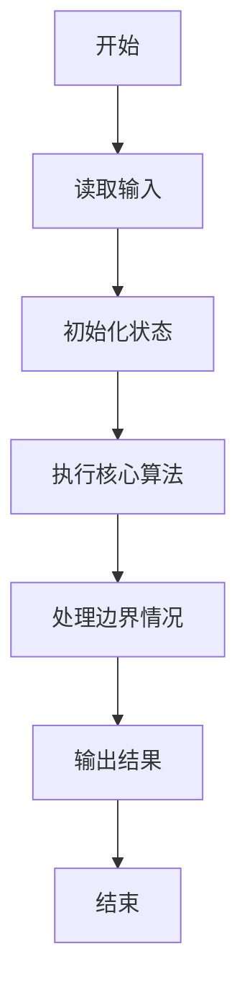
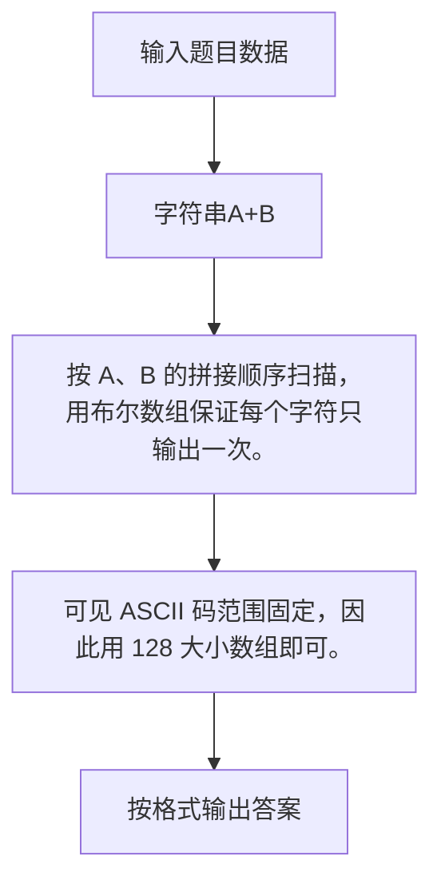

# 1093 字符串A+B

- **分值：** 20分

### 题目描述

给定两个字符串 $A$ 和 $B$，本题要求你输出 $A+B$，即两个字符串的并集。要求先输出 $A$，再输出 $B$，但**重复的字符必须被剔除**。

### 输入格式：

输入在两行中分别给出 $A$ 和 $B$，均为长度不超过 $10^6$的、由可见 ASCII 字符 (即码值为32~126)和空格组成的、由回车标识结束的非空字符串。

### 输出格式：

在一行中输出题面要求的 $A$ 和 $B$ 的和。

### 输入样例：
```
This is a sample test
to show you_How it works
```

### 输出样例：
```
This ampletowyu_Hrk
```


### 解题思路

按 A、B 的拼接顺序扫描，用布尔数组保证每个字符只输出一次。 可见 ASCII 码范围固定，因此用 128 大小数组即可。

实现时按照题目的输入顺序读取数据，使用与数据规模匹配的数据结构保存必要状态，在遍历或模拟过程中完成核心计算，最后严格按照输出格式生成答案。

### 代码流程说明

1. 读取题目输入，初始化计数器、数组、集合或其他辅助状态。
2. 按 A、B 的拼接顺序扫描，用布尔数组保证每个字符只输出一次。
3. 可见 ASCII 码范围固定，因此用 128 大小数组即可。
4. 根据题目要求处理边界情况，并输出最终结果。

时间复杂度为 O(|A|+|B|)，空间复杂度主要取决于输入数据和辅助状态，通常为 O(1) 到 O(n)。

### 代码实现

以下是本题对应的完整 C++17 实现：

```cpp
#include <bits/stdc++.h>
using namespace std;
// 算法原理：按 A、B 的拼接顺序扫描，用布尔数组保证每个字符只输出一次。
// 关键步骤：可见 ASCII 码范围固定，因此用 128 大小数组即可。
int main() {
    string a, b;
    getline(cin, a);
    getline(cin, b);
    bool seen[128] = {};
    for (char c : a + b)
        if (!seen[(unsigned char)c])
            cout << c, seen[(unsigned char)c] = 1;
}
```

### 代码流程图



### 解题流程图



### 常见易错点

- 注意输入规模，超大整数、长字符串或链表地址不能简单依赖普通整数和下标。
- 严格区分题目中的边界条件，例如是否包含等号、是否需要保留前导零以及是否只处理完整区块。
- 输出时按照题目规定的空格、换行、大小写和小数位数格式，避免计算正确但格式错误。
