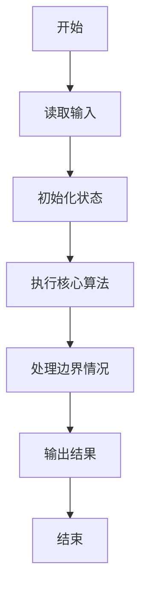
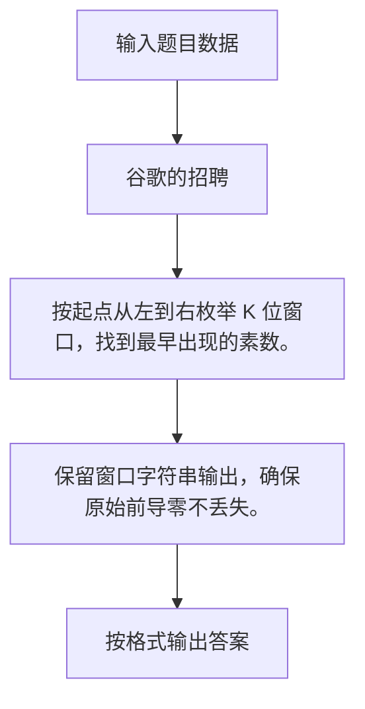

# 1094 谷歌的招聘

- **分值：** 20分

### 题目描述

2004 年 7 月，谷歌在硅谷的 101 号公路边竖立了一块巨大的广告牌（如下图）用于招聘。内容超级简单，就是一个以 .com 结尾的网址，而前面的网址是一个 10 位素数，这个素数是自然常数 e 中最早出现的 10 位连续数字。能找出这个素数的人，就可以通过访问谷歌的这个网站进入招聘流程的下一步。


自然常数 e 是一个著名的超越数，前面若干位写出来是这样的：e = 2.71828182845904523536028747135266249775724709369995957496696762772407663035354759457138217852516642**7427466391**932003059921... 其中粗体标出的 10 位数就是答案。

本题要求你编程解决一个更通用的问题：从任一给定的长度为 L 的数字中，找出最早出现的 K 位连续数字所组成的素数。

### 输入格式：

输入在第一行给出 2 个正整数，分别是 L（不超过 1000 的正整数，为数字长度）和 K（小于 10 的正整数）。接下来一行给出一个长度为 L 的正整数 N。

### 输出格式：

在一行中输出 N 中最早出现的 K 位连续数字所组成的素数。如果这样的素数不存在，则输出 `404`。注意，原始数字中的前导零也计算在位数之内。例如在 200236 中找 4 位素数，0023 算是解；但第一位 2 不能被当成 0002 输出，因为在原始数字中不存在这个 2 的前导零。

### 输入样例：1
```
20 5
23654987725541023819
```

### 输出样例：1
```
49877
```

### 输入样例：2
```
10 3
2468001680
```

### 输出样例：2
```
404
```

**鸣谢用户 大冰 补充数据！**


### 解题思路

按起点从左到右枚举 K 位窗口，找到最早出现的素数。 保留窗口字符串输出，确保原始前导零不丢失。

实现时按照题目的输入顺序读取数据，使用与数据规模匹配的数据结构保存必要状态，在遍历或模拟过程中完成核心计算，最后严格按照输出格式生成答案。

### 代码流程说明

1. 读取题目输入，初始化计数器、数组、集合或其他辅助状态。
2. 按起点从左到右枚举 K 位窗口，找到最早出现的素数。
3. 保留窗口字符串输出，确保原始前导零不丢失。
4. 根据题目要求处理边界情况，并输出最终结果。

时间复杂度为 O(L√(10^K))，空间复杂度主要取决于输入数据和辅助状态，通常为 O(1) 到 O(n)。

### 代码实现

以下是本题对应的完整 C++17 实现：

```cpp
#include <bits/stdc++.h>
using namespace std;
// 算法原理：按起点从左到右枚举 K 位窗口，找到最早出现的素数。
// 关键步骤：保留窗口字符串输出，确保原始前导零不丢失。
bool prime(long long x) {
    if (x < 2)
        return false;
    for (long long i = 2; i * i <= x; ++i)
        if (x % i == 0)
            return false;
    return true;
}
int main() {
    int l, k;
    string s;
    cin >> l >> k >> s;
    for (int i = 0; i + k <= l; ++i) {
        string t = s.substr(i, k);
        if (prime(stoll(t))) {
            cout << t;
            return 0;
        }
    }
    cout << 404;
}
```

### 代码流程图



### 解题流程图



### 常见易错点

- 注意输入规模，超大整数、长字符串或链表地址不能简单依赖普通整数和下标。
- 严格区分题目中的边界条件，例如是否包含等号、是否需要保留前导零以及是否只处理完整区块。
- 输出时按照题目规定的空格、换行、大小写和小数位数格式，避免计算正确但格式错误。
