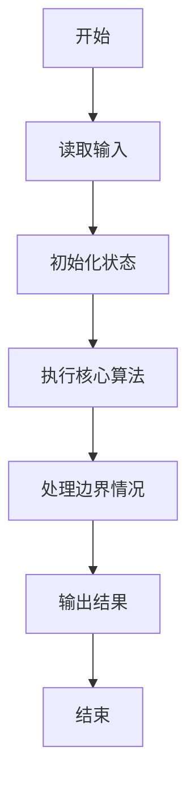
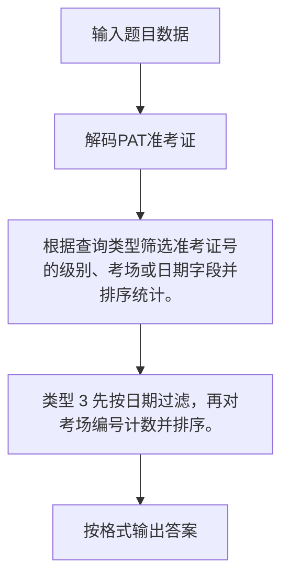

# 1095 解码PAT准考证

- **分值：** 25分

### 题目描述

PAT 准考证号由 4 部分组成：

- 第 1 位是级别，即 `T` 代表顶级；`A` 代表甲级；`B` 代表乙级；
- 第 2~4 位是考场编号，范围从 101 到 999；
- 第 5~10 位是考试日期，格式为年、月、日顺次各占 2 位；
- 最后 11~13 位是考生编号，范围从 000 到 999。

现给定一系列考生的准考证号和他们的成绩，请你按照要求输出各种统计信息。

### 输入格式：

输入首先在一行中给出两个正整数 $N$（$\le 10^4$）和 $M$（$\le 100$），分别为考生人数和统计要求的个数。

接下来 $N$ 行，每行给出一个考生的准考证号和其分数（在区间 $[0, 100]$ 内的整数），其间以空格分隔。

考生信息之后，再给出 $M$ 行，每行给出一个统计要求，格式为：`类型 指令`，其中

- `类型` 为 1 表示要求按分数非升序输出某个指定级别的考生的成绩，对应的 `指令` 则给出代表指定级别的字母；
- `类型` 为 2 表示要求将某指定考场的考生人数和总分统计输出，对应的 `指令` 则给出指定考场的编号；
- `类型` 为 3 表示要求将某指定日期的考生人数分考场统计输出，对应的 `指令` 则给出指定日期，格式与准考证上日期相同。

### 输出格式：

对每项统计要求，首先在一行中输出 `Case #: 要求`，其中 `#` 是该项要求的编号，从 1 开始；`要求` 即复制输入给出的要求。随后输出相应的统计结果：

- `类型` 为 1 的指令，输出格式与输入的考生信息格式相同，即 `准考证号 成绩`。对于分数并列的考生，按其准考证号的字典序递增输出（题目保证无重复准考证号）；
- `类型` 为 2 的指令，按 `人数 总分` 的格式输出；
- `类型` 为 3 的指令，输出按人数非递增顺序，格式为 `考场编号 总人数`。若人数并列则按考场编号递增顺序输出。

如果查询结果为空，则输出 `NA`。

### 输入样例：
```
8 4
B123180908127 99
B102180908003 86
A112180318002 98
T107150310127 62
A107180908108 100
T123180908010 78
B112160918035 88
A107180908021 98
1 A
2 107
3 180908
2 999
```

### 输出样例：
```
Case 1: 1 A
A107180908108 100
A107180908021 98
A112180318002 98
Case 2: 2 107
3 260
Case 3: 3 180908
107 2
123 2
102 1
Case 4: 2 999
NA
```


### 解题思路

根据查询类型筛选准考证号的级别、考场或日期字段并排序统计。 类型 3 先按日期过滤，再对考场编号计数并排序。

实现时按照题目的输入顺序读取数据，使用与数据规模匹配的数据结构保存必要状态，在遍历或模拟过程中完成核心计算，最后严格按照输出格式生成答案。

### 代码流程说明

1. 读取题目输入，初始化计数器、数组、集合或其他辅助状态。
2. 根据查询类型筛选准考证号的级别、考场或日期字段并排序统计。
3. 类型 3 先按日期过滤，再对考场编号计数并排序。
4. 根据题目要求处理边界情况，并输出最终结果。

时间复杂度为 O(NM)，空间复杂度主要取决于输入数据和辅助状态，通常为 O(1) 到 O(n)。

### 代码实现

以下是本题对应的完整 C++17 实现：

```cpp
#include <bits/stdc++.h>
using namespace std;
// 算法原理：根据查询类型筛选准考证号的级别、考场或日期字段并排序统计。
// 关键步骤：类型 3 先按日期过滤，再对考场编号计数并排序。
struct S {
    string id;
    int score;
};
int main() {
    int n, m;
    cin >> n >> m;
    vector<S> a(n);
    for (auto &x : a)
        cin >> x.id >> x.score;
    for (int q = 1; q <= m; ++q) {
        int type;
        string key;
        cin >> type >> key;
        cout << "Case " << q << ": " << type << ' ' << key << '\n';
        if (type == 1) {
            vector<S> v;
            for (auto &x : a)
                if (x.id[0] == key[0])
                    v.push_back(x);
            sort(v.begin(), v.end(),
                 [](S &x, S &y) { return x.score != y.score ? x.score > y.score : x.id < y.id; });
            if (v.empty())
                cout << "NA\n";
            else
                for (auto &x : v)
                    cout << x.id << ' ' << x.score << '\n';
        } else if (type == 2) {
            int cnt = 0, sum = 0;
            for (auto &x : a)
                if (x.id.substr(1, 3) == key)
                    ++cnt, sum += x.score;
            if (!cnt)
                cout << "NA\n";
            else
                cout << cnt << ' ' << sum << '\n';
        } else {
            map<string, pair<int, int>> c;
            for (auto &x : a)
                if (x.id.substr(4, 6) == key)
                    ++c[x.id.substr(1, 3)].first, c[x.id.substr(1, 3)].second = 0;
            for (auto &x : a)
                if (x.id.substr(4, 6) == key)
                    c[x.id.substr(1, 3)].second++;
            vector<pair<string, int>> v;
            for (auto &[id, z] : c)
                v.push_back({id, z.first});
            sort(v.begin(), v.end(), [](auto &x, auto &y) {
                return x.second != y.second ? x.second > y.second : x.first < y.first;
            });
            if (v.empty())
                cout << "NA\n";
            else
                for (auto &x : v)
                    cout << x.first << ' ' << x.second << '\n';
        }
    }
}
```

### 代码流程图



### 解题流程图



### 常见易错点

- 注意输入规模，超大整数、长字符串或链表地址不能简单依赖普通整数和下标。
- 严格区分题目中的边界条件，例如是否包含等号、是否需要保留前导零以及是否只处理完整区块。
- 输出时按照题目规定的空格、换行、大小写和小数位数格式，避免计算正确但格式错误。
