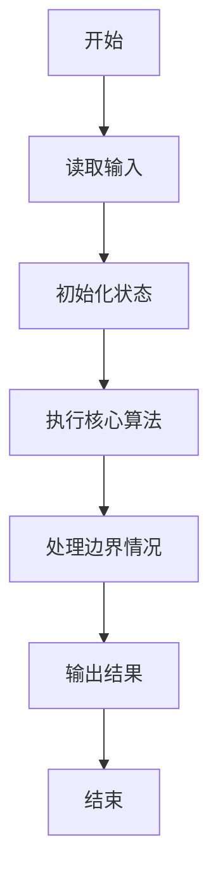
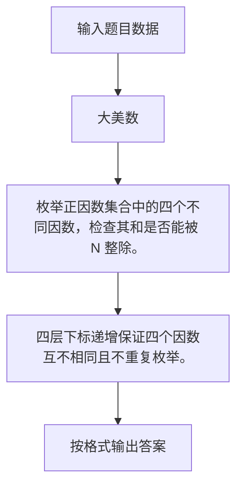

# 1096 大美数

- **分值：** 15分

### 题目描述

若正整数 $N$ 可以整除它的 4 个不同正因数之和，则称这样的正整数为“大美数”。本题就要求你判断任一给定的正整数是否是“大美数”。

### 输入格式：

输入在第一行中给出正整数 $K$（$\le 10$），随后一行给出 $K$ 个待检测的、不超过 $10^4$ 的正整数。

### 输出格式：

对每个需要检测的数字，如果它是大美数就在一行中输出 `Yes`，否则输出 `No`。

### 输入样例：
```
3
18 29 40
```

### 输出样例：
```
Yes
No
Yes
```


### 解题思路

枚举正因数集合中的四个不同因数，检查其和是否能被 N 整除。 四层下标递增保证四个因数互不相同且不重复枚举。

实现时按照题目的输入顺序读取数据，使用与数据规模匹配的数据结构保存必要状态，在遍历或模拟过程中完成核心计算，最后严格按照输出格式生成答案。

### 代码流程说明

1. 读取题目输入，初始化计数器、数组、集合或其他辅助状态。
2. 枚举正因数集合中的四个不同因数，检查其和是否能被 N 整除。
3. 四层下标递增保证四个因数互不相同且不重复枚举。
4. 根据题目要求处理边界情况，并输出最终结果。

时间复杂度为 O(√N⁴)，空间复杂度主要取决于输入数据和辅助状态，通常为 O(1) 到 O(n)。

### 代码实现

以下是本题对应的完整 C++17 实现：

```cpp
#include <bits/stdc++.h>
using namespace std;
// 算法原理：枚举正因数集合中的四个不同因数，检查其和是否能被 N 整除。
// 关键步骤：四层下标递增保证四个因数互不相同且不重复枚举。
int main() {
    int k;
    cin >> k;
    while (k--) {
        int n;
        cin >> n;
        vector<int> d;
        for (int i = 1; i <= n; ++i)
            if (n % i == 0)
                d.push_back(i);
        bool ok = 0;
        for (int a = 0; a < (int)d.size(); ++a)
            for (int b = a + 1; b < (int)d.size(); ++b)
                for (int c = b + 1; c < (int)d.size(); ++c)
                    for (int e = c + 1; e < (int)d.size(); ++e)
                        if ((d[a] + d[b] + d[c] + d[e]) % n == 0)
                            ok = 1;
        cout << (ok ? "Yes" : "No") << '\n';
    }
}
```

### 代码流程图



### 解题流程图



### 常见易错点

- 注意输入规模，超大整数、长字符串或链表地址不能简单依赖普通整数和下标。
- 严格区分题目中的边界条件，例如是否包含等号、是否需要保留前导零以及是否只处理完整区块。
- 输出时按照题目规定的空格、换行、大小写和小数位数格式，避免计算正确但格式错误。
