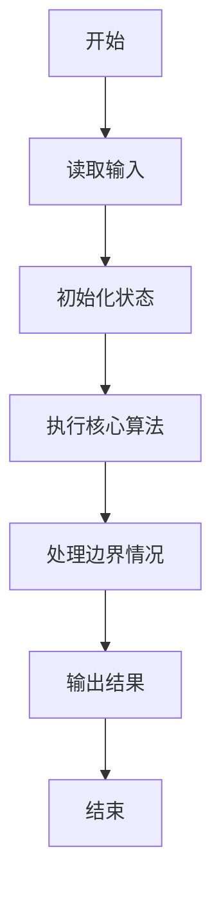
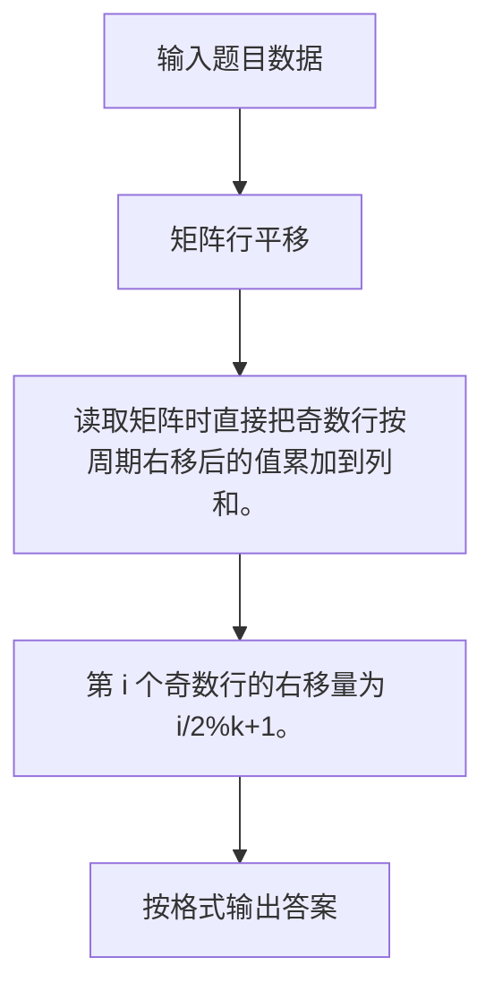

# 1097 矩阵行平移

- **分值：** 20分

### 题目描述

给定一个 $n\times n$ 的整数矩阵。对任一给定的正整数 $k<n$，我们将矩阵的奇数行的元素整体向右依次平移 1、……、$k$、1、……、$k$、…… 个位置，平移空出的位置用整数 $x$ 补。你需要计算出结果矩阵的每一列元素的和。

### 输入格式：

输入第一行给出 3 个正整数：$n$（$<100$）、$k$（$<n$）、$x$（$<100$），分别如题面所述。

接下来 $n$ 行，每行给出 $n$ 个不超过 100 的正整数，为矩阵元素的值。数字间以空格分隔。

### 输出格式：

在一行中输出平移后第 1 到 $n$ 列元素的和。数字间以 1 个空格分隔，行首尾不得有多余空格。

### 输入样例：
```
7 2 99
11 87 23 67 20 75 89
37 94 27 91 63 50 11
44 38 50 26 40 26 24
73 85 63 28 62 18 68
15 83 27 97 88 25 43
23 78 98 20 30 81 99
77 36 48 59 25 34 22
```

### 输出样例：
```
529 481 479 263 417 342 343
```

**样例解读**

需要平移的是第 1、3、5、7 行。给定 $k=2$，应该将这三列顺次整体向右平移 1、2、1、2 位（如果有更多行，就应该按照 1、2、1、2、1、2 …… 这个规律顺次向右平移），左端的空位用 99 来填充。平移后的矩阵变成：
```
99 11 87 23 67 20 75
37 94 27 91 63 50 11
99 99 44 38 50 26 40
73 85 63 28 62 18 68
99 15 83 27 97 88 25
23 78 98 20 30 81 99
99 99 77 36 48 59 25
```


### 解题思路

读取矩阵时直接把奇数行按周期右移后的值累加到列和。 第 i 个奇数行的右移量为 i/2%k+1。

实现时按照题目的输入顺序读取数据，使用与数据规模匹配的数据结构保存必要状态，在遍历或模拟过程中完成核心计算，最后严格按照输出格式生成答案。

### 代码流程说明

1. 读取题目输入，初始化计数器、数组、集合或其他辅助状态。
2. 读取矩阵时直接把奇数行按周期右移后的值累加到列和。
3. 第 i 个奇数行的右移量为 i/2%k+1。
4. 根据题目要求处理边界情况，并输出最终结果。

时间复杂度为 O(n²)，空间复杂度主要取决于输入数据和辅助状态，通常为 O(1) 到 O(n)。

### 代码实现

以下是本题对应的完整 C++17 实现：

```cpp
#include <bits/stdc++.h>
using namespace std;
// 算法原理：读取矩阵时直接把奇数行按周期右移后的值累加到列和。
// 关键步骤：第 i 个奇数行的右移量为 (i/2)%k+1。
int main() {
    int n, k, x;
    cin >> n >> k >> x;
    vector<long long> sum(n);
    for (int i = 0; i < n; ++i) {
        vector<int> a(n);
        for (int &z : a)
            cin >> z;
        if (i % 2 == 0) {
            int sh = (i / 2) % k + 1;
            for (int j = 0; j < n; ++j)
                sum[j] += j < sh ? x : a[j - sh];
        } else
            for (int j = 0; j < n; ++j)
                sum[j] += a[j];
    }
    for (int i = 0; i < n; ++i)
        cout << (i ? " " : "") << sum[i];
}
```

### 代码流程图



### 解题流程图



### 常见易错点

- 注意输入规模，超大整数、长字符串或链表地址不能简单依赖普通整数和下标。
- 严格区分题目中的边界条件，例如是否包含等号、是否需要保留前导零以及是否只处理完整区块。
- 输出时按照题目规定的空格、换行、大小写和小数位数格式，避免计算正确但格式错误。
