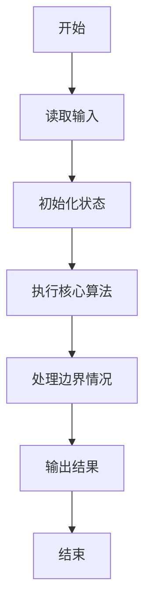
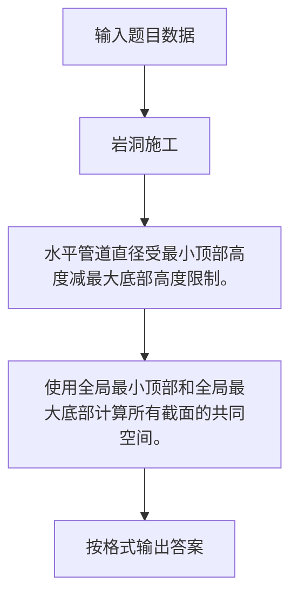

# 1098 岩洞施工

- **分值：** 20分

### 题目描述

要将一条直径至少为 1 个单位的长管道水平送入地形复杂的岩洞中，究竟是否可能？下面的两幅图分别给出了岩洞的剖面图，深蓝色的折线勾勒出岩洞顶部和底部的轮廓。图 1 是有可能的，绿色部分显示直径为 1 的管道可以送入。图 2 就不可能，除非把顶部或底部的突出部分削掉 1 个单位的高度。


本题就请你编写程序，判断给定的岩洞中是否可以施工。

### 输入格式：

输入在第一行给出一个不超过 100 的正整数 $N$，即横向采样的点数。随后两行数据，从左到右顺次给出采样点的纵坐标：第 1 行是岩洞顶部的采样点，第 2 行是岩洞底部的采样点。这里假设坐标原点在左下角，每个纵坐标为不超过 1000 的非负整数。同行数字间以空格分隔。

题目保证输入数据是合理的，即岩洞底部的轮廓线不会与顶部轮廓线交叉。

### 输出格式：

如果可以直接施工，则在一行中输出 `Yes` 和可以送入的管道的最大直径；如果不行，则输出 `No` 和至少需要削掉的高度。答案和数字间以 1 个空格分隔。

### 输入样例：1
```
11
7 6 5 5 6 5 4 5 5 4 4
3 2 2 2 2 3 3 2 1 2 3
```

### 输出样例：1
```
Yes 1
```

### 输入样例：2
```
11
7 6 5 5 6 5 4 5 5 4 4
3 2 2 2 3 4 3 2 1 2 3
```

### 输出样例：2
```
No 1
```


### 解题思路

水平管道直径受最小顶部高度减最大底部高度限制。 使用全局最小顶部和全局最大底部计算所有截面的共同空间。

实现时按照题目的输入顺序读取数据，使用与数据规模匹配的数据结构保存必要状态，在遍历或模拟过程中完成核心计算，最后严格按照输出格式生成答案。

### 代码流程说明

1. 读取题目输入，初始化计数器、数组、集合或其他辅助状态。
2. 水平管道直径受最小顶部高度减最大底部高度限制。
3. 使用全局最小顶部和全局最大底部计算所有截面的共同空间。
4. 根据题目要求处理边界情况，并输出最终结果。

时间复杂度为 O(N)，空间复杂度主要取决于输入数据和辅助状态，通常为 O(1) 到 O(n)。

### 代码实现

以下是本题对应的完整 C++17 实现：

```cpp
#include <bits/stdc++.h>
using namespace std;
// 算法原理：水平管道直径受最小顶部高度减最大底部高度限制。
// 关键步骤：使用全局最小顶部和全局最大底部计算所有截面的共同空间。
int main() {
    int n;
    cin >> n;
    vector<int> top(n), bot(n);
    for (int &x : top)
        cin >> x;
    for (int &x : bot)
        cin >> x;
    int d = *min_element(top.begin(), top.end()) - *max_element(bot.begin(), bot.end());
    if (d >= 1)
        cout << "Yes " << d;
    else
        cout << "No " << 1 - d;
}
```

### 代码流程图



### 解题流程图



### 常见易错点

- 注意输入规模，超大整数、长字符串或链表地址不能简单依赖普通整数和下标。
- 严格区分题目中的边界条件，例如是否包含等号、是否需要保留前导零以及是否只处理完整区块。
- 输出时按照题目规定的空格、换行、大小写和小数位数格式，避免计算正确但格式错误。
