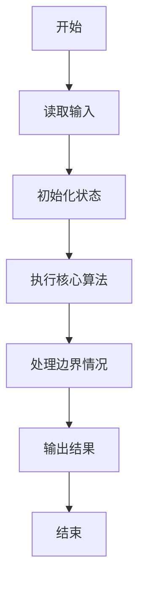
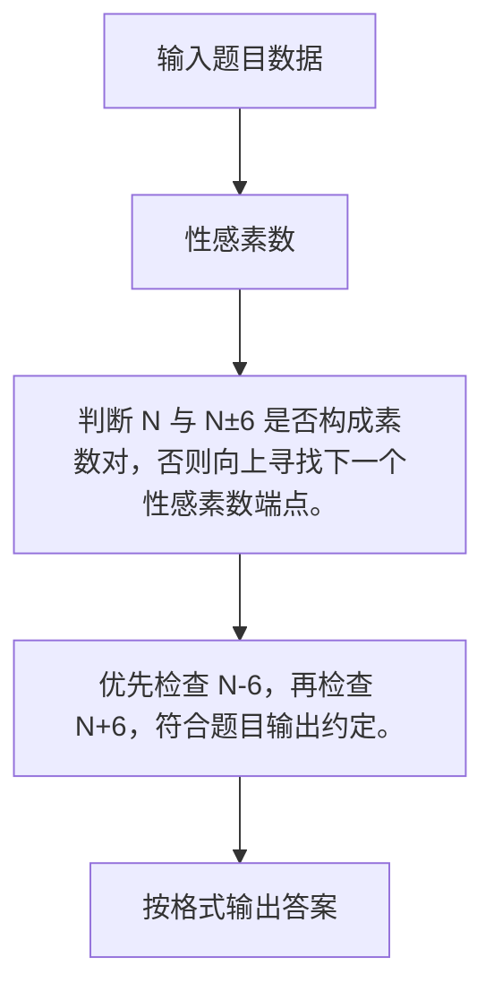

# 1099 性感素数

- **分值：** 20分

### 题目描述

“性感素数”是指形如 ($p$, $p+6$) 这样的一对素数。之所以叫这个名字，是因为拉丁语管“六”叫“sex”（即英语的“性感”）。（原文摘自 http://mathworld.wolfram.com/SexyPrimes.html）

现给定一个整数，请你判断其是否为一个性感素数。

### 输入格式：

输入在一行中给出一个正整数 $N$ ($\le 10^8$)。

### 输出格式：

若 $N$ 是一个性感素数，则在一行中输出 `Yes`，并在第二行输出与 $N$ 配对的另一个性感素数（若这样的数不唯一，输出较小的那个）。若 $N$ 不是性感素数，则在一行中输出 `No`，然后在第二行输出大于 $N$ 的最小性感素数。

### 输入样例：1
```
47
```

### 输出样例：1
```
Yes
41
```

### 输入样例：2
```
21
```

### 输出样例：2
```
No
23
```


### 解题思路

判断 N 与 N±6 是否构成素数对，否则向上寻找下一个性感素数端点。 优先检查 N-6，再检查 N+6，符合题目输出约定。

实现时按照题目的输入顺序读取数据，使用与数据规模匹配的数据结构保存必要状态，在遍历或模拟过程中完成核心计算，最后严格按照输出格式生成答案。

### 代码流程说明

1. 读取题目输入，初始化计数器、数组、集合或其他辅助状态。
2. 判断 N 与 N±6 是否构成素数对，否则向上寻找下一个性感素数端点。
3. 优先检查 N-6，再检查 N+6，符合题目输出约定。
4. 根据题目要求处理边界情况，并输出最终结果。

时间复杂度为 O(√N)，空间复杂度主要取决于输入数据和辅助状态，通常为 O(1) 到 O(n)。

### 代码实现

以下是本题对应的完整 C++17 实现：

```cpp
#include <bits/stdc++.h>
using namespace std;
// 算法原理：判断 N 与 N±6 是否构成素数对，否则向上寻找下一个性感素数端点。
// 关键步骤：优先检查 N-6，再检查 N+6，符合题目输出约定。
bool p(int x) {
    if (x < 2)
        return false;
    for (int i = 2; i * i <= x; ++i)
        if (x % i == 0)
            return false;
    return true;
}
int main() {
    int n;
    cin >> n;
    if (p(n) && p(n - 6))
        cout << "Yes\n" << n - 6;
    else if (p(n) && p(n + 6))
        cout << "Yes\n" << n + 6;
    else {
        cout << "No\n";
        for (int i = n + 1;; ++i)
            if (p(i) && (p(i - 6) || p(i + 6))) {
                cout << i;
                break;
            }
    }
}
```

### 代码流程图



### 解题流程图



### 常见易错点

- 注意输入规模，超大整数、长字符串或链表地址不能简单依赖普通整数和下标。
- 严格区分题目中的边界条件，例如是否包含等号、是否需要保留前导零以及是否只处理完整区块。
- 输出时按照题目规定的空格、换行、大小写和小数位数格式，避免计算正确但格式错误。
