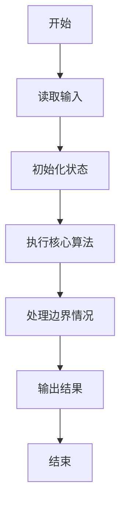
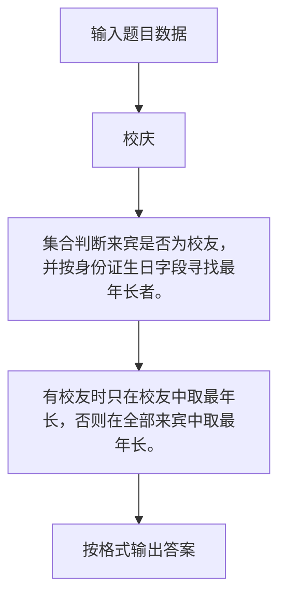

# 1100 校庆

- **分值：** 25分

### 题目描述

2019 年浙江大学将要庆祝成立 122 周年。为了准备校庆，校友会收集了所有校友的身份证号。现在需要请你编写程序，根据来参加校庆的所有人士的身份证号，统计来了多少校友。

### 输入格式：

输入在第一行给出不超过 $10^5$ 的正整数 N，随后 N 行，每行给出一位校友的身份证号（18 位由数字和大写字母X组成的字符串）。题目保证身份证号不重复。

随后给出前来参加校庆的所有人士的信息：首先是一个不超过 $10^5$ 的正整数 M，随后 M 行，每行给出一位人士的身份证号。题目保证身份证号不重复。

### 输出格式：

首先在第一行输出参加校庆的校友的人数。然后在第二行输出最年长的校友的身份证号 —— 注意身份证第 7-14 位给出的是 `yyyymmdd` 格式的生日。如果没有校友来，则在第二行输出最年长的来宾的身份证号。题目保证这样的校友或来宾必是唯一的。

### 输入样例：
```
5
372928196906118710
610481197806202213
440684198612150417
13072819571002001X
150702193604190912
6
530125197901260019
150702193604190912
220221196701020034
610481197806202213
440684198612150417
370205198709275042
```

### 输出样例：
```
3
150702193604190912
```


### 解题思路

集合判断来宾是否为校友，并按身份证生日字段寻找最年长者。 有校友时只在校友中取最年长，否则在全部来宾中取最年长。

实现时按照题目的输入顺序读取数据，使用与数据规模匹配的数据结构保存必要状态，在遍历或模拟过程中完成核心计算，最后严格按照输出格式生成答案。

### 代码流程说明

1. 读取题目输入，初始化计数器、数组、集合或其他辅助状态。
2. 集合判断来宾是否为校友，并按身份证生日字段寻找最年长者。
3. 有校友时只在校友中取最年长，否则在全部来宾中取最年长。
4. 根据题目要求处理边界情况，并输出最终结果。

时间复杂度为 O(N+M)，空间复杂度主要取决于输入数据和辅助状态，通常为 O(1) 到 O(n)。

### 代码实现

以下是本题对应的完整 C++17 实现：

```cpp
#include <bits/stdc++.h>
using namespace std;
// 算法原理：集合判断来宾是否为校友，并按身份证生日字段寻找最年长者。
// 关键步骤：有校友时只在校友中取最年长，否则在全部来宾中取最年长。
int main() {
    int n;
    cin >> n;
    set<string> a;
    for (int i = 0; i < n; ++i) {
        string s;
        cin >> s;
        a.insert(s);
    }
    int m;
    cin >> m;
    string oldestGuest, oldestAlumnus;
    int cnt = 0;
    for (int i = 0; i < m; ++i) {
        string s;
        cin >> s;
        if (oldestGuest.empty() || s.substr(6, 8) < oldestGuest.substr(6, 8))
            oldestGuest = s;
        if (a.count(s)) {
            ++cnt;
            if (oldestAlumnus.empty() || s.substr(6, 8) < oldestAlumnus.substr(6, 8))
                oldestAlumnus = s;
        }
    }
    cout << cnt << '\n' << (cnt ? oldestAlumnus : oldestGuest);
}
```

### 代码流程图



### 解题流程图



### 常见易错点

- 注意输入规模，超大整数、长字符串或链表地址不能简单依赖普通整数和下标。
- 严格区分题目中的边界条件，例如是否包含等号、是否需要保留前导零以及是否只处理完整区块。
- 输出时按照题目规定的空格、换行、大小写和小数位数格式，避免计算正确但格式错误。
