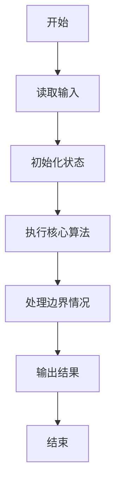
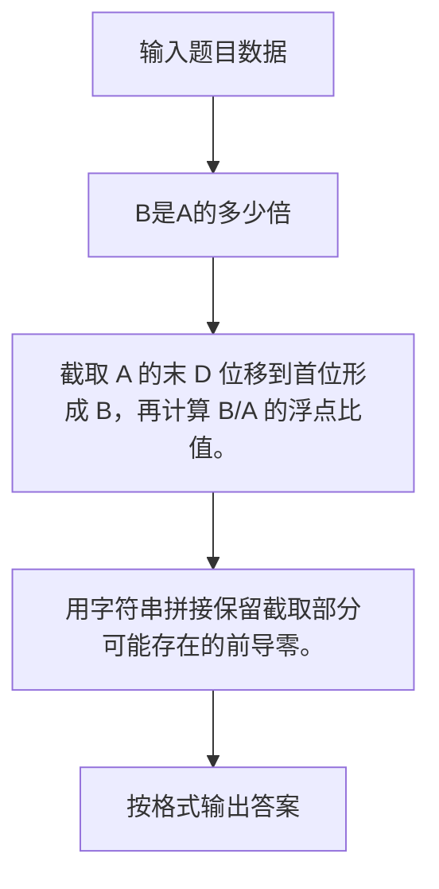

# 1101 B是A的多少倍

- **分值：** 15分

### 题目描述

设一个数 $A$ 的最低 $D$ 位形成的数是 $a_d$。如果把 $a_d$ 截下来移到 $A$ 的最高位前面，就形成了一个新的数 $B$。$B$ 是 $A$ 的多少倍？例如将 12345 的最低 2 位 45 截下来放到 123 的前面，就得到 45123，它约是 12345 的 3.66 倍。

### 输入格式：

输入在一行中给出一个正整数 $A$（$\le 10^9$）和要截取的位数 $D$。题目保证 $D$ 不超过 $A$ 的总位数。

### 输出格式：

计算 $B$ 是 $A$ 的多少倍，输出小数点后 2 位。

### 输入样例：1
```
12345 2
```

### 输出样例：1
```
3.66
```

### 输入样例：2
```
12345 5
```

### 输出样例：2
```
1.00
```


### 解题思路

截取 A 的末 D 位移到首位形成 B，再计算 B/A 的浮点比值。 用字符串拼接保留截取部分可能存在的前导零。

实现时按照题目的输入顺序读取数据，使用与数据规模匹配的数据结构保存必要状态，在遍历或模拟过程中完成核心计算，最后严格按照输出格式生成答案。

### 代码流程说明

1. 读取题目输入，初始化计数器、数组、集合或其他辅助状态。
2. 截取 A 的末 D 位移到首位形成 B，再计算 B/A 的浮点比值。
3. 用字符串拼接保留截取部分可能存在的前导零。
4. 根据题目要求处理边界情况，并输出最终结果。

时间复杂度为 O(|A|)，空间复杂度主要取决于输入数据和辅助状态，通常为 O(1) 到 O(n)。

### 代码实现

以下是本题对应的完整 C++17 实现：

```cpp
#include <bits/stdc++.h>
using namespace std;
// 算法原理：截取 A 的末 D 位移到首位形成 B，再计算 B/A 的浮点比值。
// 关键步骤：用字符串拼接保留截取部分可能存在的前导零。
int main() {
    string a;
    int d;
    cin >> a >> d;
    string b = a.substr(a.size() - d) + a.substr(0, a.size() - d);
    cout << fixed << setprecision(2) << stod(b) / stod(a);
}
```

### 代码流程图



### 解题流程图



### 常见易错点

- 注意输入规模，超大整数、长字符串或链表地址不能简单依赖普通整数和下标。
- 严格区分题目中的边界条件，例如是否包含等号、是否需要保留前导零以及是否只处理完整区块。
- 输出时按照题目规定的空格、换行、大小写和小数位数格式，避免计算正确但格式错误。
