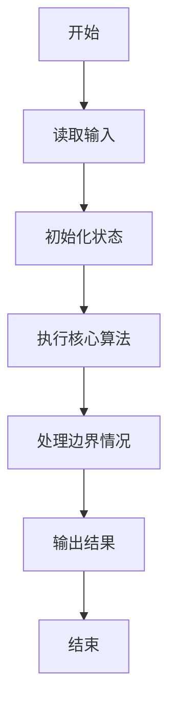
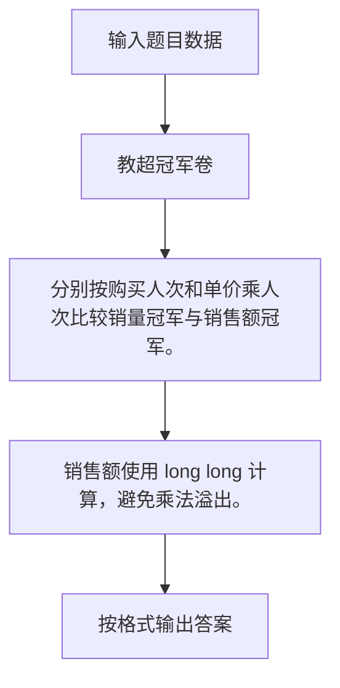

# 1102 教超冠军卷

- **分值：** 20分

### 题目描述

“教育超市”是拼题 A 系统的一个衍生产品，发布了各种试卷和练习供用户选购。在试卷列表中，系统不仅列出了每份试卷的单价，还显示了当前的购买人次。本题就请你根据这些信息找出教育超市所有试卷中的销量（即购买人次）冠军和销售额冠军。

### 输入格式：

输入首先在第一行中给出一个正整数 N（$\le 10^4$），随后 N 行，每行给出一份卷子的独特 ID （由小写字母和数字组成的、长度不超过8位的字符串）、单价（为不超过 $100$ 的正整数）和购买人次（为不超过 $10^6$ 的非负整数）。

### 输出格式：

在第一行中输出销量冠军的 ID 及其销量，第二行中输出销售额冠军的 ID 及其销售额。同行输出间以一个空格分隔。题目保证冠军是唯一的，不存在并列。

### 输入样例：
```
4
zju007 39 10
pku2019 9 332
pat2018 95 79
qdu106 19 38
```

### 输出样例：
```
pku2019 332
pat2018 7505
```


### 解题思路

分别按购买人次和单价乘人次比较销量冠军与销售额冠军。 销售额使用 long long 计算，避免乘法溢出。

实现时按照题目的输入顺序读取数据，使用与数据规模匹配的数据结构保存必要状态，在遍历或模拟过程中完成核心计算，最后严格按照输出格式生成答案。

### 代码流程说明

1. 读取题目输入，初始化计数器、数组、集合或其他辅助状态。
2. 分别按购买人次和单价乘人次比较销量冠军与销售额冠军。
3. 销售额使用 long long 计算，避免乘法溢出。
4. 根据题目要求处理边界情况，并输出最终结果。

时间复杂度为 O(N)，空间复杂度主要取决于输入数据和辅助状态，通常为 O(1) 到 O(n)。

### 代码实现

以下是本题对应的完整 C++17 实现：

```cpp
#include <bits/stdc++.h>
using namespace std;
// 算法原理：分别按购买人次和单价乘人次比较销量冠军与销售额冠军。
// 关键步骤：销售额使用 long long 计算，避免乘法溢出。
struct S {
    string id;
    long long price, num;
};
int main() {
    int n;
    cin >> n;
    vector<S> a(n);
    for (auto &x : a)
        cin >> x.id >> x.price >> x.num;
    auto p = max_element(a.begin(), a.end(), [](S &x, S &y) { return x.num < y.num; });
    auto q = max_element(a.begin(), a.end(),
                         [](S &x, S &y) { return x.price * x.num < y.price * y.num; });
    cout << p->id << ' ' << p->num << '\n' << q->id << ' ' << q->price * q->num;
}
```

### 代码流程图



### 解题流程图



### 常见易错点

- 注意输入规模，超大整数、长字符串或链表地址不能简单依赖普通整数和下标。
- 严格区分题目中的边界条件，例如是否包含等号、是否需要保留前导零以及是否只处理完整区块。
- 输出时按照题目规定的空格、换行、大小写和小数位数格式，避免计算正确但格式错误。
